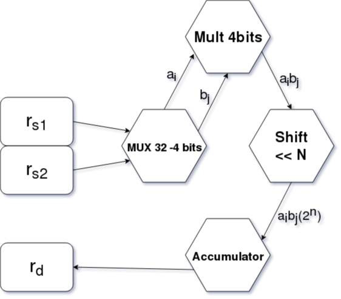

# “M” Standard Extension for Integer Multiplication and Division, Version 2.0

```VHDL
rd(63 downto 0) <= rs2(31 downto 0) * rs1(31 downto 0) 

a7(3 downto 0) <= rs1(31 downto 28); 
a6(3 downto 0) <= rs1(27 downto 24); 
a5(3 downto 0) <= rs1(23 downto 20); 
a4(3 downto 0) <= rs1(19 downto 16); 
a3(3 downto 0) <= rs1(15 downto 12); 
a2(3 downto 0) <= rs1(11 downto 8); 
a1(3 downto 0) <= rs1(7 downto 4); 
a0(3 downto 0) <= rs1(3 downto 0); 

b7(3 downto 0) <= rs2(31 downto 28); 
b6(3 downto 0) <= rs2(27 downto 24); 
b5(3 downto 0) <= rs2(23 downto 20); 
b4(3 downto 0) <= rs2(19 downto 16); 
b3(3 downto 0) <= rs2(15 downto 12); 
b2(3 downto 0) <= rs2(11 downto 8); 
b1(3 downto 0) <= rs2(7 downto 4); 
b0(3 downto 0) <= rs2(3 downto 0); 

a(31 downto 0) <= a7*(2^28) + 
 				  a6*(2^24) + 
 				  a5*(2^20) + 
 				  a4*(2^16) + 
 				  a3*(2^12) + 
 				  a2*(2^08) + 
 				  a1*(2^04) + 
 				  a0;

b(31 downto 0) <= b7*(2^28) + 
 				  b6*(2^24) + 
 				  b5*(2^20) + 
 				  b4*(2^16) + 
 				  b3*(2^12) + 
 				  b2*(2^08) + 
 				  b1*(2^04) + 
 				  b0;

rd <= a7b7*(2^56) + a7b6*(2^52) + a7b5*(2^48) + a7b4*(2^44) + a7b3*(2^40) + a7b2*(2^36) + a7b1*(2^32) + a7b0*(2^28) +
	  a6b7*(2^52) + a6b6*(2^48) + a6b5*(2^44) + a6b4*(2^40) + a6b3*(2^36) + a6b2*(2^32) + a6b1*(2^28) + a6b0*(2^24) +
	  a5b7*(2^48) + a5b6*(2^44) + a5b5*(2^40) + a5b4*(2^36) + a5b3*(2^32) + a6b2*(2^28) + a6b1*(2^24) + a6b0*(2^20) +
	  a4b7*(2^44) + a5b6*(2^40) + a5b5*(2^36) + a5b4*(2^32) + a5b3*(2^28) + a6b2*(2^24) + a6b1*(2^20) + a6b0*(2^16) +
	  a3b7*(2^40) + a5b6*(2^36) + a5b5*(2^32) + a5b4*(2^28) + a5b3*(2^24) + a6b2*(2^20) + a6b1*(2^16) + a6b0*(2^12) +
	  a2b7*(2^36) + a5b6*(2^32) + a5b5*(2^28) + a5b4*(2^24) + a5b3*(2^20) + a6b2*(2^16) + a6b1*(2^12) + a6b0*(2^8)  +
	  a1b7*(2^32) + a5b6*(2^28) + a5b5*(2^24) + a5b4*(2^20) + a5b3*(2^16) + a6b2*(2^12) + a6b1*(2^8)  + a6b0*(2^4)  +
	  a0b7*(2^28) + a5b6*(2^24) + a5b5*(2^20) + a5b4*(2^16) + a5b3*(2^12) + a6b2*(2^8)  + a6b1*(2^4)  + a6b0;

```

