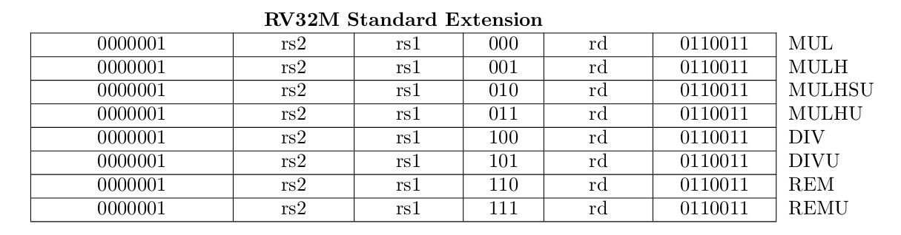
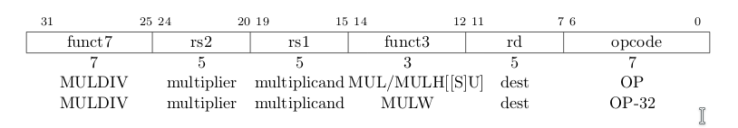
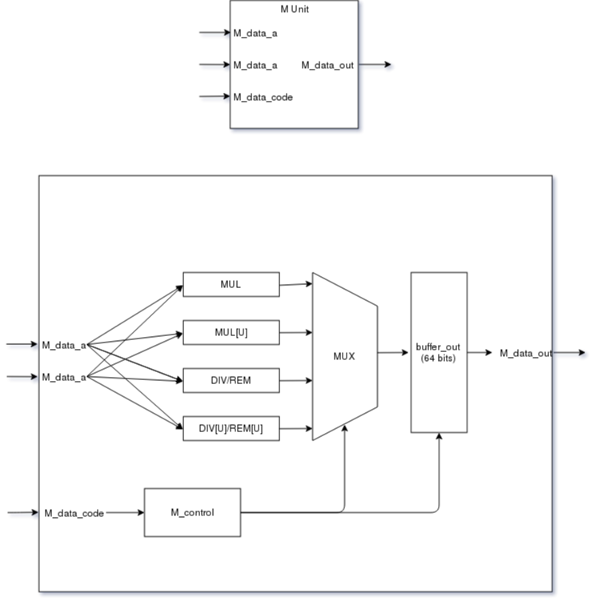

# [“M” Standard Extension for Integer Multiplication and Division, Version 2.0](https://content.riscv.org/wp-content/uploads/2017/05/riscv-spec-v2.2.pdf#chapter.6)

[RV32/64G Instruction Set Listings](https://content.riscv.org/wp-content/uploads/2017/05/riscv-spec-v2.2.pdf#chapter.19)

* MUL - **Signed\*Signed** 32 bits multiplication (rs1*rs2) - Place lower 32 bits in rd.
* MULH - **Signed\*Signed** 32 bits multiplication (rs1*rs2) - Place higher 32 bits in rd.
* MULHU - **Unsigned\*Unsigned** 32 bits multiplication (rs1*rs2) - Place higher 32 bits in rd.
* MULHSU - **Signed\*Unsigned** 32 bits multiplication (rs1*rs2) - Place higher 32 bits in rd.
* DIV - **Signed\*Signed** 32 bits division (rs1*rs2) - Place lower 32 bits in rd.
* DIVU - **Unsigned\*Unsigned** 32 bits division (rs1*rs2) - Place lower 32 bits in rd.
* REM - **Signed** remainder of the corresponding division operation
* REMU - **Unsigned** remainder of the corresponding division operation

