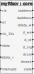

# RISC SoftCore

[](./README.md)

RISC SoftCore is a dyadic-purpose VHDL implementation of the RISCV RV32IM instruction set. This particular version does not implement a pipeline. The idea is to create a microcontroller with common peripherals such as I2C, USART, SPI and GPIOs initially used for the discipline of Programmable Logic Devices.

Programming/compiler tools can be obtained from this [link](https://github.com/xpack-dev-tools/riscv-none-embed-gcc-xpack/releases).

Check in-depth architecture here:  [Virgularor, a minimum RISC-V](http://tice.sea.eseo.fr/riscv/)

Check [here](https://github.com/TheThirdOne/rars) a assembly simulator based on Mars



## Getting Started (hardware):

- Simulation:
    - Run this script [testbench.do](./testbench.do) in Modelsim (Altera Edition).
    - Main testbench: [testbench.vhd](./testbench.vhd).Simulates the core, a timer and general purpose pins (gpio and 7-segment display).
    - Check that the program file is pointed correctly  (i.e.: __./software/quartus_blink.hex__) in module [iram_quartus.vhdl](./memory/iram_quartus.vhd).
    - See this [complete diagram](./readme_img/testbench.svg)

- Synthesis: Quartus 19.1 or higher (tested in the DE10- Lite development Kit)
    - Open the generic project at [./peripherals/gpio/sint/de10_lite/](./peripherals/gpio/sint/de10_lite/)
    - For post-synthesis software programming :
        - Quartus Main Menu: Tools -> In-System Memory Editor

## Getting Started (software):

Compilation of programs requires the _toolchain_ __riscv32-unknown-elf__ (or __riscv-none-embed__) supporting the subset __RV32IM__, __without ABI__. At ./software/ folder, there are several examples. Note that in the current phase of the project we use a custom _linker_ _script_ (sections.ld). _libc_ has not yet been tested/supported.

### For Linux

Install tutorial [here](https://gnu-mcu-eclipse.github.io/toolchain/riscv/install/#gnulinux)

Toolchain Release: riscv-none-gcc [Github](https://github.com/xpack-dev-tools/riscv-none-embed-gcc-xpack/releases).

When using xPacks it may be necessary to export the  `XPACKS_REPO_FOLDER` environment variable:

```export XPACKS_REPO_FOLDER=~/opt/xPacks/```

Arch Linux Instructions:

```bash
sudo pacman -Syyu npm
sudo npm install --global xpm@latest
export XPACKS_REPO_FOLDER=~/opt/xPacks/
mkdir -p $XPACKS_REPO_FOLDER
xpm install --global @xpack-dev-tools/riscv-none-embed-gcc@latest
export MY_PLD_WORKSPACE=~/workspace_vhdl
mkdir -p $MY_PLD_WORKSPACE
cd $MY_PLD_WORKSPACE
git clone https://github.com/xtarke/riscv-multicycle
cd $MY_PLD_WORKSPACE/riscv-multicycle/tests
```

1. Update Makefile with the toolchain folder:

```bash
RISCV_TOOLS_PREFIX = ~/opt/xPacks/@xpack-dev-tools/riscv-none-embed-gcc/8.3.0-1.1.1/.content/bin/riscv-none-embed-
```

2. Type _make_ to compile.

### For Windows Subsystem (WSL):

1. Install WSL: [Microsoft Docs](https://docs.microsoft.com/en-us/windows/wsl/install-win10)

2. Install Ubuntu in WSL

- Follow this [link](https://devblogs.microsoft.com/commandline/an-in-depth-tutorial-on-linux-development-on-windows-with-wsl-and-visual-studio-code/) to integrate Visual Code with the built-in compiler in WSL:    

3. At Ubuntu shell Ubuntu:

4. Install nodejs:

```sudo apt update
sudo apt upgrade
sudo apt install nodejs
sudo apt install npm
sudo npm --global install xpm
```

5. Install the toolchain using xmp [GNU Eclipse](https://gnu-mcu-eclipse.github.io/toolchain/riscv/install/):

```bash
xpm install --global @gnu-mcu-eclipse/riscv-none-gcc
```

6.  Update Makefile with the toolchain folder:

  - from:
  ```bash
  RISCV_TOOLS_PREFIX = riscv32-unknown-elf-
  ```

	- to:
  ```bash
  RISCV_TOOLS_PREFIX = ~/opt/xPacks/@<versão compilador>/.contents/bin/riscv-none-embed-```

7. Change current directory to the risc-v repository at Ubuntu shell:

```bash
cd /mnt/c/<cWindows path>/software/
```

8. Type  _make_ to compile.
