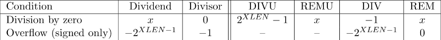

# [“M” Standard Extension for Integer Multiplication and Division, Version 2.0](https://content.riscv.org/wp-content/uploads/2017/05/riscv-spec-v2.2.pdf#chapter.6)

[RV32/64G Instruction Set Listings](https://content.riscv.org/wp-content/uploads/2017/05/riscv-spec-v2.2.pdf#chapter.19)


* MUL - **Signed\*Signed** 32 bits multiplication (rs1*rs2) - Place lower 32 bits in rd.
* MULH - **Signed\*Signed** 32 bits multiplication (rs1*rs2) - Place higher 32 bits in rd.
* MULHU - **Unsigned\*Unsigned** 32 bits multiplication (rs1*rs2) - Place higher 32 bits in rd.
* MULHSU - **Signed\*Unsigned** 32 bits multiplication (rs1*rs2) - Place higher 32 bits in rd.
* DIV - **Signed\*Signed** 32 bits division (rs1*rs2) - Place lower 32 bits in rd.
* DIVU - **Unsigned\*Unsigned** 32 bits division (rs1*rs2) - Place lower 32 bits in rd.
* REM - **Signed** remainder of the corresponding division operation
* REMU - **Unsigned** remainder of the corresponding division operation


# RISC-V Division Exceptions

Some situations may occur where is no possible to return a correct result as when happens in a division by zero or a sign overflow, the risc standard stipulate the behavior of these two in the following table.



# Divider block

The design of this block came from the article [Rethinking Integer Divider Design for FPGA-based Soft-Processors](http://www.sfu.ca/~zhenman/files/C17-FCCM2019-Divider.pdf), and of the two designs presented there we sticked with the one that uses less resource from the FPGA, that is, the quick-naive implementation. The algorithm is sumarized as:

```python
Remainder = Dividend, Quotient = 0
while(Remainder > Divisor) {
	msb_d = [log_2(Remainder)] - [log_2(Divisor)]
	EstimatedDivisor = (2**msb_d)*Divisor
	A = Remainder - EstimatedDivisor
	B = Remainder - EstimatedDivisor/2
	Quotient[(A < 0) ? msb_d-1:msb_d] = 1
	Remainder = (A < 0) ? B:A
}
```

Since this divider is unsigned, it was necessary to do sign conversion when dealing with negative numbers in sign division.

## Performing the division in one clock cicle

The division can take up to 32 clock cicles to complete the division, so, so as not to slow down the processor while doing division, we feed a clock signal that is thirty-two times the core clock, in doing so the core can get the result in what seems a single clock instruction to him. This technique is called multi-pump.

## FPGA Resources with the new divider

Comparing the use of resources in a same project, the only difference between the three projects is the divider block.

|Implementation|Total logic elements|Total registers|Total pins|Total memory bits|Embedded Multiplier 9-bit elements|Total PLLs|
|--------------|--------------------|---------------|----------|-----------------|----------------------------------|----------|
|Old one|7,773/49,760 (16%)|864|149/360 (41%)|67,584/1,677,312 (4%)|16/288 (6%)|1/4 (25%)|
|quick-clz|5,135/49,760 (10%)|1250|149/360 (41%)|67,584/1,677,312 (4%)|16/288 (6%)|1/4 (25%)|
|quick-naive|4,621/49,760 (9%)|1250|149/360 (41%)|67,584/1,677,312 (4%)|16/288 (6%)|1/4 (25%)|

## Files to use M unit:

* division_functions.vhd - Functions used in the divider block
* quick_naive.vhd - Divider block
* M_types.vhd
* M.vhd

## Testbench:

* tb_M.do - Modelsim
* tb_M.vhd

## Code to Teste:
```C
#include "utils.h"
#include "hardware.h"
#include <limits.h>

int main(){
	volatile int a_int32=3, b_int32=2;
	volatile int a_int64=3, b_int64=2;

	volatile uint32_t a_uint32=INT_MAX, b_uint32=2;
	volatile uint64_t a_uint64=INT_MAX, b_uint64=2;

	volatile uint64_t mul_result;
 	volatile uint32_t mulh_result;
 	volatile uint32_t mulhsu_result;
 	volatile uint32_t mulhu_result;
 	volatile int div_result;
 	volatile uint32_t divu_result;
 	volatile int rem_result;
 	volatile uint32_t remu_result;

	while (1){


		mul_result = a_uint32 * b_int32;

		mulh_result = a_int64*b_int64;

		mulhsu_result = a_uint64*b_uint64;

		mulh_result = a_int64*b_int64;

		div_result = a_int32/b_int32;

		divu_result = a_uint32/b_uint32;

		div_result = a_int32%b_int32;

		divu_result = a_uint32%b_uint32;
	}

	return 0;
}
```
