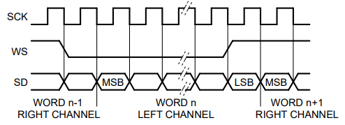
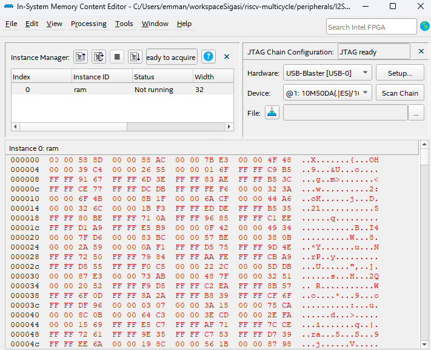
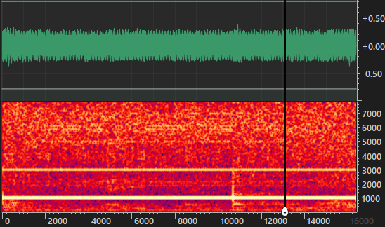
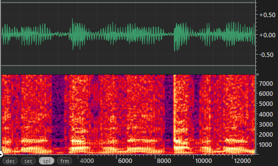

# Protocolo de comunicação I2S

O protocolo I²S (ou I2S, como também é conhecido) é uma interface serial utilizada para transmitir áudio digital de dois canais em formato de modulação por código de pulso (PCM) entre componentes de circuitos integrados em dispositivos eletrônicos.

### O que é o I²S?

- O I²S (Inter-Integrated Circuit Sound) é um protocolo de comunicação serial síncrono. Ele foi introduzido em 1986 pela Philips Semiconductor (agora conhecida como NXP Semiconductors) e tem sido amplamente utilizado em dispositivos de áudio e sistemas embarcados.
- A principal finalidade do I²S é transmitir dados de áudio digital entre componentes, como microcontroladores, processadores de sinal digital (DSPs), conversores analógico-digital (ADCs) e conversores digital-analógico (DACs).

### Como funciona o I²S?
O barramento I²S utiliza três linhas principais:
- Serial Clock (SCK): Também conhecido como bit clock (BCLK), é responsável por sincronizar a transmissão dos dados.
- Word Select (WS): Também chamado de left-right clock (LRCLK) ou frame sync (FS), indica qual canal (esquerdo ou direito) está sendo transmitido. O WS tem uma frequência igual à taxa de amostragem.
- Serial Data (SD): Transmite os dados de áudio.

### Funcionamento

Para o funcionamento do periférico deve se atentar que: 
- O I2S desenvolvido possui uma resolução de 32 bits e como o microfone usado nos testes era de 24 bits foi necessário ajuste na leitura (processo ready em i2s.vhd), então ele deve ser ajustado conforme o mic usado para garantir a leitura correta.

- A taxa de amostragem é definida por $ clk/64 $, nos testes foi usado um clk de 1Mhz resultando em uma taxa de amostragem de 15625Hz. Caso for utilizar um clk menor, o áudio captado poderá ser prejudicado, visto que devemos ter uma taxa de amostragem de pelo menos o dobro da maior frequência que será captada para garantir a integridade do sinal.

- Para o funcionamento também é necessário ter nível lógico alto no pino de enable.

- O áudio captado é escrito na memória desenvolvidada, ela escreve de maneira circular, ou seja, sempre o dado será escrito sob o antigo, ela suporta 16384 palavras de 32 bits, logo é salvo aproximamente 1 segundo. Também deve ser resaltado que é gravado somente o dado do microfone direito, pois somente ele esta transmitindo nos testes. 

### Gravando um áudio

Foi utilizado kit DE10-Lite, baseado na FPGA MAX10 para gravar um áudio, deve-se conectar o mic do seguinte modo:

    ARDUINO_IO(0) <= sck;
	ARDUINO_IO(2) <= ws;
	ARDUINO_IO(4) <= sd;

Com a hardware já em funcionamento use o In-System Memory Contet Editor para ler a memória e exportar o áudio, verá algo semelhate a isso:

Como o áudio é exportado em .hex e a parte significativa do áudio são os 24 bits menos significativos, iremos converter à inteiro sinalizado com um ganho, dessa forma podemos ouvir o áudio gravado. Para isso foi usado um script python para fazer a conversão.

    # Lê o arquivo original
    with open('audio.hex', 'r') as arquivo_original:
        linhas = arquivo_original.readlines()

    # Extrai os caracteres de cada linha
    ultimos_caracteres = [linha.strip()[-10:-2] for linha in linhas]

    # Cria um novo arquivo para salvar os caracteres
    with open('audio.txt', 'w') as novo_arquivo:
        for caracteres in ultimos_caracteres:
            inteiro = int(caracteres,16)
            if inteiro &(1 << (31)):
                inteiro -= 1 << 32
            novo_arquivo.write(str(inteiro*256) + '\n')

Para a análise da gravação foi utilizado o Ocenaudio.
Abaixo tem o espectro do áudio gravado quando é emitido um som na frequência de 1KHz.

Testando o microfone com voz se tem o seguinte resultado:

### Pendências

- Integrar com o softcore;
- Ajustar os timings do sinal de WS e gravação na memória.
