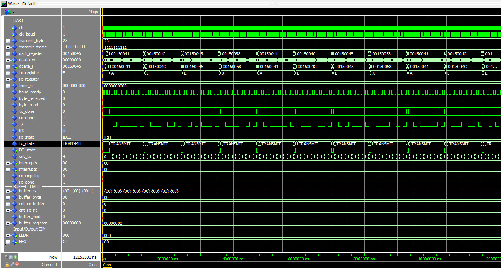

# RS485
---

O periférico realiza a comunicação RS485 com um baudrate de 9600. Tanto a transmissão quanto a recepção foram implementados e testados no Kit de desenvolvimento DE-10 Lite.

Descrição de entradas e saídas do componentes:
* clk	: Clock de entrada que será utilizado para os processos das máquinas de estado Moore e para sinalização de interrupção;
* rst   : Reset o funcionamento da UART;
* clk_baud	: Clock relacionado à transmissão e recepção de dados;
* daddress   : Endereço dos dados a serem lidos ou escritos; 
* ddata_w    : Dado de 32 bits para a escrita na memória do periférico;
* ddata_r    : Dado de 32 bits para a leitura na memória do periférico;
* d_we       : Sinal para habilitar a escrita na memória;
* d_rd       : Sinal para habilitar a leitura na memória;
* dcsel      : Dado para a seleção do chip;
* dmask      : Seleção da máscara para leitura e escrita entre Word,half word e byte;
* tx_out     : Saída de transmissão de dados;
* rx_out     : Entrada de recepção de dados;
* interrupts : Flag utilizada para sinalizar uma interrupção quando a interrupção para o periférico está habilitada;
* rs485_dir_DE : Sinal de controle para transeiver RS485, '1' para transmissor, '0' para receptor

É importante ressaltar a síntese da PLL para gerar os clocks utilizados:

- Output clocks:
	- clk c0 em 1 MHz
	- clk c1 em 50 MHz
	- clk c2 em 0.03840000 MHz (38400 Hz)

## Analise inicial para implementação RS485

Analisando os periféricos disponíveis no repositório desta disciplina verificamos que o mesmo já possui uma implantação UART, este tipo de interface implementa a mesma forma de comunicação necessária para a implementação do periférico de comunicação RS485, entretanto UART realiza esta comunicação de forma Fullduplex, um par de fios para transmissão e um par para a recepção de dados.
Ja na comunicação RS485 a comunicação é Halffuplex, o mesmo par de fios é utilizado para envio e recebimento de dados. Além deste ponto a frequência de comunicação necessita ser 9600.
Considerando que o processo de comunicação UART ja esta descrito em seu respectivo diretório, realizaremos a descrição apenas dos pontos de alteração necessário para realizar a criação do modulo RS485.
#### Transeiver :
Por padrão a comunicação RS-485 define um sinal diferencial de tensão entre um par de fios,  1.5v/-1.5v. Este nível de sinal não pode ser conectado diretamente ao FPGA, desta forma verificamos a necessidade de conectar o periférico a um transeiver. Analisado a documentação do mesmo, foi verificado a necessidade de 3 sinais:
- **RX**: canal de comunicação para o recebimento de dados;
- **TX**: canal de comunicação para o envio de dados;
- **DE**: sinal que informa ao transeiver se o periferico esta escutando ou transmitindo dados.  '1' para transmissor, '0' para receptor; 

Como a implementação UART já possuía os sinais RX e RX implementados, nossa implementação iniciou por realizar a criação do sinal de controle do transeiver, ``rs485_dir_DE``;

```VHDL
    ----------- Port declations RS485.VHDL ----------
        -- sinal de controle de direção [RS485]
        rs485_dir_DE : out std_logic    -- '1' para transmissor, '0' para receptor
    );
```
```VHDL
    ----------- Signals declations RS485.VHDL ----------
		-- Sinal interno para controle de direção RS485 [RS485]
	    signal rs485_dir_int : std_logic := '0';
    );
```

O segundo passo foi criar a função de controle deste sinal. A função foi criada de forma a monitorar a maquina de estado de controle do ``TX``, sempre que esta sai de ``IDLE`` a função coloca o sinal em ``1``, colocando o transeiver em modo de transmissão.

```VHDL
	-- Atribuição para o controle de direção RS485 [RS485]
    rs485_dir_DE <= rs485_dir_int;

    -- Processo para atualizar o controle de direção com base na máquina de estados do TX [RS485]
    process(clk, rst)
    begin
        if rst = '1' then
            rs485_dir_int <= '0';       -- Modo recepção por padrão
        elsif rising_edge(clk) then
            if state_tx /= IDLE then
                rs485_dir_int <= '1';   -- Ativa transmissão sempre que state_tx não estiver em IDLE, estiver transmitindo
            else
                rs485_dir_int <= '0';   -- Caso contrario volta para o modo recepção
            end if;
        end if;
    end process;
```
#### Conversão em novo periférico:
Com estas alterações realizamos a criação deste novo periférico que RS485 e realizamos os  ajustes necessários para conecta-lo ao mux do barramento de comunicação do core do processador e o apontamento da região de memória a destinada para este novo periférico.

```C
//hardware.h adicionado
#define RS485_BASE_ADDRESS               	(*(_IO32 *) (PERIPH_BASE + 23*16*4))
```
```VHDL
	----------- port declaration - iodatabusmux.vhd ----------
    ddata_r_RS485 => ddata_r_RS485 -- adicionando novo io do mux
```
```VHDL   
   ----------- entity declaration - RS485.vhd ----------
    generic(
        --! Chip selec
        MY_CHIPSELECT   : std_logic_vector(1 downto 0) := "10";
        MY_WORD_ADDRESS : unsigned(15 downto 0)        := x"0170"
    );
```
```VHDL
	----------- architecture - iodatabusmux.vhd ----------
	with daddress(19 downto 4) select ddata_r_periph <=
        ddata_r_gpio when x"0000",
        ddata_r_segments when x"0001",
        ddata_r_uart when x"0002",
        ddata_r_adc when x"0003",
        ddata_r_i2c when x"0004",
        ddata_r_timer when x"0005",
        ddata_r_dif_fil when x"0008",
        ddata_r_stepmot when x"0009",
        ddata_r_lcd when x"000A",
        ddata_r_nn_accelerator when x"000B",
        ddata_r_fir_fil  when x"000D",
        ddata_r_key when x"000E",
        ddata_r_crc when x"000F",
        ddata_r_spwm  when x"0011",
        ddata_r_accelerometer when x"0012",
		ddata_r_RS485 when x"0017", -- data_r de RS485 adicionado
        -- Add new io peripherals here
        (others => '0') when others;
```
A síntese do projeto  em ``de10_lite.vhd`` foi adicionado um novo sinal de saída, DE para conexão do FPGA ao transeiver RS485.
```VHDL
	----------- Peripheral data signals - de10_lite.vhd ----------
	signal ddata_r_RS485          : std_logic_vector(31 downto 0);
```
```VHDL
	----------- RS485_inst - iodatabusmux.vhd ----------
	RS485_inst : entity work.RS485
		port map(
			clk          => clk,
			rst          => rst,
			clk_baud     => clk_baud,
			daddress     => daddress,
			ddata_w      => ddata_w,
			ddata_r      => ddata_r_uart,
			d_we         => d_we,
			d_rd         => d_rd,
			dcsel        => dcsel,
			dmask        => dmask,
			tx_out       => ARDUINO_IO(1),
			rx_out       => ARDUINO_IO(0),
			interrupts   => uart_interrupts,
			rs485_dir_DE => ARDUINO_IO(3) --[RS485] Conectando sinal DE ao IO para conectar ao transeiver
		);
```
## Simulação:
~~ADICIONAR DESCRIÇÃO DA CRIAÇÃO DA FUNÇÃO DE ENVIO EM C~~


Durante as tentativas de simulação do periférico verificamos que durante o envio de bytes, a flag ``tx_done.vhd`` estava apresentando um comportamento inesperado que causava um erro ao enviar dados em sequencia em um curto espaço de tempo. Isso ocorria pois o processo temporiza a transmissão através do contador ``cnt_rx`` entretanto a maquina de estados terminava o processo e entrava em ``IDLE`` antes que a contagem retornasse a ``0``, resultando em um pulo de etapas caso um segundo envio fosse realizado muito rapidamente.

 
 
 Para evitar que isto ocorresse , implementamos uma alteração na maquina de estados do TX de forma a garantir que durante envios sequenciais a contagem tenha realmente terminado antes de iniciar uma nova transmissão, este processo foi realizado durante o estado  ``MOUNT_BYTE``.
```VHDL
	----------- Maquina de estado TX: Moore - RS485.vhd ----------
	----------- MOUNT_BYTE - NOVO ----------
                when MOUNT_BYTE =>
                    if (cnt_tx > 1) then
                        state_tx <= MOUNT_BYTE;
                    else
                        state_tx <= TRANSMIT;
                    end if;
                when MOUNT_BYTE_PARITY =>
                    if (cnt_tx > 1) then
                        state_tx <= MOUNT_BYTE_PARITY;
                    else
                        state_tx <= TRANSMIT_PARITY;
                    end if;
```
```VHDL
	----------- Maquina de estado TX: MEALY - RS485.vhd ----------
	----------- MOUNT_BYTE - NOVO ----------
            when MOUNT_BYTE =>
                if (cnt_tx = 0) then
                    to_tx <= "11" & tx_register(7 downto 0) & '0';
                end if;

            when MOUNT_BYTE_PARITY =>
                if (cnt_tx = 0) then
                    to_tx_p <= "11" & tx_register(7 downto 0) & parity & '0';
                end if;
```
Com esses ajustes em caso de envios sucessivos a maquina de estados entra em ``MOUNT_BYTE`` e aguarda a contagem zerar, respeitando a temporização de envio dos dados. Nos casos analisados este tempo em "espera" normalmente durante 1 ciclo de clock ``baud_ready``. Com esse ajuste conseguimos realizar a simulação de envio com sucesso.
Na imagem a seguir pode ser visualizado o envio dos caracteres ``A L E X`` e o acionamento do controle ``DE_state``, sinal realizado para informar ao transeiver que esta sendo realizada a transmissão.

 

Em seguida iniciamos a simulação do recebimento de dados, para isso criamos 2 processos no ``testebench.vhd``.
O primeiro processo carrega o hexadecimal desejado ao sinal ``transmit_byte`` e depois monta ele e coloca em ``transmit_frame``.
```VHDL
process
    begin
        wait for 9 ms;
        -- wait for 300 us;

        transmit_byte  <= x"81";
        transmit_frame <= '1' & transmit_byte & '0';

        wait;
    end process;
```
O segundo processo espera o dado estar preparado para envio, salvo em ``transmit_frame`` e então realiza a simulação de envio para a entrada de dados ``RX``.
```VHDL
    data_transmit_proc : process
    begin
        RX <= '1';
        wait on transmit_frame;         -- Espera até que transmit_frame mude
        wait for 10 us;
        for i in 0 to 9 loop
            RX <= (transmit_frame(i));
            wait until clk_state;
        end loop;
    end process;
```

