# PWM Space Vector Monofásico 
Alunos: Eduardo Francisco Pereira e Cicero Eduardo Dick Junior.

-------
## Periférico
Implementaçao do periferico de PWM Space Vector Monofásico, que gera os sinais de chaveamento para uma ponte H monofásica 

<figure style="text-align: center;">
  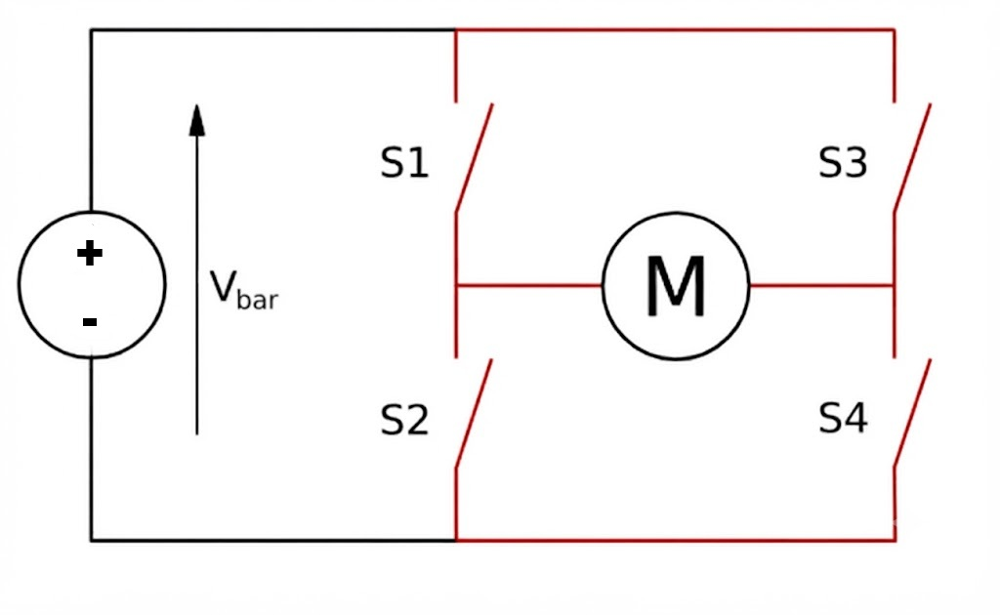
  <figcaption><em>Figura 1: Esquema da Ponte H Monofásica.</em></figcaption>
</figure>

## Descrição dos pinos

    
    clk  ->  Sinal de clock conectado ao Clock de 50MHz.
    rst  ->  Sinal de reset, deve ser conectado ao barramento do `reset` do softcore.
    gate_s1 -> Sinal de saída do gate do transistor S1.
    gate_s2 -> Sinal de saída do gate do transistor S2.
    gate_s3 -> Sinal de saída do gate do transistor S3.
    gate_s4-> Sinal de saída do gate do transistor S4.

## Definição:

Space Vector Pulse Width Modulation (SVPWM) é uma técnica de modulação por largura de pulso que utiliza vetores espaciais para controlar a tensão aplicada a cargas, como motores elétricos. As características principais do SVPWM incluem a mudança de estado de uma chave por vez, a utilização de vetores nulos para reduzir a distorção harmônica e a capacidade de fazer a carga enchergar o dobro da frequencia de chaveamento, resultando em uma operação mais eficiente e suave. 

## Funcionamento do Space Vector PWM Monofásico

Diferente dos métodos tradicionais de modulação por largura de pulso (PWM), o Space Vector PWM (SV-PWM) utiliza uma abordagem baseada dividir o período de chaveamento em segmentos, aplicando vetores ativos e nulos de forma que a tensão média desejada seja obtida. 

## Cálculos: 

1º Passo: Entrar com dados de tensão e corrente do motor, frequência de operação e tensão de alimentação.

    Vbar = 100   -- Tensão de alimentação do motor
    f_sw = 10000 -- Frequência de chaveamento do PWM
    Ts = 1 / f_sw -- Período de chaveamento do PWM

2º Passo:  Calculo dos vetores ativos e nulos e as suas normalizaçoes

    --Vetores Reais
    vetor_0 = [0, 0, 0.0,  0.0,   0.0]
    vetor_1 = [1, 0, Vbar, 0.0,   Vbar]
    vetor_2 = [0, 1, 0.0,  Vbar, -Vbar]
    vetor_3 = [1, 1, Vbar, Vbar,  0.0]

    --Vetores Normalizados
    vetor_0_n = [vetor_0[0], vetor_0[1], vetor_0[2]/Vbar, vetor_0[3]/Vbar, vetor_0[4]/Vbar]
    vetor_1_n = [vetor_1[0], vetor_1[1], vetor_1[2]/Vbar, vetor_1[3]/Vbar, vetor_1[4]/Vbar]
    vetor_2_n = [vetor_2[0], vetor_2[1], vetor_2[2]/Vbar, vetor_2[3]/Vbar, vetor_2[4]/Vbar]
    vetor_3_n = [vetor_3[0], vetor_3[1], vetor_3[2]/Vbar, vetor_3[3]/Vbar, vetor_3[4]/Vbar]

3º Passo: entrada do vetor de comando e a sua normalização

    u_cmd = -60             -- Tensao a ser aplicada no motor
    u_cmd_L = u_cmd / Vbar  -- Normalização do vetor de comando

4º Passo: Identificação do setor e do vetor ativo a ser aplicado.

Verifica se u_cmd_L é maior que 0, se sim, então o setor é 1, caso contrário, o setor é 2.
Se o se tor for 1, então o vetor ativo a ser aplicado é o vetor_1_n, caso contrário, o vetor ativo a ser aplicado é o vetor_2_n.

5º Passo: Cálculo do tempo de aplicação dos vetores ativos e nulos.

    v1= vec_ativo_n[4]           -- Tensão do vetor ativo a ser aplicado
    M1 = 1 / v1                  -- Matriz de decomposição
    delta_t1 = Ts * M1 * u_cmd_L -- Tempo de aplicação do vetor ativo
    t_nulo_total = Ts - delta_t1 -- Tempo total de aplicação dos vetores nulos
    t_v_at_metade = delta_t1 / 2 -- Tempo de aplicação do vetor ativo dividido por 2
    t_v3 = t_nulo_total / 2      -- Tempo de aplicação do vetor nulo dividido por 2
    t_v0 = t_v3 / 2              -- Tempo de aplicação do vetor nulo dividido por 2

[Download arquivo python com os cálculos teóricos](./codigos/ModulaçãoSpaceVectorPonteCompletaMonofasica.ipynb)

## Resultados dos cálculos teóricos
  
  Para Vbar = 100V, f_sw = 10kHz e u_cmd = 60V:

  Passo | S1 | S3  |  VAB' | Duração (us)|
  ------|----|-----|-------|-------------|
   v0   |  0 |  0  |   0.0 |        10.0
   v1   |  1 |  0  |   1.0 |        30.0
   v3   |  1 |  1  |   0.0 |        20.0
   v1   |  1 |  0  |   1.0 |        30.0
   v0   |  0 |  0  |   0.0 |        10.0

  Para Vbar = 100V, f_sw = 10kHz e u_cmd = -60V:

  Passo | S1 | S3  |  VAB' | Duração (us)|
  ------|----|-----|-------|-------------|
   v0   |  0 |  0  |   0.0 |        10.0
   v2   |  0 |  1  |  -1.0 |        30.0
   v3   |  1 |  1  |   0.0 |        20.0
   v2   |  0 |  1  |  -1.0 |        30.0
   v0   |  0 |  0  |   0.0 |        10.0

## Como rodar o projeto

### 1. Compilar o firmware (software do softcore)

O periférico é controlado pelo software que roda no softcore RISC-V. Para compilar:

    cd software/sv_pwm
    make

Isso gera o arquivo `quartus_main_sv_pwm.hex`, usado tanto na simulação quanto na síntese para inicializar a memória de instruções. É necessário o toolchain RISC-V em `compiler/gcc/bin/riscv-none-elf-` (ou definir a variável `RISCV_TOOLS_PREFIX` apontando para outro toolchain).

### 2. Simulação do periférico isolado (Questa/ModelSim)

Simula apenas o núcleo SVPWM, com estímulos aplicados diretamente nas entradas (`v_bar`, `u_cmd`), sem o softcore:

    cd peripherals/SpaceVectorPWM
    do tb_space_vector_pwm.do

O script compila o periférico e o testbench, abre a janela de ondas com os sinais dos gates, da FSM e dos timers, e roda 1000 us.

### 3. Simulação integrada com o softcore

Simula o sistema completo: o core RISC-V executa o `main_sv_pwm.c` (compilado no passo 1), que configura o periférico pelo barramento de dados:

    cd peripherals/SpaceVectorPWM
    do tb_sv_pwm_core.do

O script compila o core, memórias, barramentos e o periférico, carrega o `quartus_main_sv_pwm.hex` na memória de instruções e roda 10 ms, com a janela de ondas já configurada (registradores do periférico, FSM, gates e displays).

### 4. Síntese e gravação na FPGA (DE10-Lite)

1. Compilar o firmware (passo 1).
2. Abrir o projeto `sint/de10_lite/de10_lite.qpf` no Quartus.
3. Executar *Start Compilation*.
4. Gravar o `.sof` gerado (em `output_files/`) na placa pelo *Programmer* (USB-Blaster).
5. Gravar i `.hex`compilado na memória do FPGA. 

Os gates ficam disponíveis nos pinos definidos no `de10_lite.qsf` para conexão com o driver da ponte H.

### 5. Controle via software

O driver em `software/sv_pwm/sv_pwm.c` expõe as funções de configuração e controle:

    #include "sv_pwm.h"

    sv_pwm_set_vbus(100);    // Tensão do barramento DC [V]
    sv_pwm_set_vcmd(60);     // Tensão de saída desejada [V] (aceita negativo)
    sv_pwm_set_fsw(10000);   // Frequência de chaveamento [Hz]

    sv_pwm_start();          // Inicia o chaveamento
    // ...
    sv_pwm_stop();           // Para o PWM: os 4 gates vão imediatamente para 0

## Simulação 

A simulação foi realizada no Questa/ModelSim com o testbench integrado ao softcore (`tb_sv_pwm_core.do`), com Vbar = 100V e f_sw = 10kHz.

### Start e tensão de 0V

A Figura 2 mostra o sinal `start` mudando de 0 para 1 e o início do chaveamento do PWM. Pelo sinal `estado` é possível verificar que o periférico se mantém no estado `ST_CALCULATE` até que o `start` seja 1. Como a tensão de comando `u_cmd` é 0V nesse momento, o periférico alterna apenas entre os vetores nulos — o estado em que S2 e S4 estão ligados (V0) e o estado em que S1 e S3 estão ligados (V3) — mantendo a diferença de tensão na saída em 0V.

<figure style="text-align: center;">
  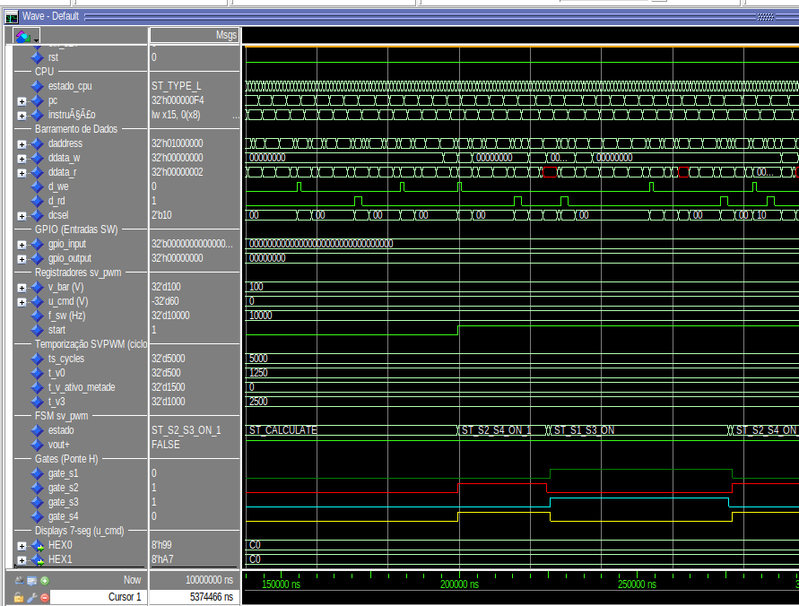
  <figcaption><em>Figura 2: Sinal start indo de 0 para 1 e início do chaveamento com u_cmd = 0V (apenas vetores nulos).</em></figcaption>
</figure>

### Para u_cmd = +60V

A Figura 3 mostra a forma de onda para o caso de uma tensão positiva, onde o PWM segue a sequência V0 → V1 → V3 → V1 → V0 definida pelos cálculos teóricos demonstrados na seção Cálculos.

<figure style="text-align: center;">
  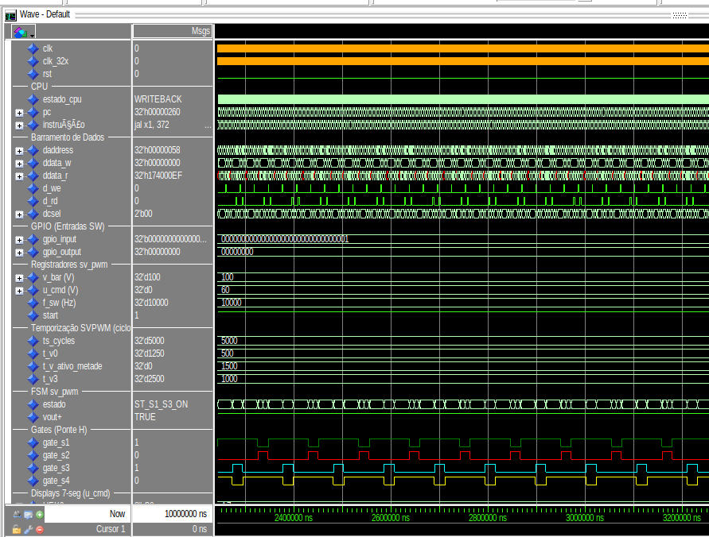
  <figcaption><em>Figura 3: Formas de onda dos gates para u_cmd = +60V.</em></figcaption>
</figure>

### Para u_cmd = -60V

A Figura 4 mostra a forma de onda para o caso de uma tensão negativa, onde o PWM segue a sequência V0 → V2 → V3 → V2 → V0, também conforme especificado pela teoria do Space Vector PWM.

<figure style="text-align: center;">
  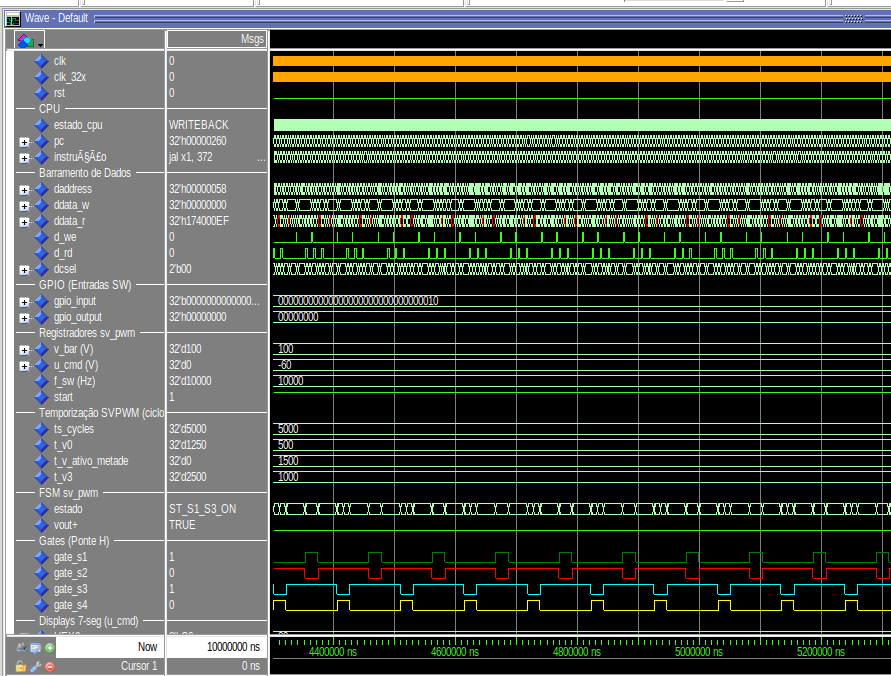
  <figcaption><em>Figura 4: Formas de onda dos gates para u_cmd = -60V.</em></figcaption>
</figure>

## Prática 

Confirmado o funcionamento do periférico através do modelsim, foi implementado o periférico na FPGA DE10-Lite. Foi utilizado o osciloscópio Tektronix TDS 2012C onde REFA era o gate_s1 e REF B era o gate_s2, Canal 1 era o gate_s3 e Canal 2 era o gate_s4. 

### Para Vbar = 100V, f_sw = 10kHz e u_cmd = 60V:
<figure style="text-align: center;">
  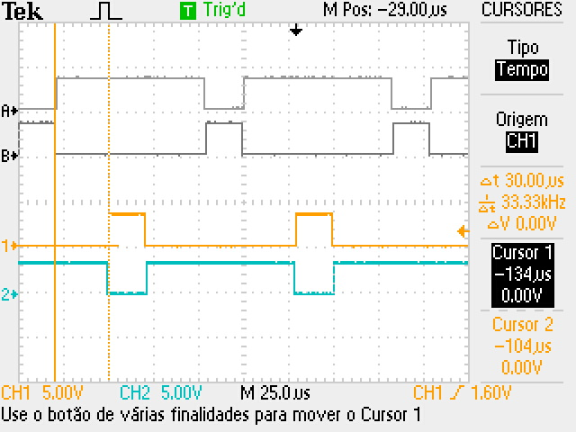
  <figcaption><em>Figura 5: Vetor V1 para +60V com 30us de duração.</em></figcaption>
</figure>

<figure style="text-align: center;">
  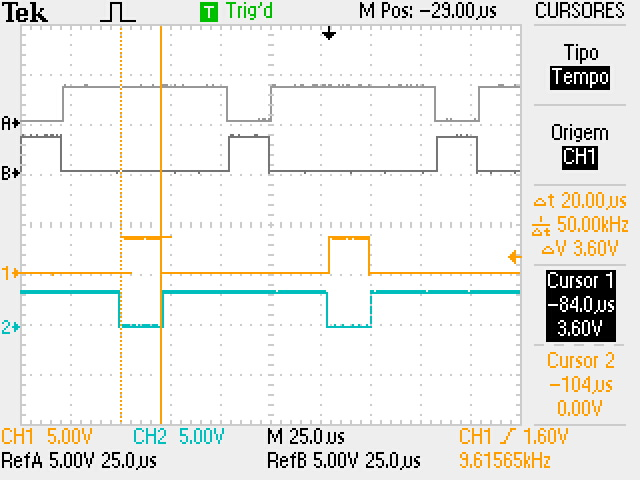
  <figcaption><em>Figura 6: Vetor V3 para +60V com 20us de duração.</em></figcaption>
</figure>

<figure style="text-align: center;">
  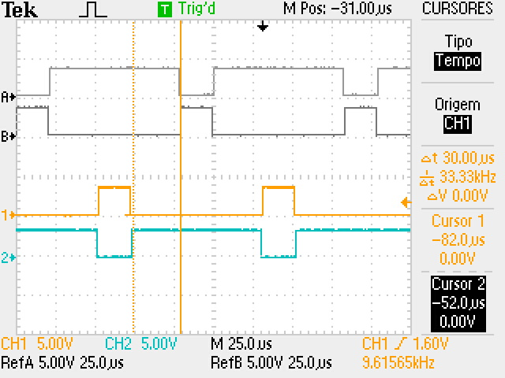
  <figcaption><em>Figura 7: Vetor V1 para +60V com 30us de duração.</em></figcaption>
</figure>

<figure style="text-align: center;">
  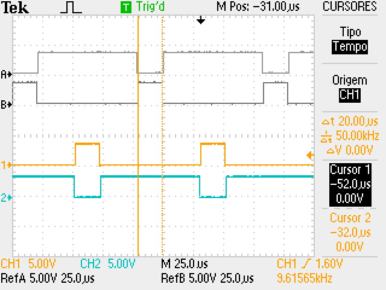
  <figcaption><em>Figura 8: Vetor V0 para +60V com 20us de duração( Está pegando o do fim e o do início 10us*2=20us).</em></figcaption>
</figure>

### Para Vbar = 100V, f_sw = 10kHz e u_cmd = -60V:

<figure style="text-align: center;">
  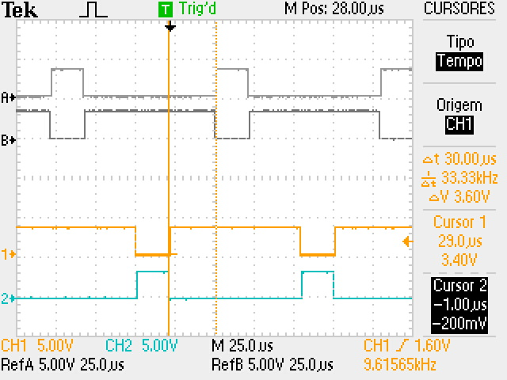
  <figcaption><em>Figura 9: Vetor V2 para -60V com 30us de duração.</em></figcaption>
</figure>

<figure style="text-align: center;">
  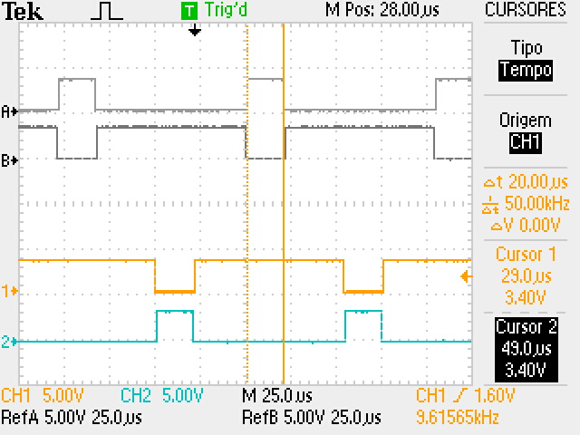
  <figcaption><em>Figura 10: Vetor V3 para -60V com 20us de duração.</em></figcaption>
</figure>

<figure style="text-align: center;">
  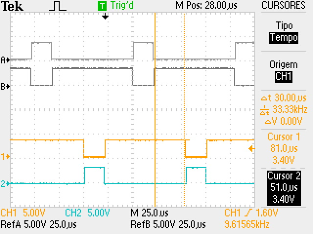
  <figcaption><em>Figura 11: Vetor V1 para -60V com 30us de duração.</em></figcaption>
</figure>

<figure style="text-align: center;">
  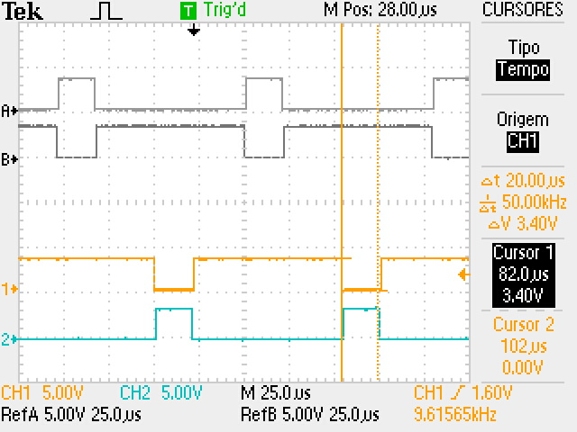
  <figcaption><em>Figura 12: Vetor V0 para -60V com 20us de duração( Está pegando o do fim e o do início 10us*2=20us).</em></figcaption>
</figure>

### Dead Time

    O dead time é o tempo de atraso entre a abertura de uma chave e o fechamento da outra chave do mesmo braço da ponte H, para evitar curto-circuitos. O tempo escolhido para o deadtime foi de 50 ciclos de clock, o que para um clock de 50MHz, resulta em um deadtime de 1us. 

<figure style="text-align: center;">
  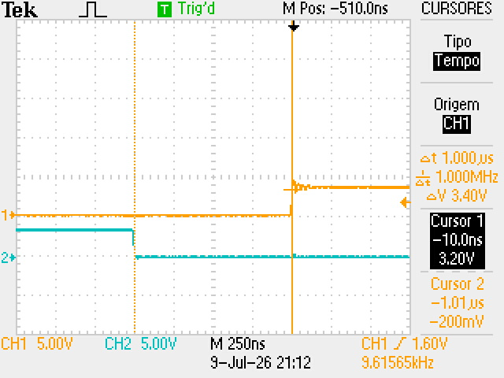
  <figcaption><em>Figura 13: Dead Time  com 1us de duração.</em></figcaption>
</figure>

##  Sugestões de melhorias
  - Implementar a geração de sinais de chaveamento para uma ponte H trifásica.
  - Utilizar os as outras chaves que sobraram da FPGA para mudar a tensão aplicada na carga
  - Atualizar o codigo para entrar com deadtime em ns ao inves de usar em ciclos de clock, para facilitar a implementação em outras FPGAs com frequencias diferentes.
## Referências
[Modulação Space Vector Para Inversores Alimentados em Tensão: Uma Abordagem Unificada](./documentos/ModulacaoSpaceVectorParaInversoresAlimentadosEmTensao.pdf)

