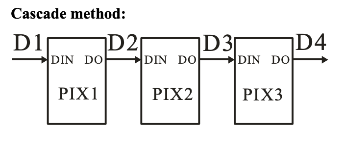
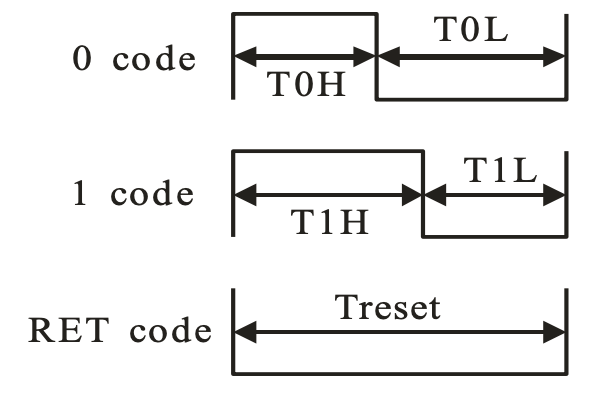
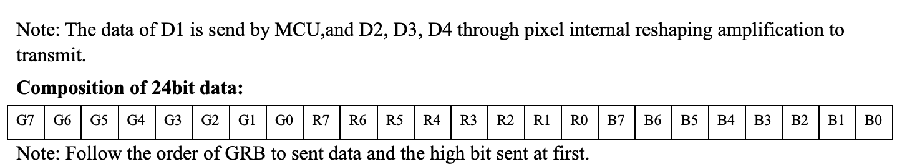
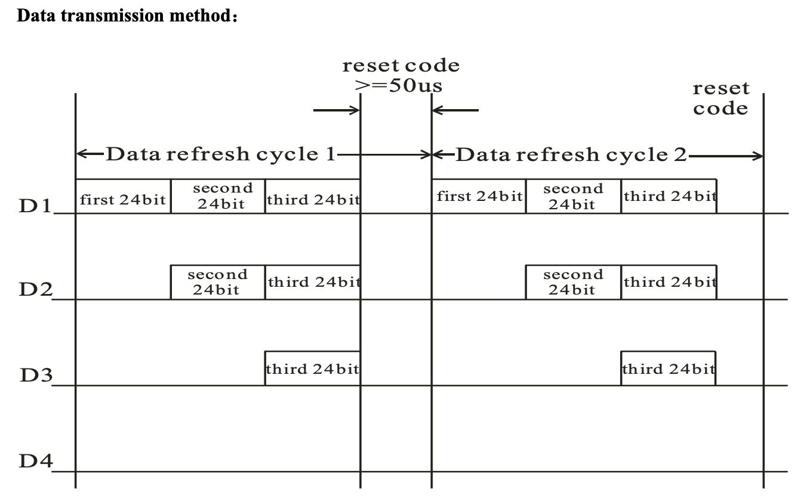
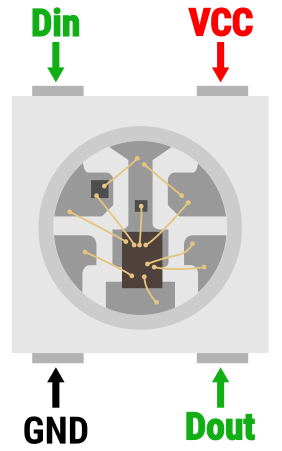
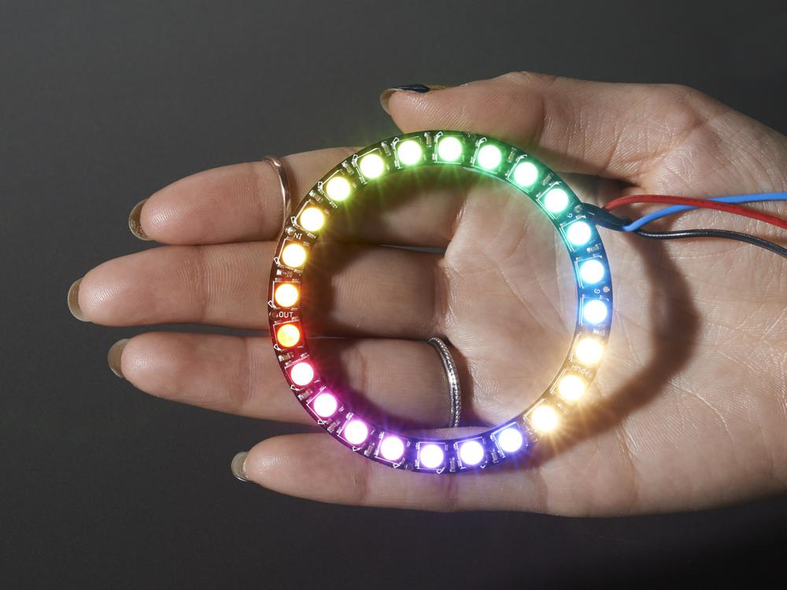
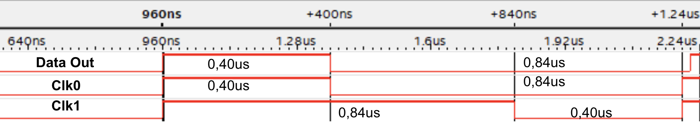

# Controlador WS2812B
 
O controlador WS2812B comanda o acionamento de LEDs RGB. Sua principal característica é a possibilidade de ser utilizado de forma cascateada, formando cadeias de LEDs que podem ser ativados individualmente. O controlador possui, além dos pinos de alimentação, dois terminais de dados: data_in e data_out. Desta forma, toda a comunicação de comando é feita utilizando-se apenas um fio.

    

Segundo o datasheet do controlador [WS-2812B](https://cdn-shop.adafruit.com/datasheets/WS2812B.pdf), para que o sistema interprete um sinal como bit 1, deverá ser gerado um sinal com 0,80us em nível lógico alto seguido por 0,45us em nível lógico baixo. Já para produzir um bit 0, o sinal deve iniciar com 0,45us em nível alto seguido por 0,85us em nível lógico baixo. O sinal de reset, que atualiza os valores dos LEDs, é interpretado quando o nível lógico baixo é mantido por pelo menos 50us:  

    

 
Para enviar a informação de cor para um LED é necessário respeitar seu formato de cor. As palavras de 24bits são compostas por 8 bits da cor verde (256 valores), 8 bits da cor vermelha e 8 bits da cor azul. O primeiro bit a ser lido é o de valor mais alto da cor verde.

    

Por fim, caso esteja-se utilizando um acionamento cascateado todos os bits, primeiramente todos os bits, de todos os LEDs devem ser enviados, seguidos por um sinal de reset que atualizará a cor dos LEDs pelos respectivos valores enviados. Por exemplo, caso esteja-se utilizando um anel com 16 LEDs únicos, deverão ser enviados 384 bits (16*24) antes do sinal de reset ser enviado.

    

## Simulação
O modelo foi simulado no software modelsim através do arquivo testebenchpll.vhd. Nele é possível ver como o sinal é modulado de acordo com os bits disponíveis na entrada data_in. O modelo atual utiliza 3 sinais de clock para gerar a saída esperada pelo controlador. O clock master possui duty cycle de 50%, com 20MHz e dita os momentos de transição entre nível lógico alto e baixo. O clk0 atua em 800KHz, com duty cycle de 32% (maior parte do tempo o sinal fica em nível lógico 0), exatamente no formato interpretado como bit 0. Já o clk1 atua em 800KHz com duty cycle de 68% (maior parte do tempo o sinal fica em nível lógico 1), exatamente no formato interpretado como bit 1. O modelo então segue o processo: ler bit atual da palavra em data in; mimetizar clk0 ou clk1 de acordo com o bit lido, replicando-o na saída.
 
 
## Montagem do circuito
O sinal data_out, a ser conectado ao LED (ou anel ou fita de LEDs), é disponível no pino `ARDUINO_IO 3`. Por definição, o kit de desenvolvimento testado utiliza 3.3V como nível lógico alto e ele pode ser utilizado diretamente para acionar os LEDs, no entanto, o controlador possui melhor performance quando acionado com nível lógico alto de 5V. Recomenda-se, portanto, utilizar um conversor de nível lógico 3.3V-5V para o acionamento. A alimentação do LED deve também ser feita com 5V.
 

    

 

    

 
## Resultados da síntese
A síntese foi testada com o auxílio do Signal Tap e do inSystem Sources and Probes. Com o Signal Tap observou-se que os intervalos de tempo para os bits 1 e 0 estavam de acordo com as simulações e dentro do especificado nos datasheets. O inSystem Source and Probe foi utilizado para alterar os sinais da entrada data in de forma a produzir cores diferentes no anel de LED utilizado para os testes. Não foram tiradas fotos do anel de LED aceso através deste método.

    

 
 
## ToDo
Para quem desejar complementar o periférico, sugere-se a seguinte lista de tarefas:

- 1. 'Hardware': Integrar o hardware sintetizado com o softcore. Para isso, a entrada data in deverá receber um sinal da outbus, de forma que o software consiga ditar quais cores deverão ser enviadas.

- 2. 'Software': Implementar funções de controle simples do tipo set_color(): Escrever em data in os bits correspondentes a cor desejada no formato GRB.

- 3. 'Software': Implementar controle para a mudança dos dados em data in de forma a sincronizar com o hardware. Cada bit tem duração de 1.25us, de forma que, para cada LED, são necessários 30us para se ler e gerar o sinal correspondente a todos os 24 bits. O ideal é que, ao fim dos 30us um novo sinal esteja disponível em data in, de forma que o cascateamento ocorra da forma mais otimizada possível.

- 4. 'Software': Implementar função  show():  Provocar impulso de reset para atualizar os LEDs. Lembrando que não há necessidade de controlar a duração do reset em software, o hardware inicia a temporização no instante em que o sinal de reset é ativo. Sugere-se que o sinal de reset por software seja ativado e desativado em menos de 50us, de forma que ao fim do ciclo de reset do hardware o sistema já volte a ler os próximos bits em data in.

- 5. 'Software': Implementar função set_brightness(): O brilho máximo é atingido quando todas as 3 cores dominantes recebem seu valor máximo (255b ou FFh). Diminuir o brilho significa reduzir os limites máximos possíveis para a representação de cada cor. Esta função é útil para reduzir o consumo de energia dos LEDs.

## Referências
* [WS2812 Datasheet](https://cdn-shop.adafruit.com/datasheets/WS2812B.pdf)
* [Article: Protocol for the WS2812B Programmable LED](https://www.arrow.com/en/research-and-events/articles/protocol-for-the-ws2812b-programmable-led)
 
 

