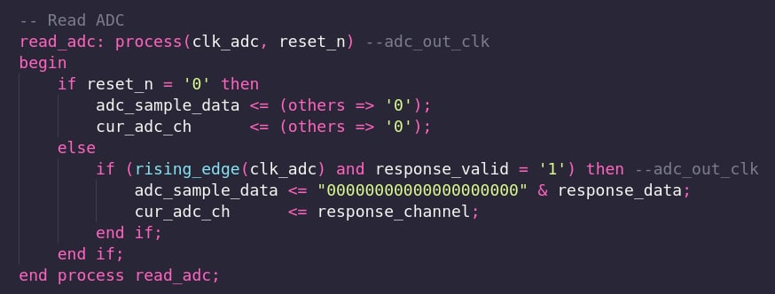
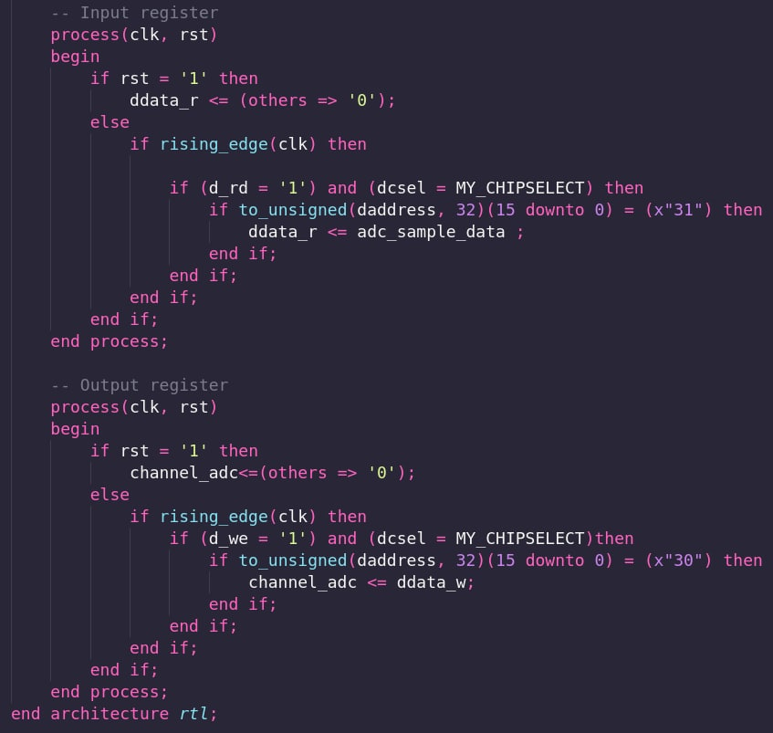

# DOCUMENTAÇÃO ADC


Informações iniciais:

Para interrupções verificar o readme localizado em: https://github.com/xtarke/riscv-multicycle/tree/master/peripherals/irq


Os arquivos .c estão vinculados com os arquivos de simulação, portanto são simuláveis. É necessário alterar o arquivo \memory\iram_quartus.vhd (init_file => "../../software/adc/quartus_main_adc.hex").

O arquivo adc_core.vhd é somente para utilização na placa. 


### Software/_core/start.S 

A ordem que será acrescentado as interrupções, no vector_base, importa, devido ao fato de ser uma tabela.

Os valores abaixo do EXTI0_IRQHandler estão disponíveis para serem utilizados, portanto, não há necessidade de ampliar o vector_base no momento.

### core/csr.vhd

O nome da interrupção declarado em start.S e csr.vhd deve ser o mesmo que será utilizado no arquivo .c.


É possível verificar se o código localizado no adc_bus.vhd e no arquivo .c estão executando conforme o planejado analisando os endereços localizados nos arquivos /peripherals/adc/sim.s e /software/adc/main_adc.lss e verificando seus códigos assembly.

## ADC

A implementação do ADC trata-se de um bloco IP da Altera, foi configurado pelo arquivo 'adc_qsys.qsys' utilizando-se a ferramenta própria da Altera. Nesta implementação, o ADC conta com 16 canais de 12 bits.

Para a aquisição ser feita, a resposta precisa ser validada pelo próprio bloco de IP, por isso o processo abaixo foi criado.



## Simulação

Como blocos de IP's não são simuláveis foi criado o arquivo 'adc_bus.vhd' que simula o funcionamento do ADC, este ainda utiliza o 'adc_qsysbus.vhd' (simula a ferramenta da Altera), onde foi inserido valores fixos de samples para verificar a integração com o softcore. Os arquivos 'tb_adc.vhd' e 'tb_adc.do', juntamente com os arquivos .c, refletem a simulação, mostrado abaixo.


Observando o segmento do ADC:

Response_channel: valores fixos de samples descritos em adc_qsysbus.vhd.

Sample: Valor amostrado no ADC.

Sample_verdadeira: É o que de fato se encontra no ddata_r. Valor do ADC enviado ao registrador de I/O do softcore.

Channel_adc: Numero do canal que deve ser lido o ADC.

Interrup_flag: Momento onde uma interrupção é ativa. Permanece ativa por um ciclo conforme imagem abaixo:


Através do adc_bus.vhd é possível entender o processo de interrupção. Ao levantar uma flag de interrupção no ADC, podemos observar no CSR que uma interrupção é gerada e após o flag baixar, outra flag de interrupção pendente é sinalizado, indicando que há um processo de interrupção a ser tratado. 

## Implementação


Na implementação foi necessário outro componente em que fosse possível realizar a síntese, o 'adc_core.vhd'. Para a seleção do canal, um valor é lido no endereço "0x30" do barramento de dados, enquanto para obter o valor lido pelo ADC é escrito no endereço "0x31". Estes valores de endereço estão descritos no arquivo iodatabusmux.vhd na pasta memory.
No arquivo "hardware_ADC_7SEG.h" está definida uma estrutura de dados para armazenar o valor lido do ADC e seu respectivo canal, que será utilizado pelo 'de10lite.vhd', bem como a declaração das funções para ler o ADC e escrever nos displays de 7 segmentos.

### TODO:

Realizar a implementação da interrupção ADC na placa.



## Software

Em 'hardware.h' foi definido o endereço de cada periférico.

```c
#define IONBUS_BASE_ADDRESS 		(*(_IO32 *) (PERIPH_BASE))			    
#define SEGMENTS_BASE_ADDRESS 		(*(_IO32 *) (PERIPH_BASE + 1*16*4))		
#define UART_BASE_ADDRESS 			(*(_IO32 *) (PERIPH_BASE + 2*16*4))	
#define ADC_BASE_ADDRESS 		    (*(_IO32 *) (PERIPH_BASE + 3*16*4))		
#define I2C_BASE_ADDRESS 			(*(_IO32 *) (PERIPH_BASE + 4*16*4))	
#define TIMER_BASE_ADDRESS 			(*(_IO32 *) (PERIPH_BASE + 5*16*4))		
#define SPI_BASE_ADDRESS 		    (*(_IO32 *) (PERIPH_BASE + 6*16*4))	
```

No arquivo 'adc.h' foi estabelecido a estrutura de dados para a leitura e escrita no barramento de dados, habilitar e desabilitar interrupção, além dos escopos das funções.

```c
typedef struct 
{
	uint32_t sel_channel; 		// 0x0030       
	uint32_t indata_adc;        // 0x0031	
	uint32_t irq_adc_en; 			// 0x0032 irq enable
	uint32_t irq_adc_di; 			// 0x0033 irq disable
}ADC_TYPE;

#define OUTBUS  *(&IONBUS_BASE_ADDRESS + 1)
#define ADC ((ADC_TYPE *) &ADC_BASE_ADDRESS)

uint32_t adc_read (uint32_t channel_sel);
void ADC_interrupt_enable(void);
```

Em 'adc.c' foi criado a função que envia qual o canal a ser lido e recebe a resposta com o valor do sample e a função que ativa a interrupção.

```c
#include "adc.h"

uint32_t adc_read (uint32_t channel_sel)
{
	ADC -> sel_channel = channel_sel;
    return ADC -> indata_adc;
}

inline void ADC_interrupt_enable(void){
	ADC->irq_adc_en = 1; // entra no endereço 0x0032 onde habilita uma flag
}
```

O arquivo `main_adc.c` mostra um exemplo de funcionamento da interrupção e do ADC.

A função ADC0_IRQHandler executa a rotina de tratamento da interrupção. Neste caso, apenas repassa ao display a informação da variável sample_verdadeira e reseta a flag de interrupção.

```c
// Rotina de tratamento da interrupção
// Repassa a informação lida do ADC ao display e reseta a interrupção
void ADC0_IRQHandler(void){
	SEGMENTS_BASE_ADDRESS = ADC -> indata_adc;
	ADC->irq_adc_di = 1; // vai para o endereço 0x0033
}

int main(){

	uint32_t adc_value;
	uint32_t adc_ch = 1;

	ADC_interrupt_enable();
	extern_interrupt_enable(true);
	global_interrupt_enable(true);

	//x faz a varredura dos canais para teste!
	while (1){
		/* Pino A0 do KIT é canal 1 *
		 * Pino A1 do KIT é canal 2 */
		adc_ch = 9;

		//função para ler o adc do kit DE10_LITE
		adc_value = adc_read(adc_ch);

		/* Remover _delay se estiver no Modelsim */
		//delay_(100000);
		//adc_ch++;
	}
	return 0;
}
```

