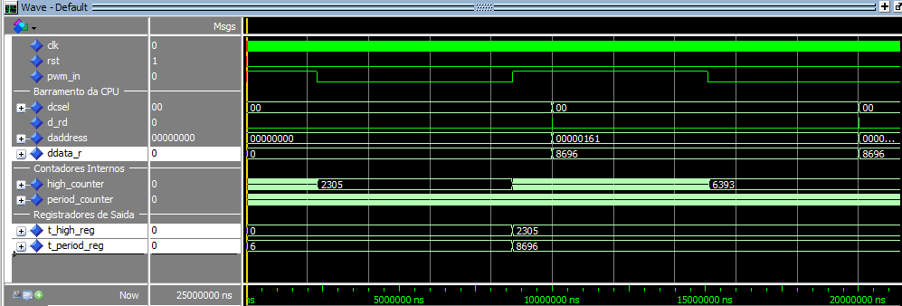
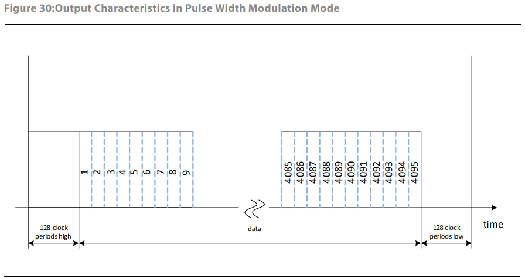
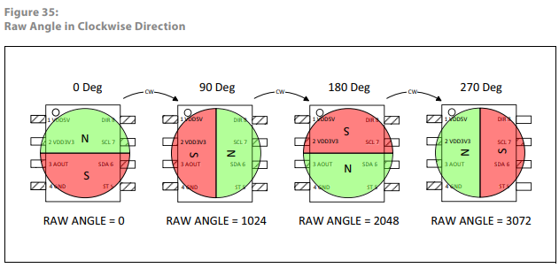

# Projeto AS5600 Integrado com Softcore RISC-V (Placa DE10-Lite)

Este documento descreve toda a arquitetura, montagem e fluxo de execução do projeto de integração do sensor magnético de posição absoluta AS5600 em um ambiente FPGA contendo um processador RISC-V.

---

## 1. Visão Geral do Projeto

O objetivo do projeto é medir o ângulo de rotação de um ímã utilizando o sensor **AS5600** através de sua interface **PWM** e exibir o ângulo (0 a 360°) nos displays de 7 segmentos da placa FPGA Intel MAX 10 (DE10-Lite).

O sistema conta com um **Modo Potenciômetro (Multi-voltas)**: ao ligar a chave `SW0`, o processador começa a contar as voltas acumuladas, agindo como um potenciômetro que vai do valor 0 ao 100 após duas voltas completas (720 graus).

---

## 2. Arquitetura do Sistema

O projeto é dividido em duas partes: **Hardware (VHDL)** e **Software (C)**.

### A. Camada de Hardware (VHDL)
A FPGA atua medindo os sinais na placa DE10-Lite.
* **Filtro:** Como o sinal do sensor é externo e assíncrono, ele passa por duas variáveis (`pwm_sync_1` e `pwm_sync_2`) para se alinhar com o clock da placa, evitando falhas.

* **Cronômetros:** O VHDL não calcula ângulos. Ele apenas possui dois timers, um que conta o tempo total do ciclo PWM (`t_period`) e outro que conta o tempo que o sinal fica em nível lógico alto (`t_high`).
* **Comunicação:** O módulo disponibiliza esses tempos no **Slot 22** do barramento de dados do processador.

**Simulação e Sinais (Testbench):**

Para validar o funcionamento do hardware, simulamos o circuito no ModelSim. A imagem abaixo demonstra o comportamento dos sinais internos durante a leitura do sensor.



Na análise da forma de onda, destacam-se os seguintes sinais:
* **clk e rst:** Sinais de clock (50 MHz) e reset.

* **pwm_in:** É o pino *out* do sensor AS5600.

* **pwm_sync_1 e pwm_sync_2:** São duas variáveis de sincronização. Eles replicam o `pwm_in`, mas com um atraso de 1 e 2 ciclos de clock. O sistema detecta uma nova borda de subida avaliando quando `pwm_sync_1` está alto e `pwm_sync_2` está baixo.

* **period_counter:** Um contador contínuo que incrementa a cada ciclo de clock, registrando o tempo total.

* **high_counter:** Um contador que incrementa apenas enquanto o sinal sincronizado `pwm_sync_2` está em nível lógico alto.

* **t_high_reg e t_period_reg:** Registradores que capturam os valores finais dos contadores no exato instante em que um novo ciclo inicia. São esses valores enviados para o processador ler.

* **daddress, ddata_r, d_rd e dcsel:** Sinais do barramento. Quando o processador envia o endereço de leitura correto e ativa o chip select (`dcsel`), o valor dos registradores é colocado no barramento `ddata_r` para o software em C processar.

### B. Camada de Software (C)
Rodando dentro do núcleo RISC-V, o software calcula os valores a serem mostrados no display.

* **Memória:** O C acessa o Slot 22 através dos ponteiros `#define AS5600_T_HIGH` e `AS5600_T_PERIOD` presentes no mapa de memória (`hardware.h`).

* **Datasheet:** Com base no *datasheet* do AS5600, o sinal PWM possui um formato específico.

  

  O quadro total (período) dura exatos **4351 clocks internos** do chip. Deste total, o sinal inicia com um cabeçalho em nível alto por **128 clocks**. Em seguida, a informação do ângulo é transmitida em nível alto de 0 a 4095 clocks. Por fim, há um rodapé em nível baixo de 128 clocks.

  

  O software aplica uma regra de três convertendo a proporção de tempo lida pela FPGA para a base de clocks internos. Em seguida, converte a porção de dados resultante  para o arco em graus (**0 a 360**).

* **BCD:** Enviamos o ângulo final formatado ao hardware dos displays de 7 segmentos.

---

## 3. Montagem

Para que o projeto funcione, você precisará de:
1. FPGA **Terasic DE10-Lite**.
2. O módulo do sensor magnético **AS5600**.
3. Um ímã diametral (com os polos perpendiculares à face do ímã).

**Conexões dos Pinos:**
* **VCC:** Ligar no pino de 3.3V ou 5V da DE10-Lite (verifique a versão exata da sua plaquinha do AS5600).

* **GND:** Ligar em qualquer pino GND da FPGA.

* **PWM OUT:** Ligar no pino de GPIO específico definido pelo seu projeto Quartus (onde o sinal `pwm_in` está mapeado, aqui é `ARDUINO_IO(2)`).

> **Alinhamento do Ímã:** O ímã diametral deve ser posicionado acima do centro do chip AS5600 (distância entre 0.5 mm a 3 mm).

---

## 4. Como Compilar e Rodar

### Passo 1: Compilar o C
Abra o seu terminal Linux/WSL/MSYS2, navegue até a pasta `software/as5600_app/` e rode:
```bash
make clean
make
```
Isso gerará o arquivo atualizado `quartus_main.hex`.

### Passo 2: Gravar na FPGA

**In-System Memory:**

1. Abra o projeto principal **`de10_lite.qpf`** (localizado em `sint/de10_lite/`) no software Intel Quartus.

2. Na barra superior, clique em: `Processing` -> `Update Memory Initialization File`.

3. Na barra superior, clique em: `Processing` -> `Start` -> `Start Assembler`.

4. Abra o `Programmer` (Tools -> Programmer), selecione o novo arquivo `.sof` gerado e clique em **Start** para gravar a placa.

---

## 5. Como Testar e Apresentar

1. Gire o ímã sobre o sensor.

2. Os displays da DE10-Lite  exibirão o ângulo de **0 a 360°**.

3. Levante a **Chave SW0**. Isso aciona o 'Modo Potenciômetro'.

4. Dê voltas com o ímã. Ele vai acumular os giros e a tela exibirá uma escala unificada de **0 a 100**, onde 100 só é atingido após você completar exatamente duas voltas (720 graus).
