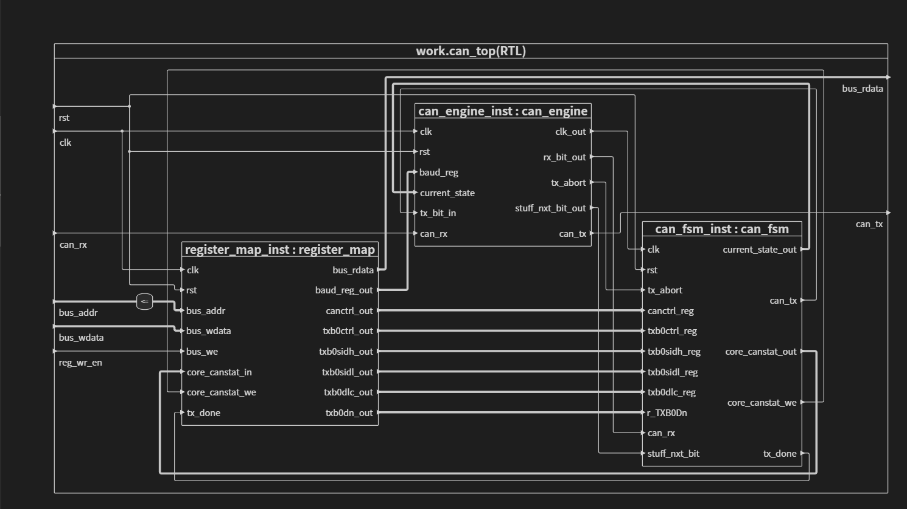
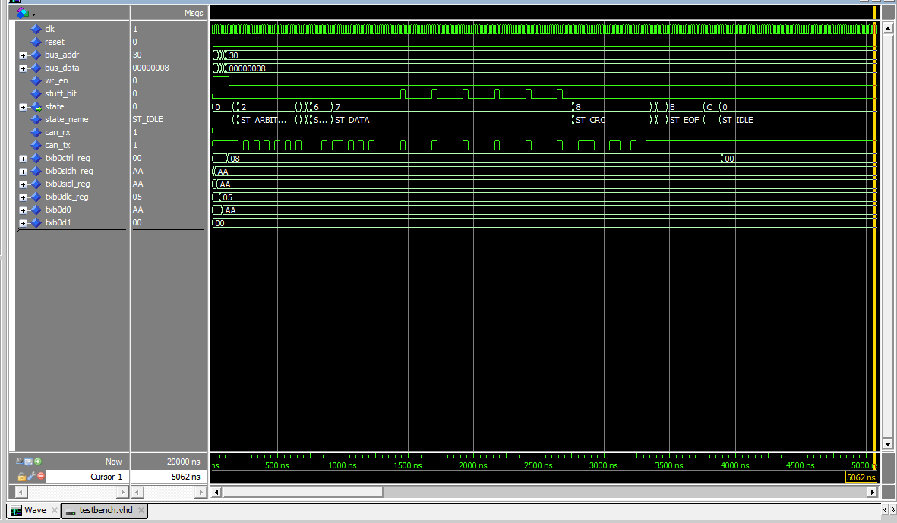
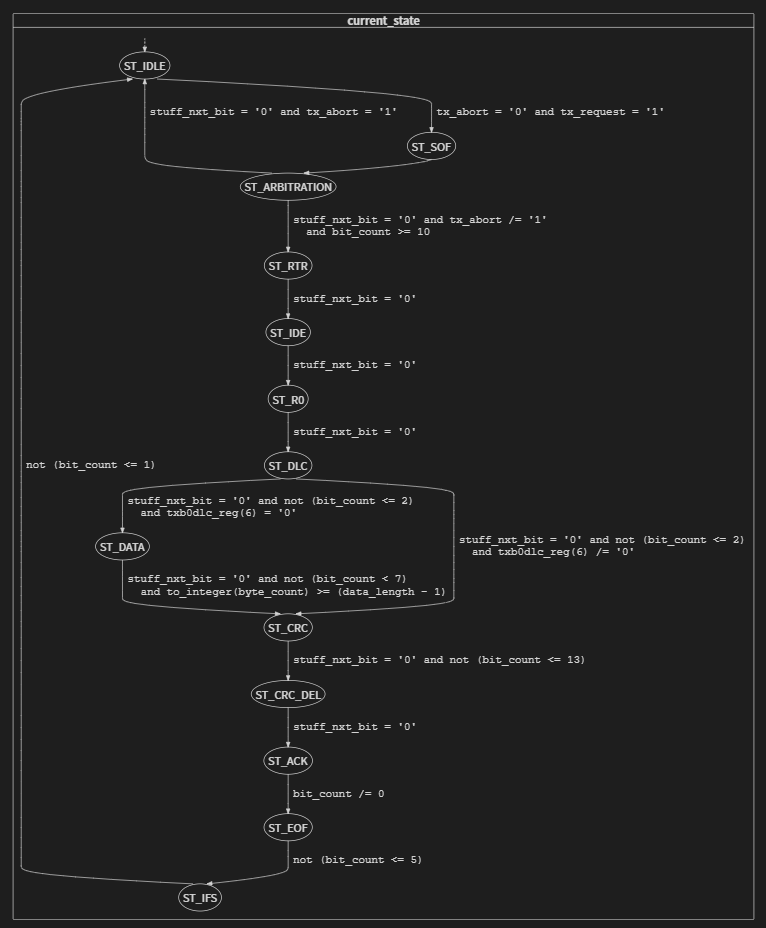
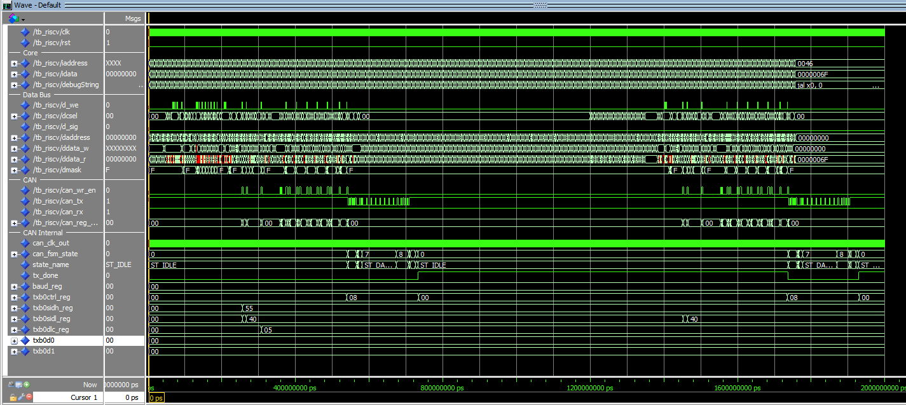

# Controlador CAN

descrever (implementa o controlador CAN, apenas transmissão...)

O módulo implementa um controlador CAN com apenas a transmissão (TX). Suporta quadros no formato CAN 2.0B (identificador de 11 ou 29 bits), taxa de transmissão configurável via prescaler e segmentos do *bit time*. A interface com o barramento do RISC‑V é feita por um mapa de registradores, acessível através do espaço de periféricos.

# Simulação do componente
Para verificar o funcionamento isolado do periférico, execute o script `peripherals/can/tb.do` no ModelSim/Questa. Esse testbench instancia apenas o `can_top` e estimula diretamente seus sinais.

resultado

falar do resultado
# maquina de estados
descrever brevemente cada um

# Simulação com o RISCV
- Compilar o código de teste `software/can/can_main.c` ou usar o 'can.hex' previamante compilado
certificar que no tb_riscv.vhd em iram_inst indicam o .hex do formato certo e esta no caminho correto em relação a tb.do e que iram tem um generic que o suporte

resultado

falar do resultado