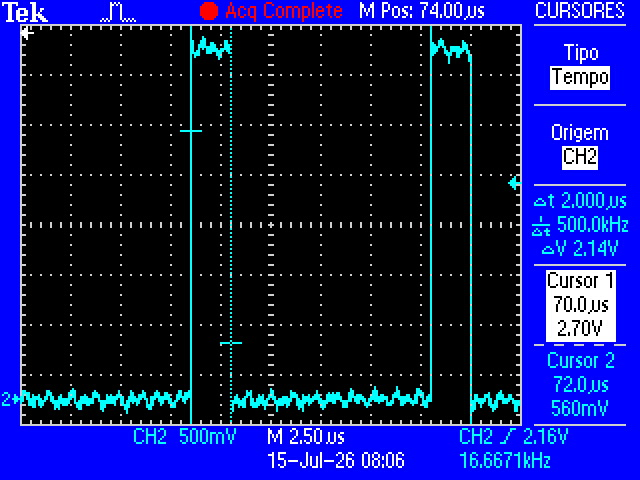
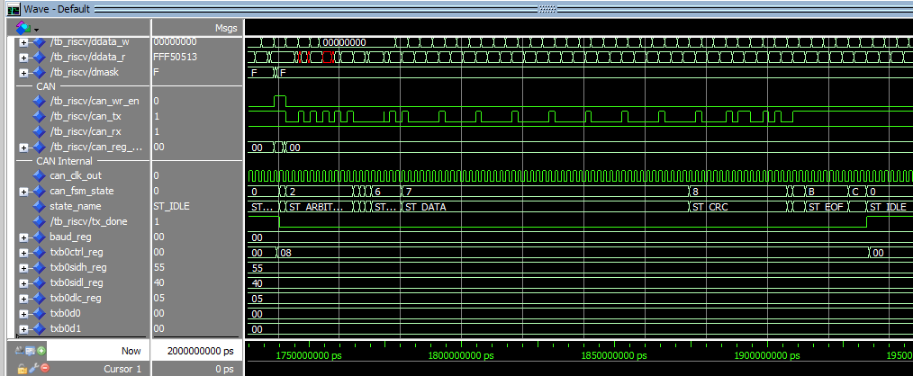
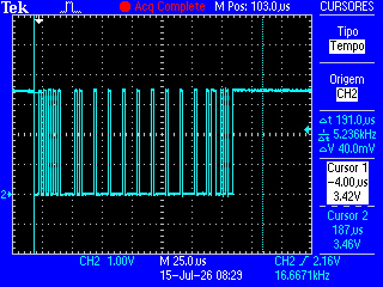

# Controlador CAN

Este projeto implementa um controlador CAN baseado no **MCP2515** da **Microchip Technology**.

O **MCP2515** implementa a camada de enlace do protocolo CAN. Possui interface SPI para escrita e leitura de seus registradores; no entanto, necessita de um circuito que implemente a camada física (ISO 11898), como o **MCP2551** ou **TJA1050**. 

Algumas mudanças foram necessárias em relação ao **MCP2515** para que o mesmo se enquadre como um periférico de um **RISC-V** de 32 bits:
- O **MCP2515** apresenta interface SPI. No projeto, a comunicação ocorre pelos barramentos de dados do processador de forma paralela, em blocos de 8 bits.
- Os registradores **CNFn**, responsáveis pelo baud rate e pela amostragem, foram abstraídos em um único registrador denominado **BAUD_REG**.
- O **MCP2515** conta com três buffers distintos de dados para o envio de diferentes *CAN frames* com prioridade personalizada. No entanto, neste projeto foi implementado apenas o *buffer* "0", que inicia o envio da mensagem assim que o barramento CAN é considerado desocupado.

Ressalta-se que o periférico desenvolvido implementa um controlador CAN apenas para transmissão (TX) em *one-shot mode*. Ele suporta quadros no formato CAN 2.0A (identificador de 11 bits), taxa de transmissão configurável via prescaler. A interface com o barramento do RISC‑V é realizada por meio de um mapa de registradores, acessível através do espaço de periféricos.

Para versões futuras, sugere-se a implementação da recepção de quadros (RX) e dos demais modos de operação presentes no MCP2515 (*Normal mode, Sleep mode e Listen-Only mode*).

Abaixo, uma imagem representativa das entidades do periférico em diagrama de blocos:


- **register_map.vhd** -> Responsável por armazenar os dados de configuração, IDs de mensagens, flags de status e os payloads (TX), atuando como interface de memória entre o processador e o controlador CAN.
- **can_engine.vhd** -> Responsável por gerenciar a camada física e temporal do barramento, executando o *bit stuffing*, a geração do *baud rate* e a interface direta com o *transceiver* (pinos TX e RX).
- **can_fsm.vhd** -> Responsável pela lógica do protocolo, controlando a máquina de estados sequencial para a correta montagem dos campos do quadro CAN (SOF, Arbitragem, Dados, CRC, ACK e EOF).
- **can_top.vhd** -> Responsável por instanciar e interconectar todos os submódulos do projeto, expondo apenas a interface de comunicação com o processador e o *transceiver*.


# Instruções de Uso

Similarmente ao MCP2515, é necessário a configuração inicial do periférico através da escrita de seus periféricos.

Inicialmente faz-se necessário escrever:

- **TXB0SIDH**     -> Armazena os bits mais significativos (10 a 3) do identificador padrão (ID) da mensagem a ser enviada.
- **TXB0SIDL**     -> Armazena os bits menos significativos (2 a 0) do identificador padrão, mapeados nos bits 7 a 5 deste registrador.
- **TXB0DLC**      -> Define a quantidade de bytes de dados a serem transmitidos (bits 3 a 0) e o bit de requisição remota (RTR, bit 6). RTR = '1' para *remote frame* ou '0' para *data frame*.
- **TXB0Dn(0:7)**  -> Conjunto de 8 registradores de dados que armazenam individualmente os bytes da payload que será transmitida.
- **BAUD_REG**     -> Configura o divisor de clock (prescaler) interno para ajustar a velocidade de transmissão de dados (baud rate) no barramento. Quando BAUD_REG = x"00" a frequência da transmissão é clk/2.

E por fim, solicitar a transmissão em *one-shot mode*:

- **TXB0CTRL**     -> TXB0CTRL(3) é o bit TXREQ (Request to Send) do registrados. O bit TXREQ deve ser setado '1' para solicitar uma transmissão.


# Simulação do Componente

Para verificar o funcionamento isolado do periférico, execute o script [tb.do](/peripherals/can/tb.do) no ModelSim/Questa. Esse testbench instancia apenas o `can_top` e estimula diretamente seus sinais. [testbench.vhd](/peripherals/can/testbench.vhd) pode ser alterado conforme instruções de uso para simular diferentes *CAN frames*.


A imagem acima apresenta o *CAN frame* que é resultado da seguinte configuração de registradores na entidade [testbench.vhd](/peripherals/can/testbench.vhd):

```VHDL
    ------------------------------------------------------------------
    -- escrita dos registadores
    ------------------------------------------------------------------
	regiters_config_p : process
    begin
        -- espera o fim do reset
        wait for 10 ns;

        -- 1. TXB0SIDH (ID alto)
        bus_addr  <= unsigned(TXB0SIDH);
        bus_wdata <= x"000000AA";
        reg_wr_en <= '1';
        wait for CLK_PERIOD*2;  -- Escreve os registradores TXB0SIDH e TXB0SIDH

        -- 2. TXB0DLC (DLC = 5)
        bus_addr  <= unsigned(TXB0DLC);
        bus_wdata <= x"00000005";
        wait for CLK_PERIOD;    -- Data length = 5 bytes + RTR = '0'

        -- 3. TXB0D0 (primeiro byte de dados)
        bus_addr  <= unsigned(TXB0D0);
        bus_wdata <= x"000000AA";
        wait for CLK_PERIOD;
        -- Escreve os registradores TXB0D1 a TXB0D7
        bus_wdata <= x"00000000";
        wait for CLK_PERIOD*7;

        -- 4. BAUD_REG
        bus_addr  <= unsigned(BAUD_REG);
        bus_wdata <= x"00000000";   -- Baud rate = clk/2
        -- reg_wr_en <= '1';
        wait for CLK_PERIOD;

        -- 5. TXB0CTRL (pedido de transmissão)
        bus_addr  <= unsigned(TXB0CTRL);
        bus_wdata <= x"00000008";
        wait for CLK_PERIOD;
        reg_wr_en <= '0';
		wait;
    end process;
```

Na imagem, pode-se observar a concordância de todos os campos do protocolo CAN, desde o *Start of Frame* até o *End of Frame*. Nota-se também o *bit stuffing* ocorrendo no campo de payload, o que contribui para a redução do nível DC da mensagem e, consequentemente, para o aumento do seu comprimento.

Adendo: Para fins de validação, o sinal **can_tx** que representa a transmissão da mensagem apresenta-se atrasado em um ciclo de clock do sinal **state_name** que representa o estado da máquina de estados.


# Máquina de Estados

A máquina de estados é implementada na entidade [can_fsm.vhd](/peripherals/can/can_fsm.vhd), cujos estados correspondem diretamente aos segmentos do pacote CAN. A imagem que representa essa máquina de estados pode ser visualizada abaixo:


Os estados podem ser descritos brevemente da seguinte forma:

- **ST_IDLE** -> Verifica se é possível iniciar uma nova transmissão.
- **ST_SOF** -> Envia um bit dominante e inicia um *frame*.
- **ST_ARBITRATION** -> Envia o ID enquanto verifica se há um *frame* mais prioritário sendo transmitido ao mesmo tempo.
- **ST_RTR** -> Envia '1' para *remote frame* ou '0' para *data frame*.
- **ST_IDE** -> Envia '0' para CAN2.0A (*standard*).
- **ST_R0** -> Bit reservado, envia '0'.
- **ST_DLC** -> Envia o tamanho do pacote e verifica se o pacote é um *remote frame* ou *data frame*.
- **ST_DATA** -> Envia o *payload* contido nos registadores TXB0Dn.
- **ST_CRC** -> Envia o CRC-15 a partir do calculo de todo o pacote até **ST_DATA**.
- **ST_CRC_DEL** -> Envia bit demilitador do CRC.
- **ST_ACK** -> Transmissor envia sempre bit recessivo.
- **ST_EOF** -> Envia 7 bits recessivos sem *bit stuffing* indicando o fim do pacote.
- **ST_IFS** -> Estado para garantir um tempo mínimo entre *frames*. Envia 3 bits recessivos e retorna para **ST_IDLE**.


# Simulação com o RISC-V

Para simular o periférico com o **RISC-V** é necessário compilar o código de teste [can_main.c](/software/can/can_main.c) ou utilizar o [can.hex](/software/can/can.hex) previamente compilado.  

É preciso certificar-se de que, no arquivo **tb_riscv.vhd**, a instância **iram_inst** esteja configurada para indicar o arquivo `.hex` no formato correto e que este se encontre no caminho adequado em relação ao **tb.do**. Além disso, a instância **iram** deve possuir um *generic* que ofereça suporte a essa configuração.  

A imagem abaixo apresenta o resultado da simulação do periférico em conjunto com o **RISC-V**:


De igual forma ao apresentado anteriormente, há concordância de todos os campos do protocolo CAN no sinal can_tx. No entando, os registadores são agora escritos pelo núcleo do **RISC-V** através dos barramentos:

- **daddress** -> Informa o endereço do periférico juntamente com o endereço do registrador que será escrito.  
- **ddata_w** -> Os 8 LSB do barramento são escritos no registrador indicado por **daddress**.  
- **dcsel** -> Seleciona o barramento destinado como "Periféricos".  
- **d_we** -> Habilita a escrita nos registradores do periférico.


# Síntese

Para realizar a síntese, são compilados no quartus as seguintes entidades:

- register_map.vhd
- can_top.vhd
- can_pkg.vhd
- can_fsm.vhd
- can_engine.vhd
- iregister.vhd
- decoder_types.vhd
- decode.vhd
- iram_quartus.vhd
- dmemory.vhd
- instructionbusmux.vhd
- databusmux.vhd
- iodatabusmux.vhd
- alu_types.vhd
- alu.vhd
- division_functions.vhd
- quick_naive.vhd
- M_types.vhd
- M.vhd
- register_file.vhd
- csr.vhd
- core.vhd
- txt_util.vhdl
- trace_debug.vhd

A entidade top é [de10_lite.vhd](peripherals/can/sint/de10_lite/de10_lite.vhd) que instancia todos os componentes préviamente listados e gera o sinal de saída no pinos **IO0** (tx_can) e **IO1** (rx_can) do kit FPGA DE10-lite.

# Testes

A imagem abaixo apresenta a aquisição do tempo de um pulso que corresponde ao *baud rate* de 500 kHz, esperado para a transmissão. Esse é o período mínimo de transmissão, mas pode ser aumentado mediante a alteração do valor do registrador **BAUD_REG**.  



A duas imagens abaixo apresentam os pacotes enviados em simulação em *hardware* ambos com a seguinte configuração para fins de comparação:

```C
    frame.id       = 0x2AA;     /* 11 bits */
    frame.dlc      = 5;         /* 5 bytes de dados */
    frame.baud     = 0;         /* prescaler = 0 (sem divisão) */
    frame.rtr      = false;     /* data frame, não remote */
    frame.tx_start = true;      /* transmite imediatamente */
```






# Referências

* [MCP2515 Datasheet](https://www.microchip.com/en-us/product/mcp2515)
* [Artigo sobre camada física do CAN](https://www.ti.com/lit/an/slla270/slla270.pdf)
* [Artigo sobre protocolo CAN](https://www.port.de/fileadmin/user_upload/Dateien_IST_fuer_Migration/CAN20A.pdf)
