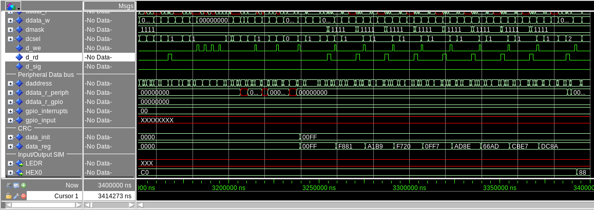

# Periférico CRC

Cada escrita em 0x00F0 resulta no calculo do CRC com o ultimo valor presente no mesmo endereço, o último valor calculado pode ser lido em 0x00F0. Para definir o valor inicial deve-se escrever o valor em 0x00F1.

# Simulação do componente
- Executar o script `peripherals/crc/crc.do` no ModelSim/Questa
```console
ModelSim> pwd
# peripherals/crc
ModelSim> do crc.do
```

# Simulação com `core`
- Compilar o código de teste `software/crc/main.c`
```console
foo@bar:software/crc$ make
--------------------------- ESSA É A SAÍDA ESPERADA ------------------------------------------------
../../compiler/gcc/bin/riscv-none-elf-gcc -march=rv32im -O1 -fpack-struct    -c -o main.o main.c
../../compiler/gcc/bin/riscv-none-elf-gcc -march=rv32im -O1 -fpack-struct -c -nostdlib ../_core/start.S
../../compiler/gcc/bin/riscv-none-elf-gcc -march=rv32im -O1 -fpack-struct    -c -o ../_core/syscalls.o ../_core/syscalls.c
../../compiler/gcc/bin/riscv-none-elf-gcc -march=rv32im -O1 -fpack-struct    -c -o ../_core/utils.o ../_core/utils.c
../../compiler/gcc/bin/riscv-none-elf-gcc -march=rv32im -O1 -fpack-struct    -c -o ../gpio/gpio.o ../gpio/gpio.c
../../compiler/gcc/bin/riscv-none-elf-gcc -march=rv32im -O1 -fpack-struct    -c -o ../irq/interrupt.o ../irq/interrupt.c
../../compiler/gcc/bin/riscv-none-elf-gcc -march=rv32im -O1 -fpack-struct -Wl,-Map=main.map -o main.elf main.o start.o ../_core/syscalls.o ../_core/utils.o ../gpio/gpio.o ../irq/interrupt.o -T ../_core/sections.ld
chmod -x main.elf
../../compiler/gcc/bin/riscv-none-elf-objcopy -O verilog main.elf main.tmp
../../compiler/gcc/bin/riscv-none-elf-objdump -h -S main.elf > "main.lss"
python3 ../hex8tohex32.py main.tmp > main32.hex
python3 ../hex8tointel.py main.tmp > quartus_main.hex
rm main32.hex
--------------------------- FIM DA SAÍDA ESPERADA ------------------------------------------------
foo@bar:software/crc$ |
```
- Substituir o valor de `init_file` em `memory/iram_quartus.vhd` por `./software/crc/quartus_main.hex`
```diff
- init_file => "./software/irq/quartus_irq_example.hex",
+ init_file => "./software/crc/quartus_main.hex",
```
- Executar o script `peripherals/crc/core.do` no ModelSim/Questa
```console
ModelSim> pwd
# peripherals/crc
ModelSim> do core.do
```
O resultado da compútação do CRC está bem no final da simulação


