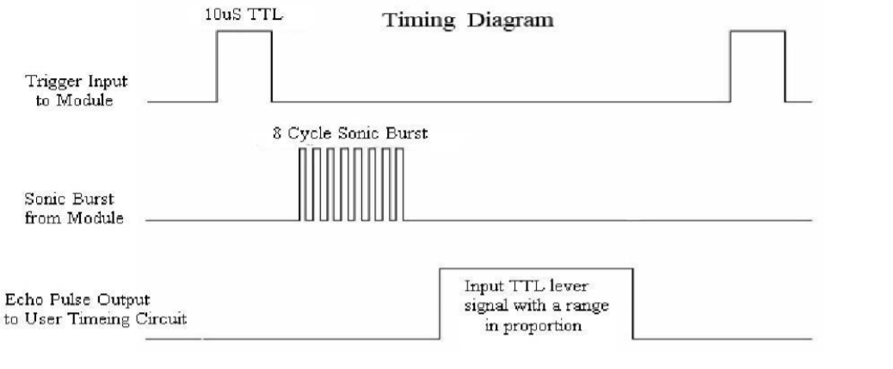
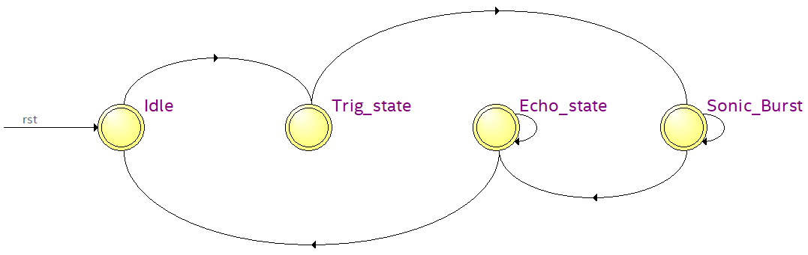
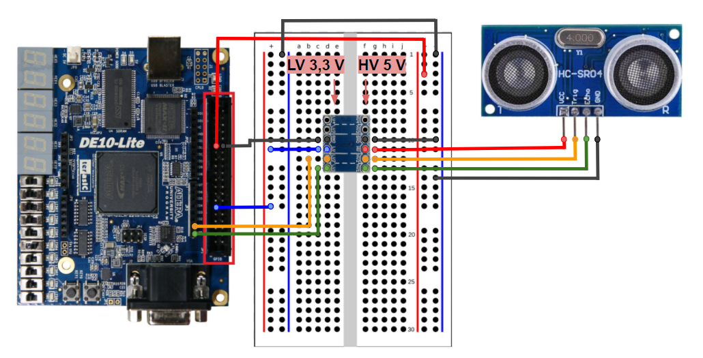
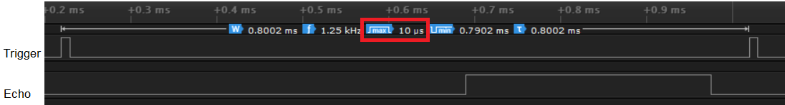

# Sensor Ultrassônico HC-SR04
 
Esta é uma implementação de uso do periférico [HC-SR04](https://cdn.sparkfun.com/datasheets/Sensors/Proximity/HCSR04.pdf), o qual é um sensor ultrassônica. O funcionamento dele é descrito conforme apresentado no diagrama abaixo. Primeiro é enviado um pulso de *trigger* de 10 us. Posteriormente é recebido um sinal de *echo*, em que sua largura é proporcional à distância do sensor a um objeto específico.
 

    

 
Para isso, gerou-se uma [máquina de estados](HCSR04.vhd), representada na figura abaixo.

    

 
## Simulação
Para a simulação, gerou-se dois arquivos de teste. Um sem o arquivo de memória [testbench2.vhd](testbench2.vhd) , onde é possível visualizar a mudança dos estados e o contador de pulsos do sinal de entrada *echo*. O outro arquivo é com o uso da arquitetura RiscV [testbench.vhd](testbench.vhd).
 
 
## Montagem do circuito
Este sensor necessita de tensão de entrada de 5V para seu funcionamento adequado. Por isso, para a montagem do circuito, utilizou-se um conversor de nível lógico de 5V a 3V3 bidirecional, conforme apresentado abaixo. 

Os pinos *echo* e *trigger* são conectados aos pinos do `ARDUINO_IO 0` e `1`, respectivamente.
 

    

 
## Resultados da síntese
A figura abaixo foi retirado com o auxílio de um analisador lógico. Nesta, pode ser visto o sinal de *trigger* de 10 us e o sinal de *echo* gerado pelo sensor. 

    

 
Para melhor visualização dos resultados na placa, foram utilizados [os displays 7 segmentos](../disp7seg/display_dec.vhd). A saída é equivalente à quantidade de ciclos de 10 us, a qual aumenta com o aumento da distância do objeto.
 
## ToDo
Na síntese, observou-se que após um determinado tempo, ele parava de realizar a contagem e necessitava de *reset*. Por isso, posteriormente é necessário analisar o sinal de *echo* no osciloscópio para verificar uma possível perda de descida deste sinal.  

## Referências
* [HC-SR04 Datasheet](https://cdn.sparkfun.com/datasheets/Sensors/Proximity/HCSR04.pdf)
 
 

