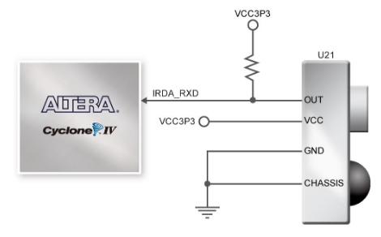
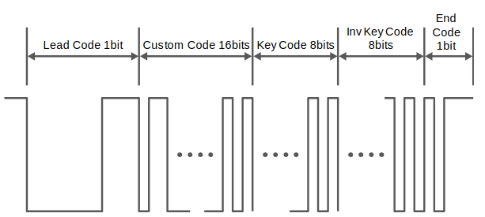
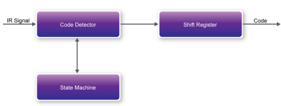
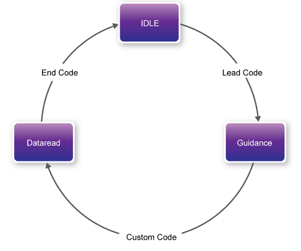
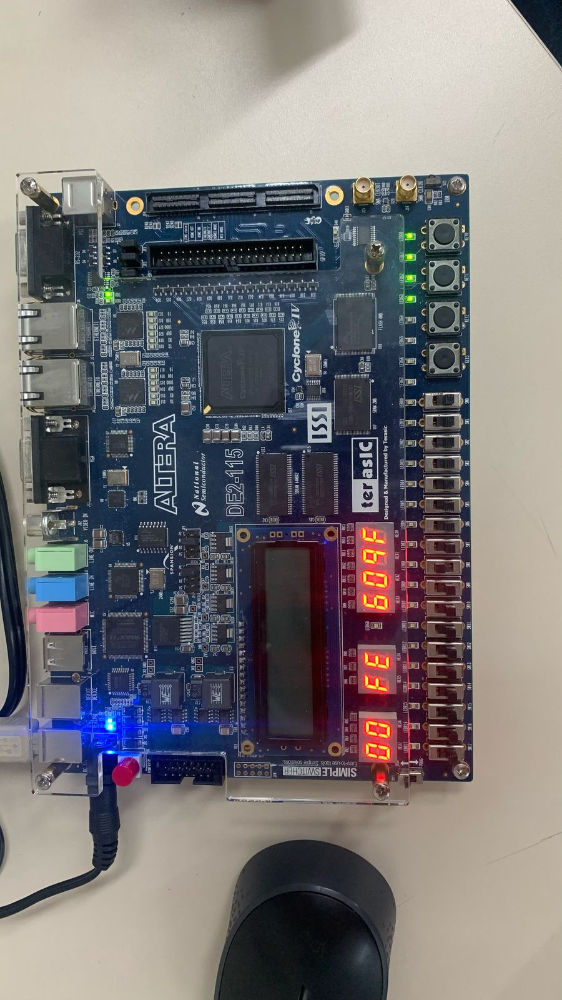
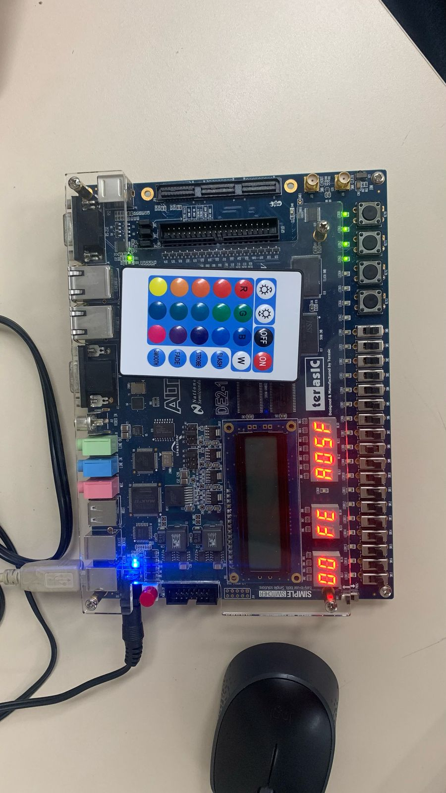

# Sensor IRDA

    O sensor infravermelho **IRM-V538N7/TR1** é amplamente  utilizado como receptor de sinais de controles remotos infravermelhos.  Sua função principal é detectar qual botão foi pressionado pelo usuário  no controle remoto, permitindo a execução de uma tarefa específica. No  entanto, para que isso seja possível, é necessário o uso de um hardware  dedicado para decodificar os sinais recebidos.

    No desenvolvimento deste projeto, foi utilizada a placa **DE2-115**, que já possui um sensor infravermelho integrado. Essa característica facilitou a implementação, eliminando a necessidade de componentes  adicionais e agilizando a execução das atividades.

## Funcionamento do Projeto

    Quando uma tecla do controle remoto é pressionada, o controle emite um **quadro de sinal padrão**, conforme ilustrado na Figura abaixo. Esse quadro é composto por três partes principais:

1. **Código inicial (lead code):** Representa o **bit de início**, que sinaliza o começo da transmissão do sinal. Ele funciona como uma espécie de "aviso" para o receptor, indicando que uma nova mensagem está sendo enviada.
2. **Informação da tecla:** Após o código inicial, o sinal transmite os dados relacionados à tecla pressionada. Essa parte contém a informação específica que identifica qual botão foi acionado.
3. **Código final (end code):** O último bit do quadro, chamado de **bit de fim**, indica o término da transmissão. Ele serve para marcar que o sinal foi completamente enviado e que o quadro está concluído.

    Após o **receptor infravermelho** na placa **DE2-115** receber o quadro de sinal, ele transmite os dados diretamente para a **FPGA**. Nesta demonstração, o **IP (Intellectual Property)** do controlador do receptor infravermelho foi implementado na FPGA. Conforme mostra a Figura 6-20, esse IP é composto por três blocos principais:

1. **Code Detector (Detector de Código):**
   
   - O receptor infravermelho demodula o sinal recebido e envia os dados para o bloco **Code Detector**.
   
   - Esse bloco é responsável por verificar o **código inicial (Lead Code)** e validar se ele está correto.
   
   - O resultado dessa verificação é enviado para o bloco **State Machine (Máquina de Estados)**.

2. **State Machine (Máquina de Estados):**
   
   - Recebe o resultado da verificação do **Code Detector**.
   
   - Controla o fluxo de operações com base no estado atual do sistema e nas informações recebidas.

3. **Shift Register (Registro de Deslocamento):**
   
   - Armazena e processa os dados relacionados à tecla pressionada no controle remoto.
   
   - É responsável por organizar e preparar as informações para uso posterior no sistema.

    Essa estrutura permite que o sinal infravermelho seja recebido, validado
 e processado de maneira eficiente pela FPGA, garantindo o funcionamento
 adequado do sistema.

    O bloco **State Machine (Máquina de Estados)** altera seu estado com base nas informações recebidas do **Code Detector (Detector de Código)**. O funcionamento ocorre da seguinte forma:

1. **Estado IDLE (Inicial):**
   
   - Estado inicial da máquina, onde o sistema aguarda a detecção do **código inicial (Lead Code)**.
   
   - Quando o **Lead Code** é detectado, o estado muda para **GUIDANCE**.

2. **Estado GUIDANCE (Orientação):**
   
   - Neste estado, o sistema aguarda a detecção do **Custom Code** (código personalizado).
   
   - Quando o **Custom Code** é identificado, o estado muda para **DATAREAD**.

3. **Estado DATAREAD (Leitura de Dados):**
   
   - O **Code Detector** salva o **Custom Code** e o **Key/Inv Key Code** (código da tecla e seu inverso).
   
   - Esses dados são enviados para o **Shift Register (Registro de Deslocamento)**.
   
   - Por fim, as informações são exibidas nos **displays de 7 segmentos**.

    Além disso, é importante destacar que o **clock de entrada** utilizado no sistema deve ter uma frequência de **50 MHz**. A Figura abaixo ilustra o diagrama de transição de estados do bloco **State Machine**.

    É importante destacar que este **módulo receptor all-in-one** é compatível apenas com o padrão de **portadora de 38 kHz**. Isso significa que ele foi projetado para operar exclusivamente com sinais que utilizam essa frequência específica. Além disso, de acordo com as informações do produto, a **taxa máxima de transmissão de dados** suportada pelo módulo é de aproximadamente **4 kbps**.

### Resultados do Projeto

    O projeto implementado **sem o softcore** foi validado com sucesso, conforme demonstrado nas imagens abaixo. No entanto, não foi possível validar a versão que utiliza o **softcore** para transferir os dados decodificados para os displays por meio do **barramento do softcore**, pois não houve tempo suficiente para realizar muitos testes.

