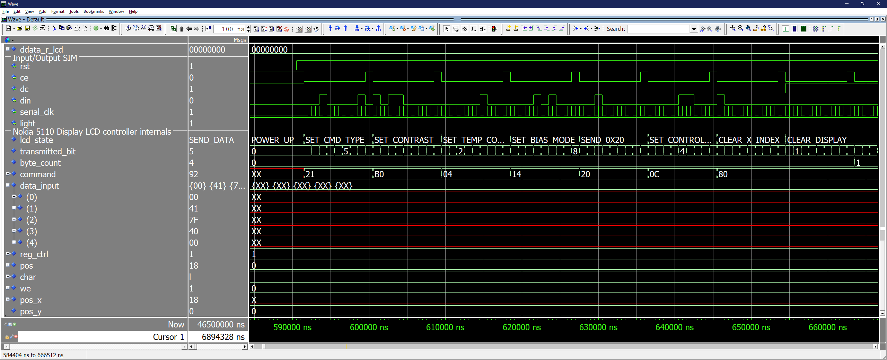

# Controlador do _display_ LCD Nokia 5110

_Hardware_ para controle de inicialização e escrita no LCD Nokia5110.

    

# Pinagem
Entradas:
- `clk`     : _Clock_ do controlador. Opera internamente na borda de subida.
- `reset`   : _Reset_ do controlador. Opera em lógica inversa (0 ativa o `reset`).
- `d_rd`    : _Bit_ para habilitar a leitura do registrador de entrada. Opera em lógica regular (1 ativa a leitura) e é controlado por meio do núcleo RISCV.
- `d_we`    : _Bit_ para habilitar a escrita do registrador de saída. Opera em lógica regular (1 ativa a escrita) e é controlado por meio do núcleo RISCV.
- `daddress`: Endereço de 32 bits do dado. Pertence a uma faixa de valores partindo do endereço do periférico.
- `dcsel`   : Seletor de região de endereçamento de 2 bits do _chip_. Valor padrão de "10" para periféricos.
- `ddata_w` : Dado de 32 bits a ser escrito no barramento de memória. Escreve na faixa de valores partindo do endereço do periférico.

Saídas:
- `ce`          : Se `ce = 0`, a transmissão serial é iniciada. Deve-se manter `ce = 0` durante a transmissão de comando ou caractere ao LCD, pois quando `ce = 1`, os pulsos do _clock_ da serial são ignorados pelo LCD.
- `dc`          : Indica se o _byte_ enviado ao LCD é um comando (`dc = 0`) ou um dado (caractere) a ser armazenado (`dc = 1`).
- `din`         : _Bit_ transmitido pela serial. Lido pelo LCD na borda de subida do _clock_ da serial (`serial_clk`).
- `light`       : Iluminação de fundo.
- `rst`         : Quando `rst = 0`, o LCD é reinicializado. Deve ser aplicado sempre para inicializar corretamente, mantendo-o durante por pelo menos 100 &mu;s.
- `serial_clk`  : _Clock_ da serial (frequência máxima de 4 MHz).
- `ddata_r`     : Dado de 32 bits a ser lido do barramento de memória. Lê a partir da faixa de valores do endereço do periférico.

# Funcionamento
Sequência de inicialização:
1. __Reset__
2. __Set Command Type__ : din = 00100PVH  
- `P = 0`: _Chip_ ativo 
- `P = 1`: Modo _power-down_  
- `V = 0`: Endereçamento horizontal
- `V = 1`: Endereçamento vertical 
- `H = 0`: Conjunto de instruções básico
- `H = 1`: Conjunto de instruções estendido
3. __Set Constrast__ : din = 1011ABCD
- `ABCD` = 0000 até 1111 (mais claro até o mais escuro)
4. __Set Temperature Coefficient__ : din = 000001AB
- `AB` = 00 até 11 compensa a tensão de controle do LCD para melhor contraste de acordo com a temperatura (menor tensão até maior tensão)
5. __Set Bias Mode__ : din = 00010ABC
- `ABC` = 000 até FFF controla a intensidade da tensão do LCD, e por sua vez, a intensidade dos _pixels_ (menor intensidade até maior intensidade)
6. __Send 0x20__ : Necessário enviar 0x20 para alterar para o conjunto de instruções básicas antes de alterar o _control_ _mode_.
7. __Set Control Mode__ : din = 000011AB
- `AB` = 00: modo normal no que os _pixels_ são escuros e o fundo claro.
- `AB` = 01: modo inverso no que os _pixels_ são claros e o fundo escuro.
8. __Clear X Index__ : din = 10000000 muda a posição do endereçamento da coluna para a inicial.
9. __Clear Display__

# Simulação da inicialização do display

    

# Integração do _hardware_ ao núcleo RISCV

# Código em C

# Simulação do _testbench_

    

# Síntese na FPGA Altera MAX10 DE10-Lite

    

# Referências
https://www.sparkfun.com/datasheets/LCD/Monochrome/Nokia5110.pdf
