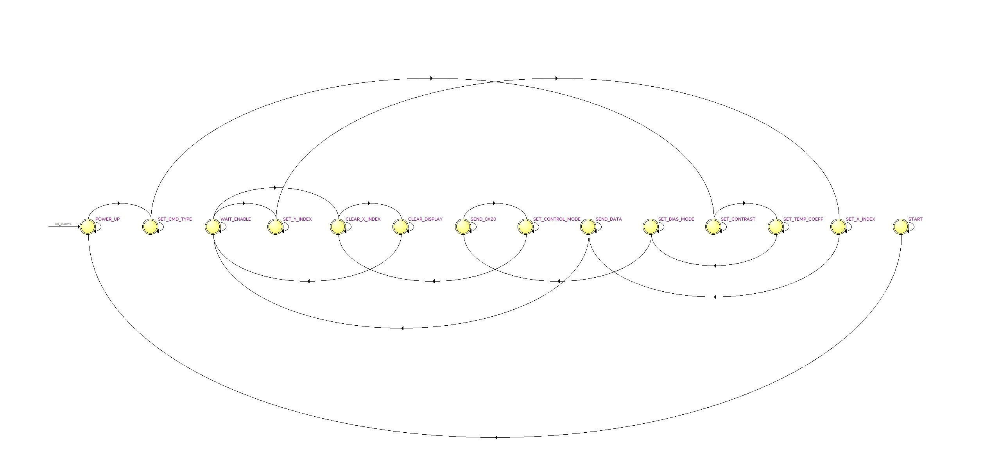

# Controlador do _display_ LCD Nokia 5110

_Hardware_ para controle de inicialização e escrita no LCD Nokia5110.
<p align="left">
    
</p>

# Pinagem do periférico
Entradas:
- `clk`     : _Clock_ do controlador. Opera internamente na borda de subida.
- `reset`   : _Reset_ do controlador. Opera em lógica inversa (0 ativa o `reset`).
- `d_rd`    : _Bit_ para habilitar a leitura do registrador de entrada. Opera em lógica regular (1 ativa a leitura) e é controlado por meio do núcleo RISCV.
- `d_we`    : _Bit_ para habilitar a escrita do registrador de saída. Opera em lógica regular (1 ativa a escrita) e é controlado por meio do núcleo RISCV.
- `daddress`: Endereço de 32 bits do dado. Pertence a uma faixa de valores partindo do endereço do periférico.
- `dcsel`   : Seletor de região de endereçamento de 2 bits do _chip_. Valor padrão de "10" para periféricos.
- `ddata_w` : Dado de 32 bits a ser escrito no barramento de memória. Escreve na faixa de valores partindo do endereço do periférico.

Saídas:
- `ce`          : Se `ce = 0`, a transmissão serial é iniciada. Deve-se manter `ce = 0` durante a transmissão de comando ou caractere ao LCD, pois quando `ce = 1`, os pulsos do _clock_ da serial são ignorados pelo LCD.
- `dc`          : Indica se o _byte_ enviado ao LCD é um comando (`dc = 0`) ou um dado (caractere) a ser armazenado (`dc = 1`).
- `din`         : _Bit_ transmitido pela serial. Lido pelo LCD na borda de subida do _clock_ da serial (`serial_clk`).
- `light`       : Iluminação de fundo.
- `rst`         : Quando `rst = 0`, o LCD é reinicializado. Deve ser aplicado sempre para inicializar corretamente, mantendo-o durante por pelo menos 100 &mu;s.
- `serial_clk`  : _Clock_ da serial (frequência máxima de 4 MHz).
- `ddata_r`     : Dado de 32 bits a ser lido do barramento de memória. Lê a partir da faixa de valores do endereço do periférico.

# Funcionamento do periférico
Sequência de inicialização:
1. __Reset__
2. __Set Command Type__ : din = 00100PVH  
- `P = 0`: _Chip_ ativo 
- `P = 1`: Modo _power-down_  
- `V = 0`: Endereçamento horizontal
- `V = 1`: Endereçamento vertical 
- `H = 0`: Conjunto de instruções básico
- `H = 1`: Conjunto de instruções estendido
3. __Set Constrast__ : `din = 1011ABCD`
- `ABCD` = 0000 até 1111 : Controla o nível de contraste (mais claro até o mais escuro)
4. __Set Temperature Coefficient__ : `din = 000001AB`
- `AB` = 00 até 11 : Compensa a tensão de controle do LCD para melhor contraste de acordo com a temperatura (menor tensão até maior tensão)
5. __Set Bias Mode__ : `din = 00010ABC`
- `ABC` = 000 até FFF : Controla a intensidade da tensão do LCD, e por sua vez, a intensidade dos _pixels_ (menor intensidade até maior intensidade)
6. __Send 0x20__ : Necessário enviar 0x20 para alterar para o conjunto de instruções básicas antes de alterar o _control_ _mode_.
7. __Set Control Mode__ : `din = 000011AB`
- `AB` = 00: modo normal no que os _pixels_ são escuros e o fundo claro.
- `AB` = 01: modo inverso no que os _pixels_ são claros e o fundo escuro.
8. __Clear X Index__ : `din = 10000000` Muda a posição do endereçamento da coluna para a inicial.
9. __Clear Display__ : `din = 00000000` Limpa o _display_ LCD enviando `din` 504 vezes (total de _bytes_ da memória do _display_ é 504).

# Simulação da inicialização do display
<p align="center">
    
</p>

# Integração do _hardware_ ao núcleo RISCV

De início foi adicionado o endereço do periférico ao núcleo RISCV. Para isso, foram modificados e escritos os seguintes arquivos: 

1. [`memory/iodatabusmux.vhd`](../../memory/iodatabusmux.vhd)
```VHDL
entity iodatabusmux is
    port(
        [...]
        ddata_r_lcd      : in  std_logic_vector(31 downto 0); -- <- Adicionado o sinal de 32 bits do endereço do periférico.
        -- Mux 
        ddata_r_periph   : out std_logic_vector(31 downto 0) --! Connect to data bus mux
    );
end entity iodatabusmux;

architecture RTL of iodatabusmux is

begin
    -- Word address, ignoring least significant 4 bytes
    with daddress(19 downto 4) select ddata_r_periph <=
        [...]
        ddata_r_lcd when x"000A", -- <- Seleciona o endereço do periférico quando o valor for igual a x"000A".
        -- Add new io peripherals here
        (others => '0') when others;
end architecture RTL;
```

2. [`software/_core/hardware.h`](../../software/_core/hardware.h)
```C
#ifndef __HARDWARE_H
#define __HARDWARE_H

[...]
#define DISPLAY_NOKIA_5110_BASE_ADDRESS (*(_IO32 *) (PERIPH_BASE + 10*16*4)) /* <-  Adicionado o endereço base do display 
                                                                                    Nokia 5110 LCD a partir do endereço 
                                                                                    base para periféricos. */

#endif //HARDWARE_H
```

3. [`software/lcd/lcd.h`](../../software/lcd/lcd.h)
```C
#ifndef __LCD_H
#define __LCD_H

#include "../_core/hardware.h"

/* Tipo do registrador para controle do display Nokia 5110 LCD */
typedef struct{
    _IO32 reg_ctrl; /*!< State machine control register. */
    _IO32 pos;      /*!< Data index. */
    _IO32 data;     /*!< Data to display.*/
    _IO32 we;       /*!< Write enable */
} DISPLAY_NOKIA_5110_REG_TYPE;

/* Declaração do registrador para controle do display Nokia 5110 LCD */
#define DISPLAY_NOKIA_5110_REGISTER ((DISPLAY_NOKIA_5110_REG_TYPE *) &DISPLAY_NOKIA_5110_BASE_ADDRESS)

#endif
```
O controle por _software_ do _display_ é descrito pela seguinte máquina de estados:

<p align="center">
    
</p>

Onde certas transições de estado ocorrem devido a mudança de valores do barramento de memória:

```C
#ifndef __LCD_H
#define __LCD_H

#include "../_core/hardware.h"

typedef struct{
    /* Valores a serem escritos no barramento de memória */
    _IO32 reg_ctrl; /*!< State machine control register. */
    _IO32 pos;      /*!< Data index. */
    _IO32 data;     /*!< Data to display.*/
    _IO32 we;       /*!< Write enable */
} DISPLAY_NOKIA_5110_REG_TYPE;

#endif
```

A influência dos valores `reg_ctrl`, `pos`, `data` e `we` sobre os estados é fornecida abaixo:

1. __START__
    1. Permanece no estado __START__ enquanto `reg_ctrl = 0` senão avança para a sequência de inicialização do _display_ a partir do estado __POWER_UP__.
3. __POWER_UP__
4. __SET_CMD_TYPE__
5. __SET_CONTRAST__
6. __SET_TEMP_COEFF__
7. __SET_BIAS_MODE__
8. __SEND_0x20__
9. __SET_CONTROL_MODE__
10. __CLEAR_X_INDEX__
11. __CLEAR_DISPLAY__
12. __WAIT_ENABLE__
    1. Retorna ao estado __CLEAR_X_INDEX__ enquanto `reg_ctrl = 0` e `we = 1`;
    2. Retorna ao estado __WAIT_ENABLE__ enquanto `reg_ctrl = 1` e `we = 0`;
    3. Lê o valor de `pos` quando `reg_ctrl = 1` e `we = 1`, e avança para o estado __SET_Y_INDEX__.
13. __SET_Y_INDEX__
14. __SET_X_INDEX__
    1. Lê o valor de `data` e avança para o estado __SEND_DATA__.
15. __SEND_DATA__

# Código em C

Toma-se conhecimento de que o controle apenas utilizando o registrador é trivial porém pouco legível, logo funções são criadas para facilitar a compreensão e uso.

## Cabeçalho

Assim, foram declaradas as funções `lcd_init`, responsável pela inicialização do _display_ Nokia 5110 LCD, `lcd_clear`, função que limpa o _display_, e `lcd_print`, que imprime na tela do _display_:
 
[`software/lcd/lcd.h`](../../software/lcd/lcd.h):
```C
#ifndef __LCD_H
#define __LCD_H

#include "../_core/hardware.h"

void lcd_init();
void lcd_clear();
void lcd_print(char *string, _IO32 len, _IO32 x, _IO32 y);

typedef struct{
    _IO32 reg_ctrl; /*!< State machine control register. */
    _IO32 pos;      /*!< Data index. */
    _IO32 data;     /*!< Data to display.*/
    _IO32 we;       /*!< Write enable */
} DISPLAY_NOKIA_5110_REG_TYPE;

#define DISPLAY_NOKIA_5110_REGISTER ((DISPLAY_NOKIA_5110_REG_TYPE *) &DISPLAY_NOKIA_5110_BASE_ADDRESS)
#define DISPLAY_NOKIA_5110_HEIGHT 6
#define DISPLAY_NOKIA_5110_WIDTH 84
#define DISPLAY_NOKIA_5110_LETTER_SPACING 6

#endif 
```

Nota-se que os argumentos da função `lcd_print` incluem, respectivamente, a string a ser impressa, o seu tamanho, a posição inicial de impressão da coluna e posição inicial de impressão da linha. No que a coluna aceita valores de 0 até 83 (84 colunas) e a linha aceita valores da faixa de 0 até 5 (6 linhas), valores excendentes para coluna resultam em incremento(s) para a linha, e para a linha, impera uma lógica circular.

## Funções

Desse modo, as implementações dessas funções são dadas no arquivo [`software/lcd/lcd.c`](../../software/lcd/lcd.c).

[`software/lcd/lcd.c`](../../software/lcd/lcd.c):
```C
#include <stdint.h>
#include "../_core/utils.h"
#include "../_core/hardware.h"
#include "lcd.h"

inline _IO32 lcd_pos(_IO32 x, _IO32 y){
    while(x >= DISPLAY_NOKIA_5110_WIDTH){
        x -= DISPLAY_NOKIA_5110_WIDTH;
        y += 1;
    }
    
    while(y >= DISPLAY_NOKIA_5110_HEIGHT)
        y -= DISPLAY_NOKIA_5110_HEIGHT;
        
    return x + y * DISPLAY_NOKIA_5110_WIDTH;
}

void lcd_init(){
    DISPLAY_NOKIA_5110_REGISTER->reg_ctrl = 1;
    DISPLAY_NOKIA_5110_REGISTER->we = 0;
    delay_(700);
}

void lcd_clear(){
    DISPLAY_NOKIA_5110_REGISTER->reg_ctrl = 0;
    DISPLAY_NOKIA_5110_REGISTER->we = 1;
    delay_(100);
    DISPLAY_NOKIA_5110_REGISTER->we = 0;
    delay_(600);
}
void lcd_print(char *string, _IO32 len, _IO32 x, _IO32 y){
    for(int i = 0; i < len; i++){
        DISPLAY_NOKIA_5110_REGISTER->reg_ctrl = 1;
        DISPLAY_NOKIA_5110_REGISTER->pos = lcd_pos(x, y) + (i*DISPLAY_NOKIA_5110_LETTER_SPACING);
        DISPLAY_NOKIA_5110_REGISTER->data = string[i];
        DISPLAY_NOKIA_5110_REGISTER->we = 1;
        delay_(10);
    }
    
    DISPLAY_NOKIA_5110_REGISTER->we = 0;
    delay_(100);
}
```
## Exemplo

Ao fim do desenvolvimento das funções, um exemplo também foi fornecido no arquivo [`software/lcd/main_lcd.c`](../../software/lcd/main_lcd.c).

[`software/lcd/main_lcd.c`](../../software/lcd/main_lcd.c):
```C
#include <stdint.h>
#include "lcd.h"
#include "../_core/utils.h"
#include "../_core/hardware.h"

int main(){
    char phrase[] = "Hello World!";
    char every_character[] = " !\"#$%&'()*+-,-./0123456789:;<=>?@"
                             "ABCDEFGHIJKLMNOPQRSTUVWXYZ[\\]^_`ab"
                             "cdefghijklmnopqrstuvwxyz{|}~";
    _IO32 len = sizeof(phrase)-1;
    _IO32 len_all = sizeof(every_character)-1;
    lcd_init();

    while(1){
        lcd_print(phrase, len, 0, 0);
        
        /* Comment delay for testbench and uncomment for synthesis. */
        //delay_(10000);
        
        lcd_clear();
        lcd_print(every_character, len_all-12, 0, 0);

        /* Comment delay for testbench and uncomment for synthesis. */
        //delay_(10000);
        
        lcd_clear();
        lcd_print(&every_character[len_all-12], 12, 0, 0);
        
        /* Comment delay for testbench and uncomment for synthesis. */
        //delay_(10000);
        
        lcd_clear();
    }

    return 0;
}
```

Observa-se que além da frase "_Hello World!_", também foi feita a impressão de todos os caracteres suportados (incluindo espaço) pelo controlador, listados abaixo para ênfase:

```
!"#$%&'()*+-,-./0123456789:;<=>?@ABCDEFGHIJKLMNOPQRSTUVWXYZ[\]^_`abcdefghijklmnopqrstuvwxyz{|}~
```

## Compilação do exemplo

A compilação do exemplo é feita com auxílio do arquivo [`software/lcd/Makefile`](../../software/lcd/Makefile), no que a máquina usada para o processo deve ter instalada o compilador _cross compiler_ GNU riscv-none-embed-gcc e o seu caminho de instalação indicado apropriadamente no [`software/lcd/Makefile`](../../software/lcd/Makefile). Para fazer a compilação, mude o diretório atual para [`software/lcd`](../../software/lcd), e digite o comando `make clean & make` no terminal. Esse comando gera um arquivo IntelHex de nome [`software/lcd/quartus_main_lcd.hex`](../../software/lcd/quartus_main_lcd.hex).

[`software/lcd/Makefile`](../../software/lcd/Makefile):
```Makefile
ifndef RISCV_TOOLS_PREFIX
#RISCV_TOOLS_PREFIX=riscv-none-embed-
# Para usar no LSC 
RISCV_TOOLS_PREFIX = ~/.local/xPacks/@gnu-mcu-eclipse/riscv-none-gcc/8.2.0-2.2.1/.content/bin/riscv-none-embed- # <- Alterar o caminho.
endif

QUARTUS_DIR=~/intelFPGA_lite/21.1/quartus/bin/ # <- Opcionalmente alterar o caminho da instalação do Quartus.
```
Há também a opção de modificar o caminho da instalação do Quartus no arquivo, com o intuito de utilizar funcionalidades extras de síntese e gravação diretamente no [`software/lcd/Makefile`](../../software/lcd/Makefile).

# Simulação do _testbench_

Primeiramente, antes de realizar o _testbench_, devem ser comentadas as linhas que contenham `delay_(10000)` no arquivo de exemplo [`software/lcd/main_lcd.c`](../../software/lcd/main_lcd.c).

O _testbench_ foi implementado no arquivo [`testbench.vhd`](testbench.vhd), ele já possui integração ao núcleo RISCV e exibe nas suas últimas linhas os sinais de saída para o _display_ e os sinais internos do controlador, como denotado pela imagem abaixo:

<p align="center">
    
</p>

# Síntese na FPGA Altera MAX10 DE10-Lite

Já para a síntese na FPGA, devem ser descomentadas as linhas que contenham `delay_(10000)` no arquivo de exemplo [`software/lcd/main_lcd.c`](../../software/lcd/main_lcd.c).

O arquivo principal para síntese é o [`sint/de10_lite/de0_lite.vhd`](sint/de10_lite/de0_lite.vhd), em que são utilizados as portas Arduino IO[[2]](#bibliografia), a porta de alimentação de 3,3V ou 5V (de acordo com o modelo do _display_) e a referência no GND, seguindo o mesmo modelo do esquemático abaixo:

<p align="center">
    
</p>

Ao final, após a síntese e gravação do arquivo [`software/lcd/quartus_main_lcd.hex`](../../software/lcd/quartus_main_lcd.hex) na memória interna utilizada para o núcleo RISCV, espera-se do exemplo o comportamento demonstrado abaixo:

<p align="center">
    
</p>

# Bibliografia
[1] [_Datasheet_ do display Nokia 5110 LCD](https://www.sparkfun.com/datasheets/LCD/Monochrome/Nokia5110.pdf)

[2] [_Datasheet_ da placa de desenvolvimento Altera DE10-Lite](https://www.intel.com/content/dam/www/programmable/us/en/portal/dsn/42/doc-us-dsnbk-42-2912030810549-de10-lite-user-manual.pdf)