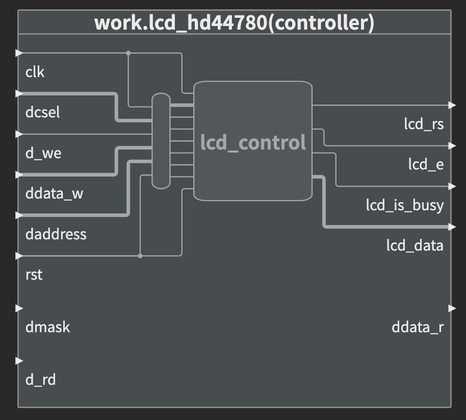

# Controlador para displays de caracteres LCD HD44780 (2021/1 e 2021/2)
  
Este trabalho está divido em duas partes. A primeira parte está na pasta base e a segunda na pasta riscV.  
  
## Primeira parte
O desenvolvimento da primeira parte contempla uma interface para utilização de um controlador para display de caracteres LCD HD44780 Hitachi [1], permitindo utilizar displays LCD alfanuméricos 16x2.
  
### Objetivos
A descrição do hardware foi feita em VHDL e possui o objetivo de promover uma interface que tenha os seguintes comandos: 

1. Realizar rotina de inicialização do LCD
2. Escrever um caractere alfanumérico
3. Posicionar o cursor de escrita na primeira ou segunda linha
4. Limpar todos caracteres

De forma que o chamador destes comandos via hardware tenha uma maior abstração do funcionamento do LCD, tendo apenas que gerenciar efetivamente o que está escrito e o que deseja escrever no display.

### Projeto
A entidade projetada consiste em:


### Esquemático de hardware


### Máquinas de estado

1. Controle dos timeouts de power-up
2. Controle de temporizadores e comandos de interface com o HD44780

### Resultados

Projeto atende aos objetivos 1, 2, 3 e 4, sendo possível escrever um caractere via variável/signal na posição inicial da linha 1 ou 2.

Porém, apresenta o problema em que comandos não são enviados um a um. Necessita mecanismo de sincronia para módulo enviar apenas UM comando ao LCD para cada trigger.


#### Testbenches
0. Power-up com o tempo mínimo para estabilização da tensão

1. Máquina de estados da inicialização do LCD, contendo todos os estímulos de configuração enviados por LCD_DATA(0..7) em RS=0 (instruções).


#### Montagem em hardware


#### Problemas encontrados:

* O comando via chave era realizado muitas vezes, pois a borda de subida de clock que é responsável pelo trigger do evento caso o bit relativo ao comando desejado esteja em 1. Resultava em, por exemplo: escritas sucessivas do mesmo caractere

## Segunda parte

O desenvolvimento da segunda parte contempla a integração da primeira parte com um softcore riscV. A dinâmica do projeto situa o controlador lcd como um periférico que é controlado pelo softcore a partir da leitura de comandos em memória. Os comandos, por sua vez, são gerados a partir de um código C compilado para o conjunto de instruções riscV.
  
### Objetivos
A entidade projetada pretendeu integrar um softcore com conjunto de instruções riscV ao controlador lcd hd44780. Além disso, foi feito a integração com outros componentes, de forma que o controlador só receberia instruções do softcore se estivesse sendo endereçado. O objetivo principal dessa integração é fornecer em código C uma camada de abstração para o controlador implementado em vhdl.  

### Projeto


### Esquemático de hardware
Permanece o mesmo do ponto de vista do controlador.

### Máquina de estado
Permanece a mesma do ponto de vista do controlador.

### Operação
A seguir, a função main códificada em C que controla o display a partir do softcore.
```C
int main(){
  unsigned int i;
  HD44780_REGISTER -> start = 0;
  HD44780_REGISTER -> wr_en = 0;
  HD44780_REGISTER -> clear = 0;
  HD44780_REGISTER -> goL1 = 0;
  HD44780_REGISTER -> goL2 = 0;
  HD44780_REGISTER -> wait_next = 0;
  
  delay_(5000);
  HD44780_REGISTER -> start = 1;
  delay_(5000);
  HD44780_REGISTER -> start = 0;
  delay_(5000);
  HD44780_REGISTER -> clear = 1;
  delay_(5000);
  HD44780_REGISTER -> clear = 0;

  char string_lcd[] = "Hello World ";

  while(1) {
    for(i=0; i<12; i++){      
      HD44780_REGISTER -> character = (int) string_lcd[i];  
      HD44780_REGISTER -> wait_next = 0;   
      HD44780_REGISTER -> wr_en = 1;
      delay_(50);
      HD44780_REGISTER -> wait_next = 1;
      delay_(150);
    }
    HD44780_REGISTER -> wr_en = 0;
    while(1){}
  }
  return 0;
}
```
O controle das ações é feito a partir da mudança de valor lógico dos membros da struct que representa o registrador utilizado na comunicação entre o softcore e o controlador. É necesário fazer o uso de "delays" entre as mudanças de valor lógico pois as ações executadas pelo controlador levam um certo tempo e uma mudança de nível prematura pode interromper a ação objetivada.  
No código acima, com o intuito de escrever uma string no lcd, foram utilizados 4 membros da struct que representa o registrador para findar a ação. O primeiro é o "character", que representa o caracter a ser escrito. O segundo, "wr_en", informa ao controlador que deve escrever o valor em "character". O terceiro, "wait_next", serve para evitar escritas duplicadas, já que o tempo utilizado no código C como delay nessa ação é impírico e não necessariamente representa apenas a escrita de uma letra.  

### Resultados
A integração do controlador com o softcore ocorreu com sucesso e conseguiu entregar um código C com capacidade de controlar o periférico em questão. A foto a seguir mostra o feito:
[Resultado](docs/../doc/result_risc.JPG)

## Referências

[1] SPARKFUN, Hitachi HD44780 LCD Controller Datasheet <https://www.sparkfun.com/datasheets/LCD/HD44780.pdf>
