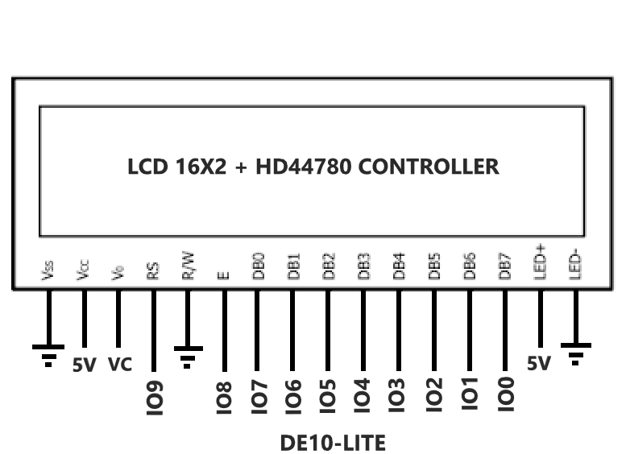
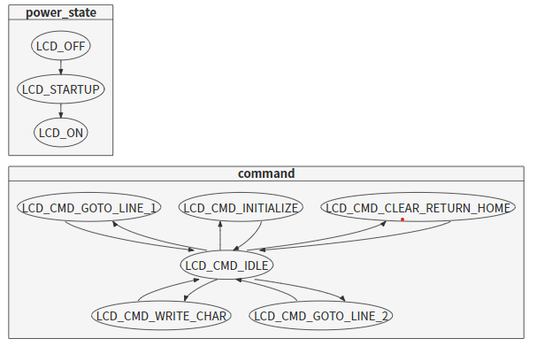
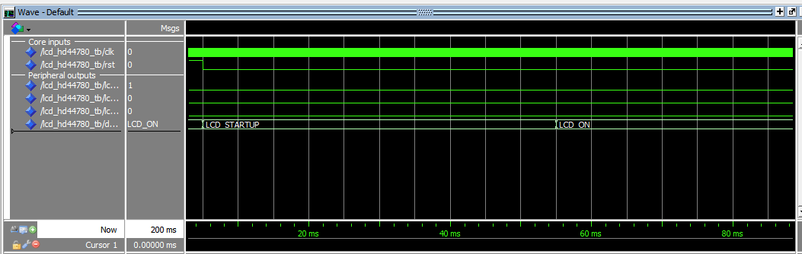
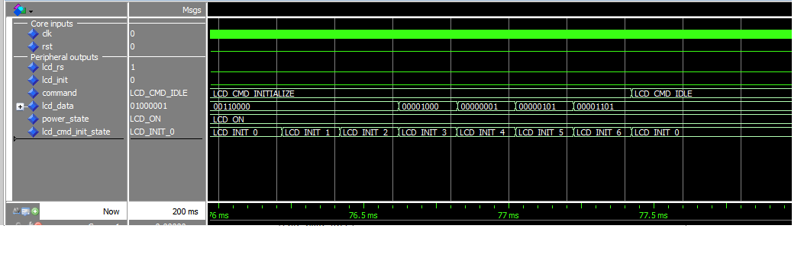
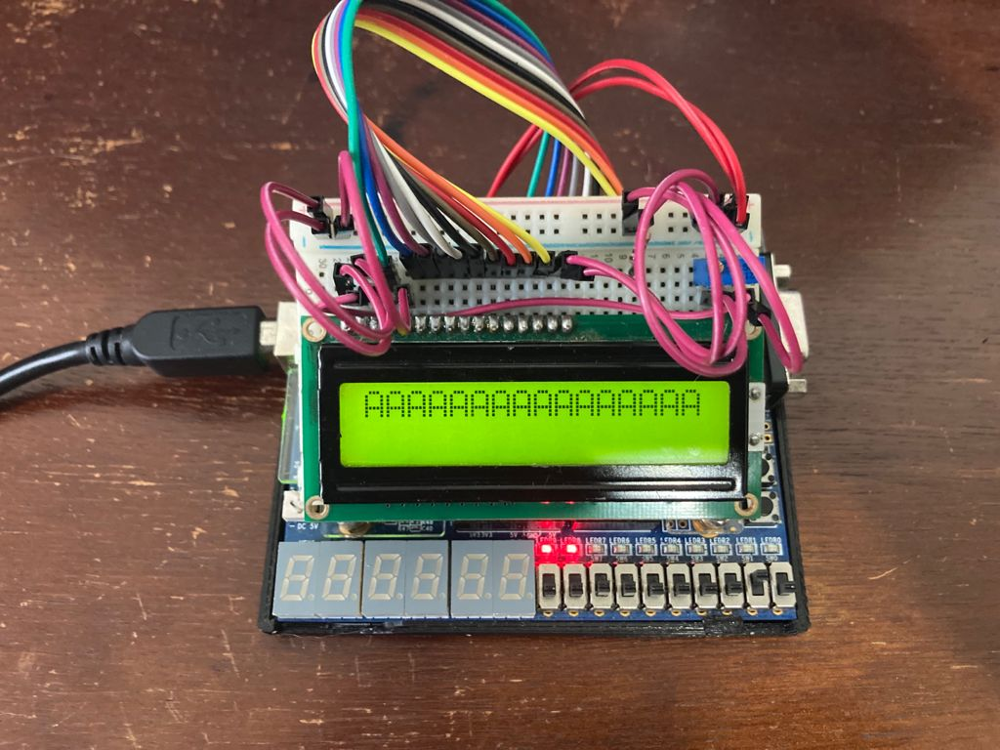

# Controlador para displays de caracteres LCD HD44780 (2021/1 e 2021/2)
  
Este trabalho está divido em duas partes. A primeira parte está na pasta base e a segunda na pasta riscV.  
  
## Primeira parte
O desenvolvimento da primeira parte contempla uma interface para utilização de um controlador para display de caracteres LCD HD44780 Hitachi [1], permitindo utilizar displays LCD alfanuméricos 16x2.
  
### Objetivos
A descrição do hardware foi feita em VHDL e possui o objetivo de promover uma interface que tenha os seguintes comandos: 

1. Realizar rotina de inicialização do LCD
2. Escrever um caractere alfanumérico
3. Posicionar o cursor de escrita na primeira ou segunda linha
4. Limpar todos caracteres

De forma que o chamador destes comandos via hardware tenha uma maior abstração do funcionamento do LCD, tendo apenas que gerenciar efetivamente o que está escrito e o que deseja escrever no display.

### Projeto
A entidade projetada consiste em:

### Esquemático de hardware

### Máquinas de estado

1. Controle dos timeouts de power-up
2. Controle de temporizadores e comandos de interface com o HD44780

### Resultados

Projeto atende aos objetivos 1, 2, 3 e 4, sendo possível escrever um caractere via variável/signal na posição inicial da linha 1 ou 2.

Porém, apresenta o problema em que comandos não são enviados um a um. Necessita mecanismo de sincronia para módulo enviar apenas UM comando ao LCD para cada trigger.

#### Testbenches
0. Power-up com o tempo mínimo para estabilização da tensão

1. Máquina de estados da inicialização do LCD, contendo todos os estímulos de configuração enviados por LCD_DATA(0..7) em RS=0 (instruções).

#### Montagem em hardware

#### Problemas encontrados:

* O comando via chave era realizado muitas vezes, pois a borda de subida de clock que é responsável pelo trigger do evento caso o bit relativo ao comando desejado esteja em 1. Resultava em, por exemplo: escritas sucessivas do mesmo caractere

## Segunda parte

O desenvolvimento da segunda parte contempla a integração da primeira parte com um processador riscV + memória. A dinâmica do projeto situa o controlador lcd como um periférico que é controlado pelo processador a partir da leitura de comandos em memória. Os comandos, por sua vez, são gerados a partir de um código C compilado para o conjunto de instruções riscV.
  
### Objetivos
A entidade projetada consiste em:

## Referências

[1] SPARKFUN, Hitachi HD44780 LCD Controller Datasheet <https://www.sparkfun.com/datasheets/LCD/HD44780.pdf>
