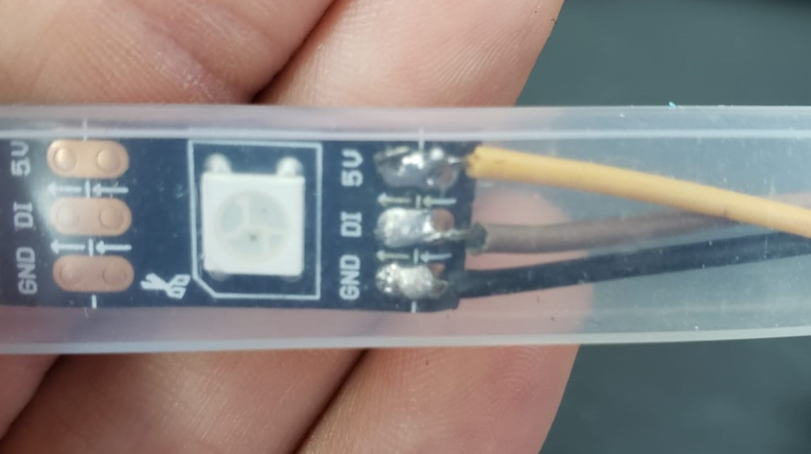

# Driver RGB

O LED WS2812 é um LED RGB inteligente com controle integrado. Ele permite o controle individual de cada cor (vermelho, verde e azul) através de um único pino de dados, o que simplifica a conexão de vários LEDs em cascata. O led possui um pino de alimentação 5V um pino para o GND e outro pino de dado

    

