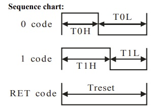
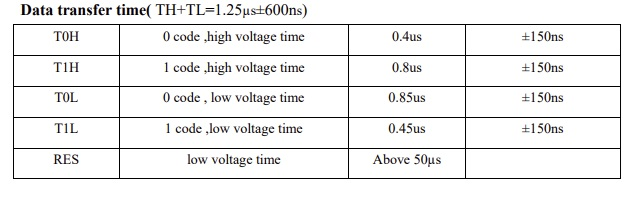
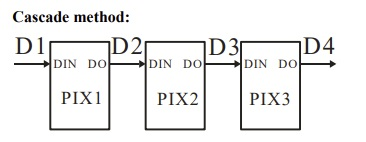

# Driver RGB

O LED WS2812 é um LED RGB inteligente com controle integrado. Ele permite o controle individual de cada cor (vermelho, verde e azul) através de um único pino de dados, o que simplifica a conexão de vários LEDs em cascata. O led possui um pino de alimentação 5V, um pino para o GND e outro pino de dados

    

O LED WS2812 utiliza um protocolo de comunicação baseado em um sinal de dados serial com a frequÊcnai de aproximadamente 800KHz. Para controlar a cor e o brilho, é enviados 24 bits por led.

Cada LED WS2812 possui um controlador integrado que interpreta o sinal de dados. O sinal é transmitido em formato NRZ (Non-Return to Zero), onde a duração dos pulsos representa os bits 0 e 1. Um bit '0' é representado por um pulso de alta tensão (nível lógico alto) de 0,4 µs seguido de um pulso de baixa tensão (nível lógico baixo) de 0,85 µs. Um bit '1' é representado por um pulso de alta tensão de 0,8 µs seguido de um pulso de baixa tensão de 0,45 µs.

    
    

Os dados são enviados em pacotes de 24 bits por LED, sem pausas entre a informação de cada led, com 8 bits para o valor de cada cor (verde, vermelho e azul, nessa ordem). O primeiro LED da cadeia recebe o pacote de dados, armazena as informações que correspondem a ele e retransmite o restante do sinal para o próximo LED na cadeia, processando os dados subsequentes. Isso permite que cada LED seja controlado individualmente, e o sinal é propagado de um LED para o próximo ao longo da cadeia.

    

Após o envio dos dados, o controlador do LED WS2812 precisa de um intervalo de pelo menos 50 µs de baixa tensão para concluir a transmissão e exibir as cores configuradas. Isso também permite que o sistema de controle saiba que a transmissão de dados foi finalizada, iniciando um novo ciclo se necessário.

