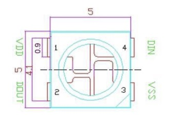
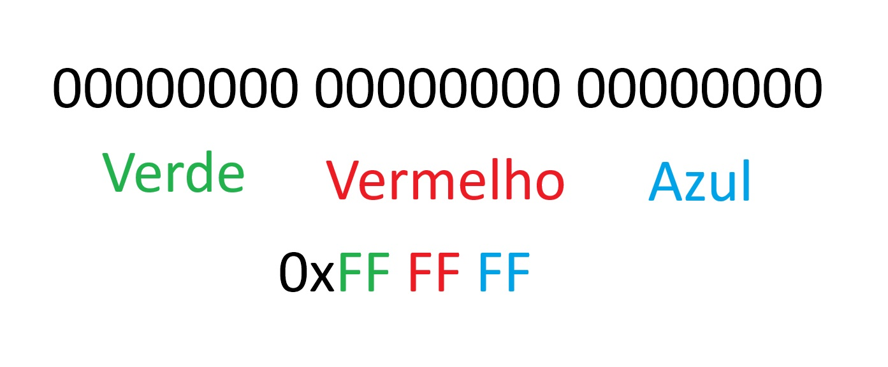
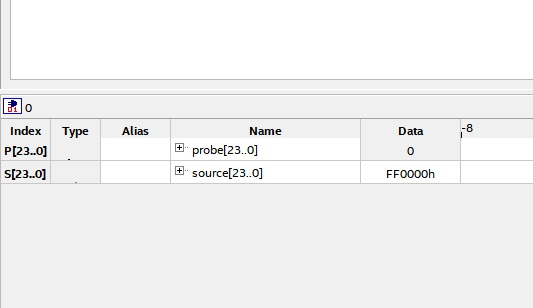
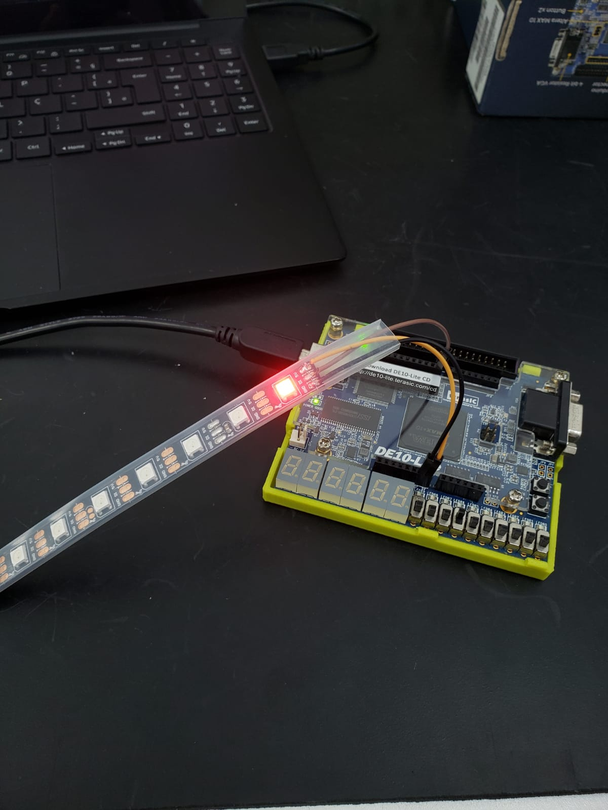
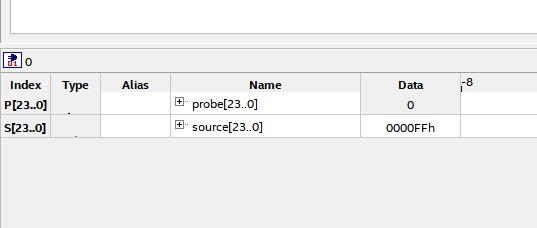
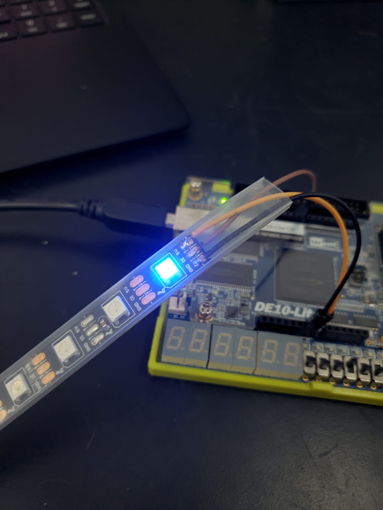
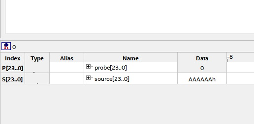
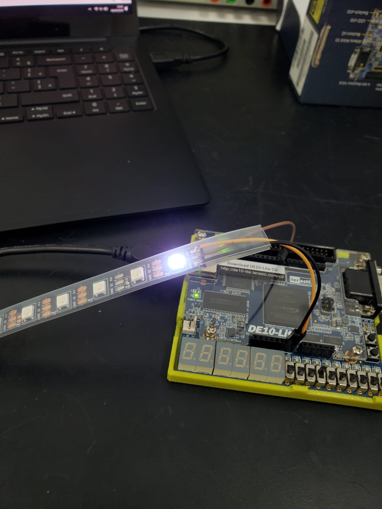
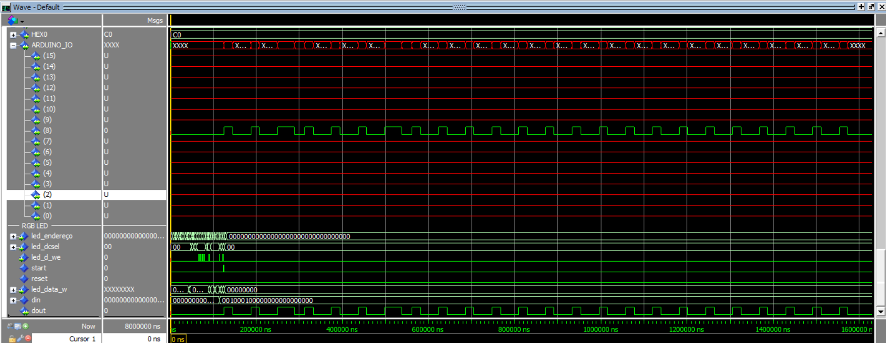
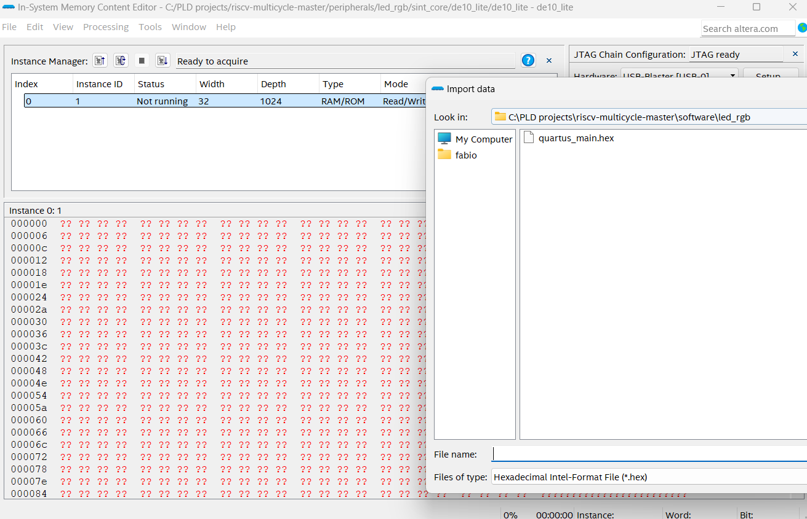

# Driver RGB

O LED WS2812 é um LED RGB inteligente com controle integrado. Ele permite o controle individual de cada cor (vermelho, verde e azul) através de um único pino de dados, o que simplifica a conexão de vários LEDs em cascata. O led possui um pino de alimentação 5V, um pino para o GND, pino de entrada dados e outro de saída de dados conectado ao próximo led.

 

    

    

O LED WS2812 utiliza um protocolo de comunicação baseado em um sinal de dados serial com a frequêcnai de aproximadamente 800KHz. Para controlar a cor e o brilho, é enviados 24 bits por led.

Cada LED WS2812 possui um controlador integrado que interpreta o sinal de dados. O sinal é transmitido em formato NRZ (Non-Return to Zero), onde a duração dos pulsos representa os bits 0 e 1. Um bit '0' é representado por um pulso de alta tensão (nível lógico alto) de 0,4 µs seguido de um pulso de baixa tensão (nível lógico baixo) de 0,85 µs. Um bit '1' é representado por um pulso de alta tensão de 0,8 µs seguido de um pulso de baixa tensão de 0,45 µs.

    
    

Os dados são enviados em pacotes de 24 bits por LED, sem pausas entre a informação de cada led, com 8 bits para o valor de cada cor (verde, vermelho e azul, nessa ordem). O primeiro LED da cadeia recebe o pacote de dados, armazena as informações que correspondem a ele e retransmite o restante do sinal para o próximo LED na cadeia, processando os dados subsequentes. Isso permite que cada LED seja controlado individualmente, e o sinal é propagado de um LED para o próximo ao longo da cadeia.

    
    

Após o envio dos dados, o controlador do LED WS2812 precisa de um intervalo de pelo menos 50 µs de baixa tensão para concluir a transmissão e exibir as cores configuradas. Isso também permite que o sistema de controle saiba que a transmissão de dados foi finalizada, iniciando um novo ciclo se necessário.  
# Desenvolvimento do driver RGB

O código VHDL desenvolvido foi dividido em uma máquina de estados com quatro estados principais: IDLE, SEND_DATA_HIGH, SEND_DATA_LOW e END_SEND_DATA.  

No estado IDLE, o controlador fica inativo até que o sinal de início (start) seja ativado. Quando isso ocorre, o controlador carrega o dado de entrada (din) em um registrador de deslocamento e inicia a transmissão dos bits, um de cada vez. No estado SEND_DATA_HIGH, o controlador verifica o valor do bit mais significativo no registrador de deslocamento. Se o bit for 1, ele envia um pulso de alta duração correspondente ao valor T1H_TIME, e se for 0, envia um pulso de alta duração correspondente ao valor T0H_TIME. Após enviar o pulso alto, o controlador altera para o estado SEND_DATA_LOW, onde envia um pulso de baixa duração. Dependendo do valor do bit (1 ou 0), o pulso de baixa duração terá o tempo configurado por T1L_TIME ou T0L_TIME. Depois de enviar o pulso de baixa, o controlador desloca o registrador para preparar o próximo bit para envio.

O processo continua até que todos os 24 bits do registrador de deslocamento sejam enviados. Quando todos os bits foram transmitidos, o controlador entra no estado END_SEND_DATA, onde aguarda por um tempo antes de retornar ao estado IDLE, pronto para uma nova transmissão. O código também possui um sinal de reinicialização (reset) que coloca o controlador de volta no estado IDLE e reinicializa os contadores e o registrador de deslocamento.  

Para testar o driver utilizando a placa DE10Lite foi utilizado o In-System Sources and Probes para selecionar o dado a ser enviado:  

## Verde

    
    

## Vermelho

    
    

## Azul

    
    

## Branco

    
    

---
### Continuação do Trabalho, implementação do periférico com o softcore e validação do funcionamento
---

Continuando a implementação feita pelo Pedro Harenza, o código do controlador foi ajustado o limite de uma variável pois estava com erro na simulação. Após atestar o funcionamento do periférico foi realizado o mapeamento em registrador para iniciar a implementação com o softcore.

O código referente ao arquivo rgb_mapeado, demonstra o periférico mapedo em registrador e com um endereço para o barramento do softcore. após realizar o mapeamento, foi feito um código em C, e usando um compilador, geramos um código em .hex para a simulação do periférico juntamente com o softcore no modelsim, como demonstra a imagem abaixo

## Simulação softcore + periférico

    

Após verificar o funcionamento do periférico com o softcore atraves da simulação no modelsim, se fez necessário o desenvolvimento do código para sintese, o qual foi utilizado o exemplo que está no periférico do GPIO, nele foi inserido a instancia do led_rgb, realizado a sintese no quartus e por meio do in system memory content, foi carregado o arquivo quartus_main.hex, e realizado o teste na placa, a imagem abaixo demonstra o arquivo carregado e a janela do in system memory content.

## In system memory content

    

Com o arquivo carregado, o sw(9) deve estar ativo em alto, ao colocar a chave sw(9) para nivel logico baixo o processador sai do reset e o periférico deve funcionar. O gif abaixo mostra o funcionamento dos leds com base no arquivo escrito para o software que foi compilado. Troca de cor entre vermelho-verde-azul-branco.

## Funcionamento do periférico integrado no softcore

    

