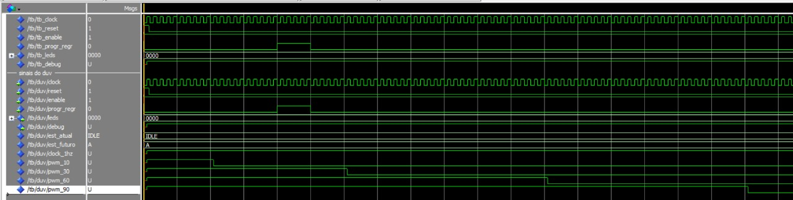
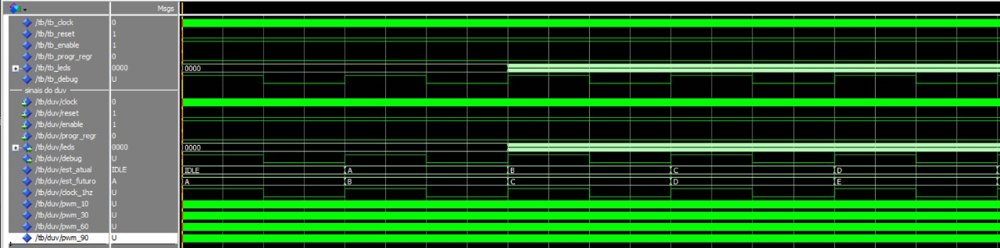

# Desenvolvimento

A concepção do projeto foi baseada na decomposição da animação dos LEDs em
três blocos principais, cada um responsável por uma função específica:
divisor de clock, gerador de PWM e máquina de estados finita (FSM). Essa
abordagem modular permitiu o desenvolvimento, teste e validação individual
de cada bloco, facilitando a integração final do sistema.

## Divisor de clock

O clock nativo da placa FPGA DE10-Lite opera em uma frequência elevada,
inadequada para a observação visual da animação dos LEDs. Dessa forma, foi
desenvolvido um módulo divisor de clock capaz de reduzir essa frequência
para aproximadamente 1 Hz. Essa redução permite que a transição entre os
estados da FSM ocorra de forma lenta e perceptível ao observador.

O divisor de clock foi implementado utilizando um contador interno e um
parâmetro genérico que define a taxa de divisão do clock. A saída
`clock_div` é utilizada como referência temporal para a FSM, garantindo
que a animação avance de maneira controlada e previsível.

## Gerador de PWM

Para possibilitar diferentes níveis de intensidade luminosa nos LEDs, foi
implementado um módulo gerador de PWM. Esse bloco é responsável por gerar
quatro sinais PWM distintos, com duty cycles aproximados de 10%, 30%, 60%
e 90%.

Cada um desses sinais é associado a um LED específico, permitindo que a
animação apresente variações graduais de brilho. Dessa forma, conforme a
FSM avança entre os estados, os LEDs não apenas aumentam em quantidade,
mas também apresentam intensidades diferentes, reforçando o efeito visual
da “barrinha” de LEDs.

## Máquina de Estados Finita (FSM)

A máquina de estados finita constitui o núcleo do sistema e é responsável
por determinar quais LEDs devem ser acesos em cada instante e qual sinal PWM
deve ser aplicado a cada um deles. A FSM foi estruturada com seis estados:
IDLE, A, B, C, D e E.

No estado IDLE, o sistema permanece em repouso, com os LEDs desligados.
No estado A, todos os LEDs permanecem apagados. Nos estados B, C, D e E,
a quantidade de LEDs acesos aumenta progressivamente, sendo cada LED
associado a um nível específico de PWM, resultando em diferentes níveis de
brilho.

O sinal `progr_regr` permite inverter o sentido da animação, possibilitando
que a “barrinha” de LEDs cresça ou diminua. Já o sinal `enable` controla se
a FSM deve avançar para o próximo estado ou permanecer no estado atual,
permitindo pausar a animação sem perder o contexto do sistema. O sinal
`reset` força a FSM a retornar ao estado inicial IDLE.

## Validação por simulação (ModelSim)

A validação funcional do sistema foi realizada inicialmente por meio de
simulações no ambiente ModelSim. As Figuras a seguir apresentam as formas de
onda obtidas durante a simulação, evidenciando o funcionamento correto da
FSM, do divisor de clock e do gerador de PWM.

Observa-se nas formas de onda a transição ordenada dos estados da FSM,
sincronizada com o sinal `clock_div`, bem como a atuação do sinal `enable`
no controle do avanço dos estados. Além disso, é possível verificar os
sinais PWM (`pwm_10`, `pwm_30`, `pwm_60` e `pwm_90`) apresentando diferentes
razões cíclicas, conforme esperado, e sendo selecionados de acordo com o
estado atual da FSM.

## Implementação em hardware (FPGA)

Após a validação por simulação, o projeto foi sintetizado e implementado na
placa FPGA DE10-Lite utilizando o software Quartus. Os gifs a seguir 
mostram a execução do sistema em hardware real, onde é possível observar
a animação dos LEDs ocorrendo conforme o comportamento previsto.

Nos registros visuais apresentados, verifica-se o efeito de “barrinha” de
LEDs, com crescimento e regressão controlados pelas chaves físicas da
placa, bem como a variação gradual da intensidade luminosa de cada LED,
resultante da aplicação dos sinais PWM. Esses resultados confirmam a
correta integração dos módulos e a coerência entre a simulação e a
implementação física do sistema.

