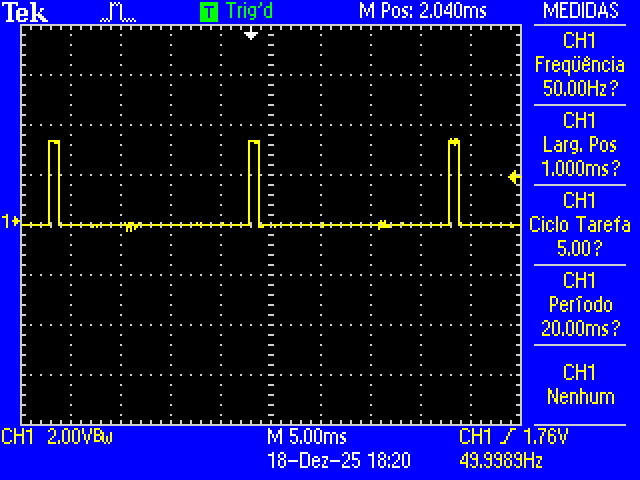
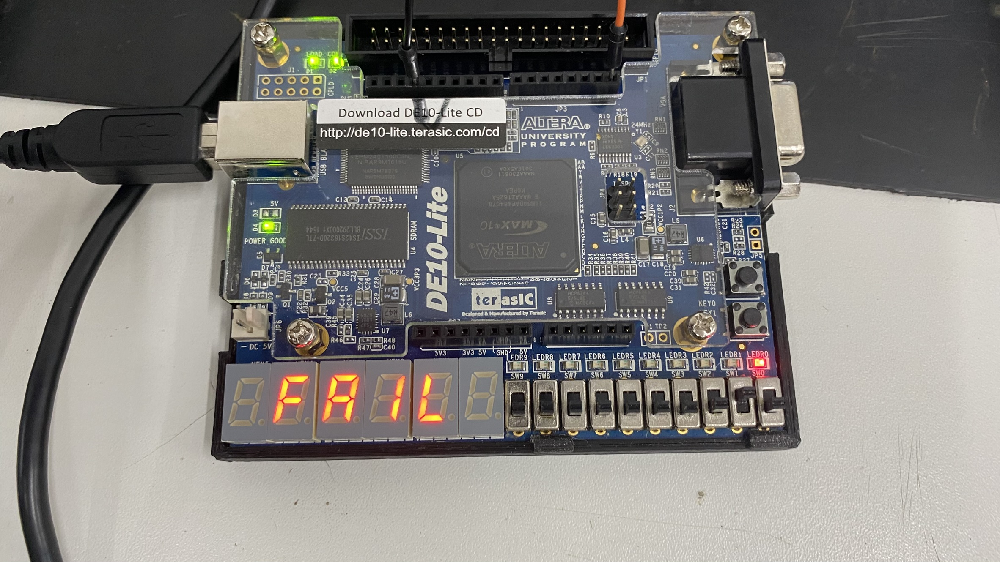

## Implementação do periferico projeto final PLD22109
### Autor: João Pedro de Araújo Duarte
### Semestre 2025/2

 O código descreve um periférico de teste para motor BLDC controlado por ESC com foco na aplicação em UAV's.
 É gerado um sinal de controle do tipo RC (servo), com período fixo de 20 ms
 (frequência de 50 Hz) e largura de pulso ajustável entre 1000 µs e 2000 µs.

 A largura de pulso de 1000 µs representa o comando mínimo (motor parado),
 enquanto 2000 µs representa o comando máximo (motor em rotação máxima).

 A aceleração do motor é realizada automaticamente por
 rampas de incremento da largura de pulso ao longo do tempo.

 São definidos três modos de operação:
 1. Modo de teste com rampa de aceleração incremental de 1% do intervalo
    total (1000 µs a 2000 µs) por segundo, até o valor máximo, seguido de parada.
 2. Modo de teste com rampa de aceleração incremental de 5% do intervalo
    total por segundo, até o valor máximo, seguido de parada.
 3. Modo de teste com rampa de aceleração incremental de 10% do intervalo
    total por segundo, até o valor máximo, seguido de parada.

 Durante todos os modos de operação, é monitorado um sinal de entrada que
 representa a relação grama-força referente à força de empuxo gerada pelo motor.

 Em todos os modos, após o comando atingir pelo menos 10% do intervalo total
 de controle, caso o valor do sinal referente ao "peso" seja zerado em qualquer momento, o motor
 é imediatamente desligado e o sistema entra em estado de falha.

Adicionalmente, é implementado um sinal de segurança denominado
motor_emergency_stop que, quando ativado, força a saída de controle do motor
para nível lógico baixo (GND), promovendo o desligamento imediato do motor.

A figura 1 apresenta a FSM do sistema:
###### Figura 1 - FSM do sistema implementado.

 

A figura 2 apresenta o diagrama de blocos do sistema:
###### Figura 2 - Diagrama de blocos do sistema implementado.

 

A figura 3 demonstra a imagem do sinal pwm_out no estado MODE_ST, indicando a saída PWM esperada na entrada do ESC, a largura de pulso inicialmente em 1000 us indicando a condição de motor parado, aguardando a seleção do modo de operação desejado pelo usuário:

###### Figura 3 - Sinal de saída pwm_out.

 

A seguir é apresentado na figura 4 o feedback visual para o usuário no caso de falha do teste. O vídeo 1 apresenta o funcionamento inicial do sistema no modo de aceleração com incremento a 1% e detectando o sinal weight zerado, levando ao corte do sinal de saída e parando o motor.

###### Figura 4 - Condição de falha.

 

###### Video 1 - Teste de falha e modo 1 .

[▶ Demonstração em vídeo - Clique para Download]([./Images/Teste.mp4](https://github.com/jaojao7/riscv-multicycle/raw/refs/heads/master/peripherals/motor_test_bldc/Images/Teste.mp4))

