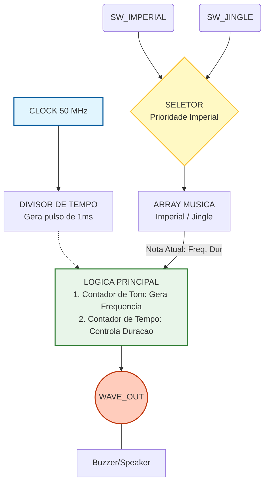

# Buzzer Passive - Dual Song

**Autor:** Sarah Bararua

**Plataforma Alvo:** DE10-Lite 

**Clock Base:** 50 MHz

**Linguagem:** VHDL

## Visao Geral
Este projeto implementa um reprodutor de melodias em VHDL. O sistema e capaz de gerar ondas quadradas em frequencias especificas (notas musicais) e controlar a duracao dessas notas para reproduzir musicas completas. Atualmente, o projeto suporta duas melodias selecionaveis via chaves fisicas: Imperial March e Jingle Bells.

## Funcionamento do Projeto
O sistema opera utilizando um clock mestre de 50 MHz. O funcionamento baseia-se na divisao de frequencia e multiplexacao de dados:

1.  **Banco de Dados de Musicas:** As musicas sao armazenadas em arrays de registros (records), onde cada registro contem:
    * `half_period`: O valor do divisor de clock para gerar a frequencia da nota.
    * `duration_ms`: A duracao da nota em milissegundos
2.  **Seletor (Multiplexador):** Um processo monitora as chaves `sw_imperial` e `sw_jingle`. Se `sw_imperial` estiver ativa, ela tem prioridade. Se nenhuma estiver ativa, o sistema carrega uma "nota vazia" (silencio).
3.  **Geracao de Onda:** O sistema conta os ciclos de clock ate atingir o `half_period` da nota atual, invertendo o estado do pino de saida (`wave_out`) para criar uma onda quadrada.

## Diagrama de Fluxo de Dados

## Maquina de Estados e Logica Principal
Embora nao utilize uma FSM (Maquina de Estados Finitos) formal com declaracao de tipos, o processo principal (`process(clk)`) atua como uma maquina de estados implicita controlada por contadores aninhados:

1.  **Estado IDLE (Reset):** Quando ambas as chaves estao em '0', o indice da musica (`note_idx`) e os contadores sao resetados para 0. O buzzer permanece desligado.
2.  **Estado PLAY (Execucao):**
    * **Sub-estado Frequencia:** Verifica se `cnt_tone` >= `half_period`. Se sim, inverte o bit de saida (`wave_reg`) e zera o contador. Isso cria o tom audivel.
    * **Sub-estado Duracao:** Um divisor gera um sinal de 1ms (`ms_tick`). A cada ms, o `cnt_time` e incrementado.
3.  **Transicao de Nota:**
    * Quando `cnt_time` atinge a `duration_ms` da nota atual, o sistema incrementa o `note_idx` para buscar a proxima nota no array.
    * Se atingir o final do array (`MAX_LEN`), o indice volta a 0, criando um loop da musica.

## Testbench e Simulacao
O arquivo `testbench.vhd` foi projetado para validar a logica de troca de musicas e geracao de ondas.

* **Clock:** Gera um sinal de 50 MHz (periodo de 20ns).
* **Cenario de Teste:**
    1.  Inicia em silencio (100 us).
    2.  Ativa a Marcha Imperial por 40 ms.
    3.  Pausa curta.
    4.  Ativa Jingle Bells por 35 ms.
* **Nota sobre o tempo:** A simulacao utiliza o arquivo `buzzer1.vhd` onde as duracoes das notas foram reduzidas (ex: 5ms em vez de 500ms) para permitir a validacao rapida da troca de notas.

### Questa / ModelSim
O projeto inclui um script de automacao (`tb.do`) para facilitar a simulacao.
Na figura a seguir podemos verificar a simulação do arquivo 'buzzer1.vhd'

A seguir temos o Video do funcionamento do projeto na de10Lite

https://github.com/user-attachments/assets/9129337d-ee25-4f10-86d1-d0d031793b2f

## Limitacoes do Projeto

### 1. Divisao de Clock (50 MHz)
O projeto foi desenhado para placas como a DE10-Lite, que possuem um clock de 50 MHz.
* **O Desafio:** Para gerar uma nota Do central (C4 - 261 Hz), o FPGA precisa contar aproximadamente 95.785 ciclos de clock antes de inverter o pino.
* **Impacto:** Isso exige contadores de inteiros grandes. Se a frequencia do clock de entrada mudar, todas as notas soarao desafinadas a menos que a constante `CLK_FREQ` seja ajustada.

### 2. Simulacao vs. Tempo Real
Devido a alta frequencia do clock (50 MHz), simular 1 segundo de musica real exigiria processar 50 milhoes de ciclos, o que e lento em simuladores.
* **Solucao Adotada:** Existem dois arquivos. `buzzer.vhd` possui os tempos reais (segundos) para o hardware fisico. `buzzer1.vhd` possui tempos reduzidos (milissegundos) apenas para validar a logica no simulador.

### 3. Monofonia
O sistema so consegue tocar uma nota por vez (onda quadrada simples). Nao ha controle de volume ou polifonia (acordes).

## Sugestoes de Melhorias Futuras
Para expandir este projeto, considere as seguintes implementacoes:

1.  **Controle de Volume (PWM):** Em vez de uma onda quadrada pura (50% duty cycle), utilizar PWM para variar a amplitude media do sinal.
2.  **Modulo ROM de Musicas:** Mover os arrays de musica para uma memoria ROM, permitindo musicas mais longas sem gastar logica da FPGA.
3.  **Gerador de Envelope (ADSR):** Implementar Ataque e Decaimento na onda para suavizar o som.

4.  **Display de 7 Segmentos:** Mostrar visualmente qual musica esta tocando (Ex: '1' para Imperial, '2' para Jingle).

