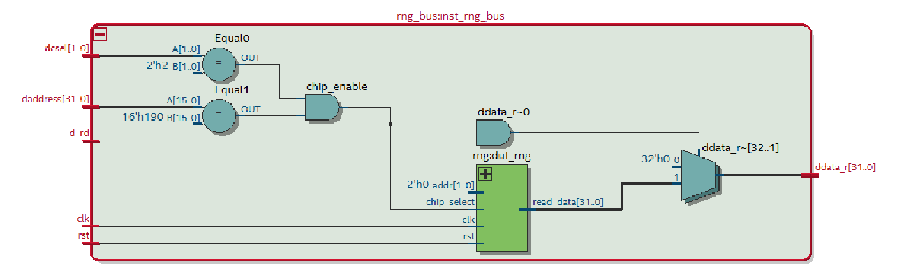

# Pseudo-Random Number Generator (RNG) em VHDL

Aluna: Elisa Anes Romero

## Introdução

Este projeto implementa um **gerador de números pseudoaleatórios (Pseudo-RNG)** totalmente em **VHDL**, utilizando um **registrador de deslocamento com realimentação linear (LFSR — Linear Feedback Shift Register)**.

O objetivo é disponibilizar um **periférico de leitura** no barramento do processador softcore (projeto do IFSC), que pode ser acessado via software para obter valores pseudoaleatórios em tempo real.

---

## Arquitetura do Sistema

O RNG é composto por dois módulos principais:

### `rng.vhd`
Implementa o **núcleo lógico** do gerador pseudoaleatório.  
É um **LFSR de 16 bits**, com polinômio que garante uma sequência de 65.535 valores únicos antes de repetir.

- **Polinômio utilizado:**  
  \\( x^{16} + x^{13} + x^{9} + x^{6} + 1 \\)

- **Sementes iniciais (seed):**  
  Valor fixo `x"ACE1"` — reinicializado no reset.

- **Funcionamento:**  
  A cada borda de subida do clock, o registrador é deslocado e o novo bit é formado pela combinação XOR das posições 16, 13, 9 e 6.

- **Saída:**  
  16 bits gerados são retornados concatenados em um vetor de 32 bits (`x"0000" & lfsr`), prontos para leitura pelo barramento.

---

### `rng_bus.vhd`
Faz a **interface entre o RNG e o barramento de dados do processador**.

- Recebe sinais de controle (`d_rd`, `dcsel`, `daddress`) do sistema.
- Decodifica o endereço base do periférico (`MY_WORD_ADDRESS := x"0190"`).
- Conecta o RNG ao barramento e disponibiliza os dados de leitura.

O módulo é **somente leitura**: não há registradores de configuração ou escrita.

