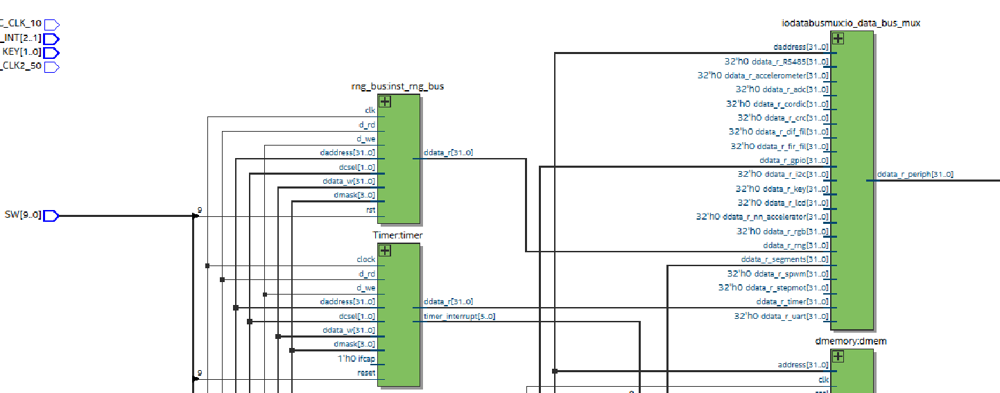

# Síntese e Integração do Periférico RNG com o Softcore

## Introdução

Este projeto implementa e sintetiza um **periférico de geração de números pseudoaleatórios (RNG)** em **VHDL**, integrado ao **processador softcore** desenvolvido no projeto do IFSC.

O objetivo é testar a comunicação entre o **hardware sintetizado na FPGA** e o **software em linguagem C** executado no softcore, que realiza a leitura contínua dos valores gerados pelo RNG.

O código em C lê o pseudo-rng a cada determinado tempo e mostra o numero gerado no display.

## Sugestões de melhorias

Uma possível melhoria seria utilizar ruído do ADC como entrada do polinômio, assim teríamos um verdadeiro gerador de números aleatórios.

