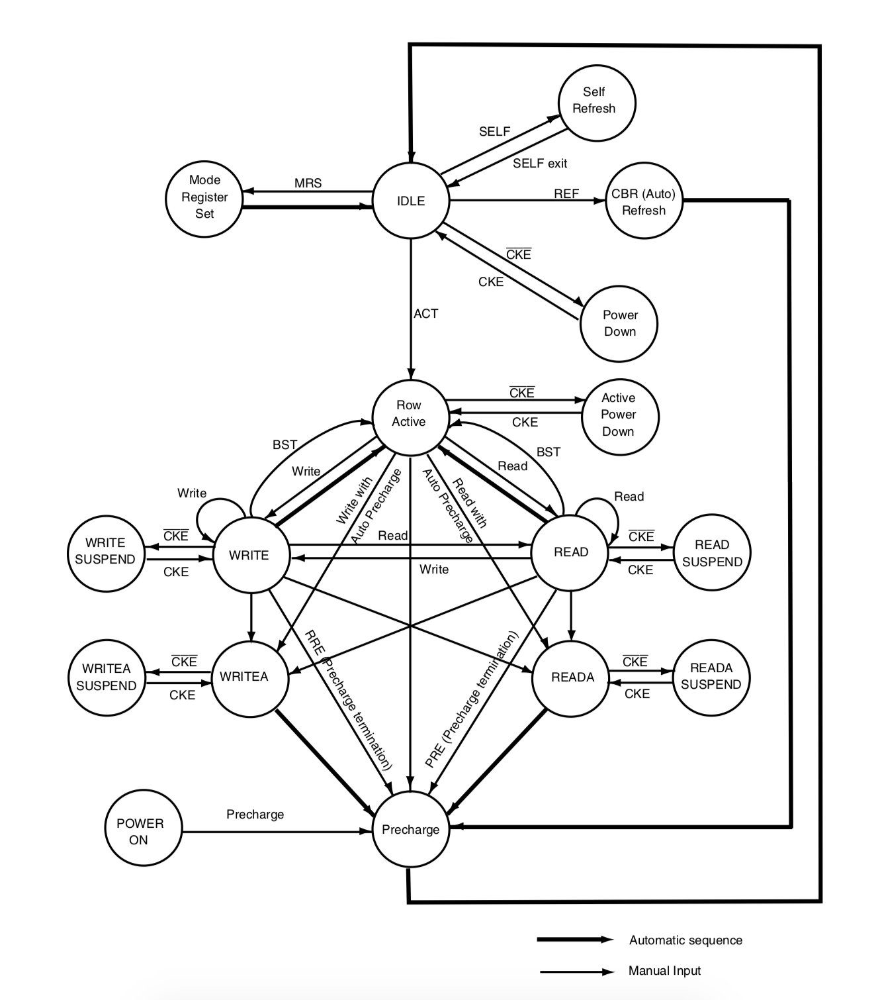
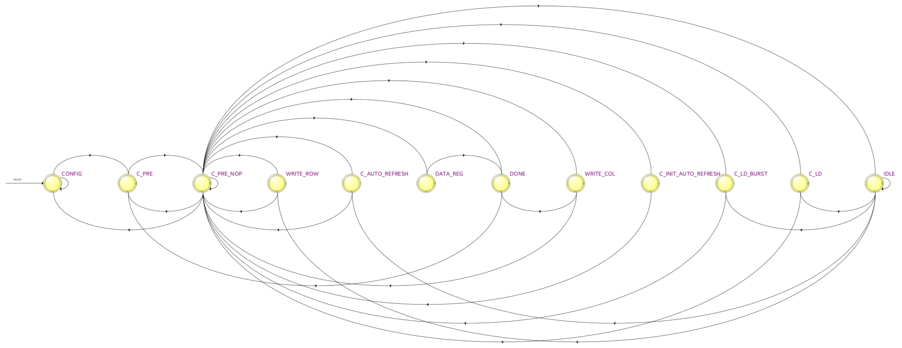
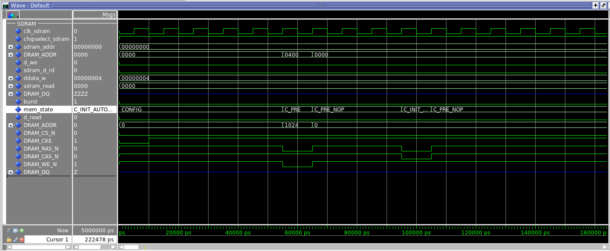
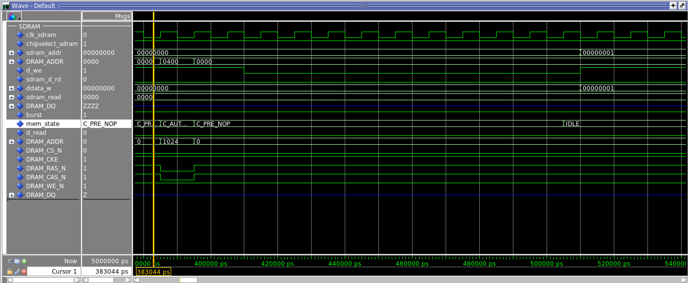
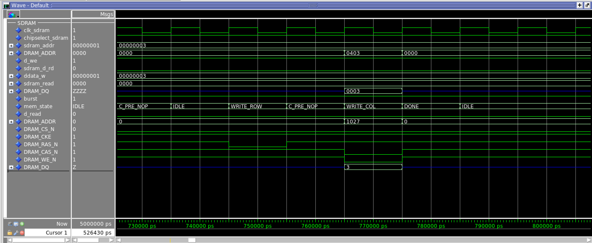
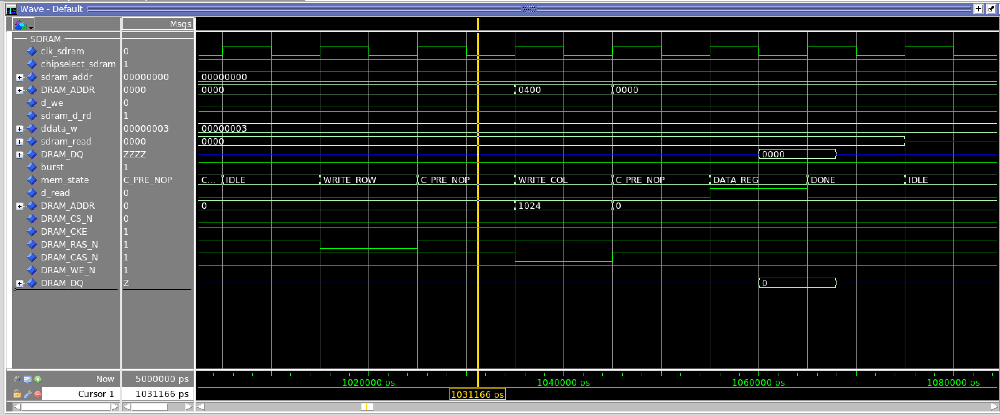

# Memória SDRAM

Este é um controlador para a memória SDRAM IS42S16320D-7TL.

[Datasheet da SDRAM](http://www.issi.com/WW/pdf/42-45R-S_86400D-16320D-32160D.pdf)

## Como fazer funcionar

Este diretório possui os seguintes arquivos:
* sdram_controller.vhd: Arquivo principal do controlador.
* testbench_sdram.vhd: Arquivo de testbench para o controlador.
* testbench_sdtam.do: Script para simulação no ModelSim.
* core_sdram_testbench.vhd: Arquivo de testbench do controlador integrado ao core.
* coretestbench.do: Script para simulação do core no ModelSim.
  
Além destes arquivos, o diretório possui uma pasta `sim/` com modelos comportamental de uma memória SDRAM.

Para utilizar o controlador é apenas necessário adicionar o arquivo sdram_controller.vhd no projeto e instanciá-lo.

## Máquina de estados

Tentou-se seguir neste projeto a máquina de estados fornecida no _datasheet_ do fabricante:

 
(ISSI - Integrated Sillicon Solution Inc., 2015)

O resultado gerado pelo Quartus após a síntese foi o seguinte:

## Resultados de simulação

O processo de inicialização foi verificado por simulação conforme imagens a seguir:

Também verificou-se as etapas de escrita:

Assim como as etapas de leitura:

## TODO:
* Verificar o offset do endereço da SDRAM em relação ao Core.
* Implemententar o suporte a 32bits, atualmente só palavras de 16bits são escritas.

## Funcionamento do [teste em Software](https://github.com/xtarke/riscv-multicycle/tree/master/software/sdram)
A main.c de Grava e verifica o conteudo da SDRAM, acendendo o LEDR0 caso o conteudo lido seja igual ao escrito na SDRAM. Em seguida grava novamente a memoria, lendo ela de forma crescente e decrescente, conforme o Gif abaixo.

## Referências

* ISSI - Integrated Sillicon Solution Inc., IS42/45R86400D/16320D/32160D IS42/45S86400D/16320D/32160D Datasheet, disponível em: <http://www.issi.com/WW/pdf/42-45R-S_86400D-16320D-32160D.pdf>.
