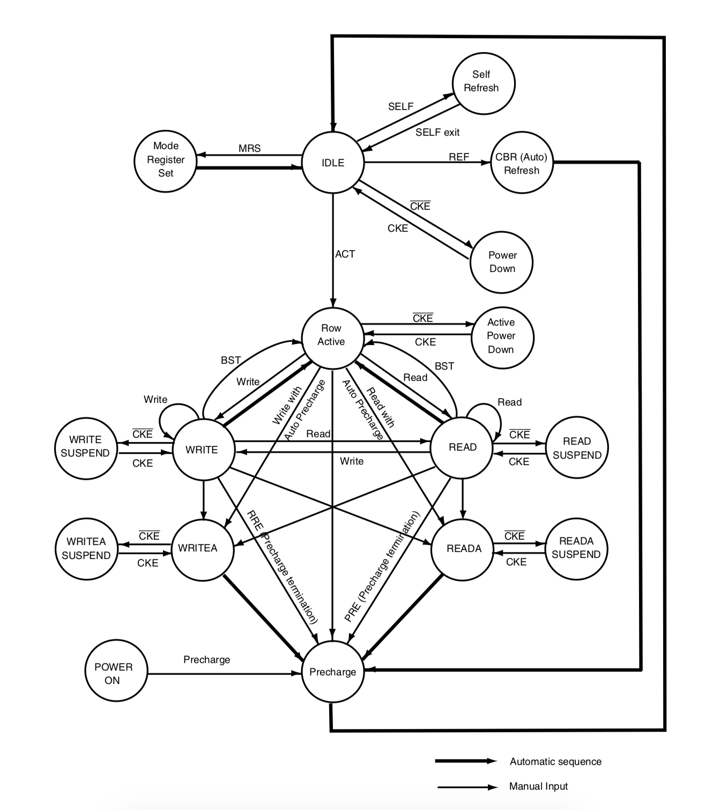
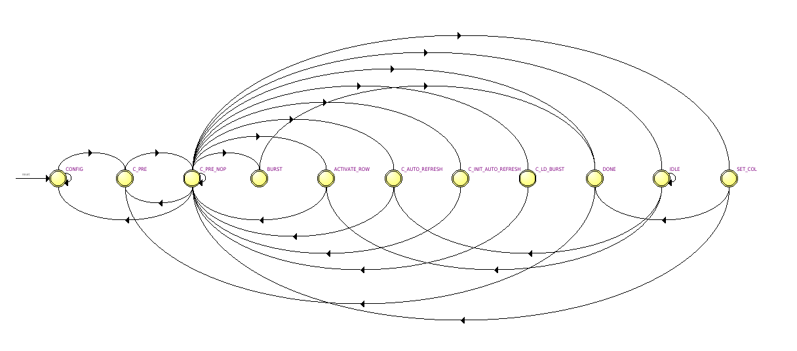
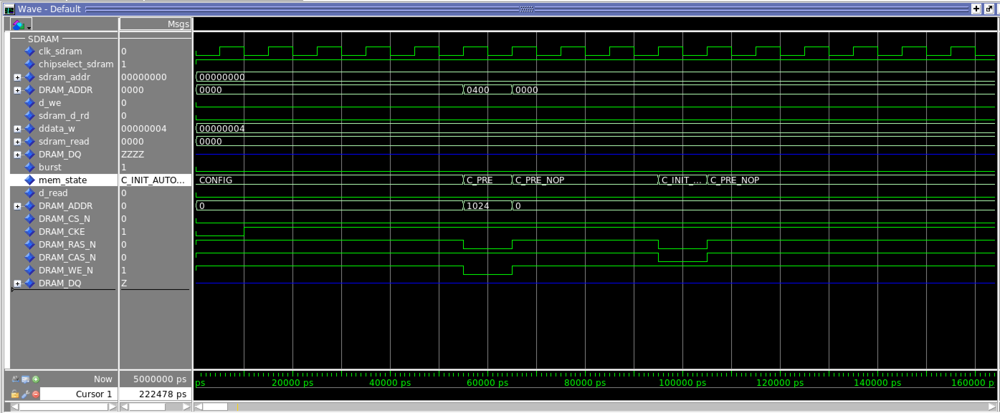
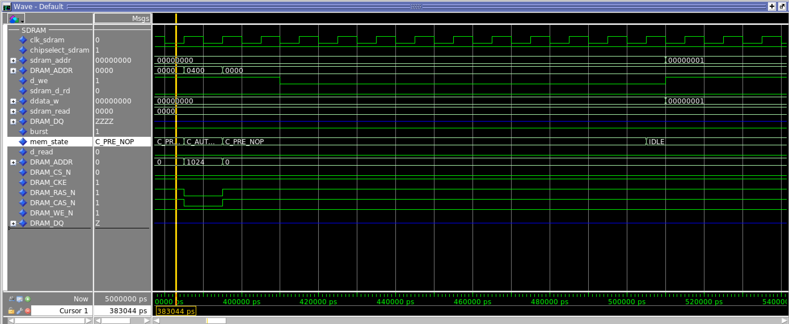
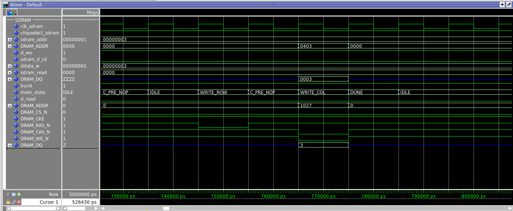
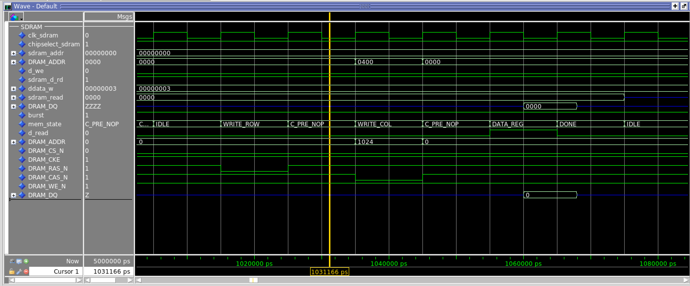

# Memória SDRAM

Este é um controlador para a memória SDRAM IS42S16320D-7TL.

O controlador de SDRAM é a camada de baixo nível que converte requisições de leitura/escrita nos comandos que a memória IS42S16320D entende, através de uma máquina de estados que segue o fluxo do datasheet: ao sair do reset ele executa sozinho toda a sequência de inicialização e depois passa a atender o barramento no estado IDLE. Cada acesso é feito por uma interface na qual o controlador decompõe o endereço em banco/linha/coluna, ativa a linha, emite a coluna e transfere um burst de 8 palavras de 16 bits, intercalando auto-refresh periódico para preservar o conteúdo. Como usa auto-precharge, cada transação é independente e fecha a linha ao final, o que simplifica a lógica ao custo de desempenho.

Este controlador tem suporte à leitura em modo "burst", porém suporta apenas escrita em modo single word.

Porém, já foi previsto que, no futuro, poderia ser implementado o modo burst para escrita. Por isso, a interface dele é baseada em dois buffers de 8 words, um para leitura e outro para escrita. Atualmente, mesmo a interface aceitando um tamanho de escrita maior que 1 word, isso será um undefined behavior, e não é garantido que tenha um funcionamento correto.

Outra limitação desta implementação é que ela utiliza automatic precharge. Isto significa que, ao terminar cada comando, o próprio controlador interno da SDRAM lida com desativar a linha e te força, a cada transação, a ativá-la novamente. Isto não é muito performático. O que poderia ser melhorado no futuro é desativar o automatic precharge e fazer um sistema mais inteligente que verifique se a linha já está ativa. Nesse caso, poderia disparar diretamente um novo burst sem precisar executar o precharge e ativar novamente a mesma linha. Isto aumenta muito a performance e também dá a possibilidade de implementar escrita em burst, porque, quando o automatic precharge está ativado, o controlador não permite cancelar uma transação de escrita. Então fica mais complicado implementar escrita em burst, porque, ao configurar um burst de escrita de, por exemplo, 8 words, com o automatic precharge ativado, é obrigatório esperar a escrita das 8 words. É possível desativar a escrita, mas ainda assim é necessário aguardar o término da operação.

Outra melhoria que poderia ser feita no controlador é mudar o layout da memória para utilizar bancos interleaved. Isto permite fazer pipeline do processo de precharge (desativar a linha) enquanto ativa a seguinte, pois a memória possui 4 bancos que podem ter linhas ativadas independentemente, e o processo de precharge e ativação leva exatamente 4 ciclos. Então, fazendo esse pipeline, teoricamente seria possível obter acesso aleatório em um ciclo.


## Diferença de timing entre o modelo da micron e o hardware.

O modelo leva um ciclo a menos para ler o dado, então DATA_AVAL tem que ser diferentre entre a simulação e o hardware. Talvez seja algum 
erro de implementação que esteja atrasando a leitura um ciclo do hw, é algo para ser investigado.

## Cache

Este cache foi criado principalmente para o periférico de VGA, mas com uma arquitetura pensada para poder ser usada em diferentes periféricos, se necessário.

Como o VGA precisa de um throughput constante, sem interrupção no fluxo de dados, este cache foi projetado para dar prioridade às leituras. Ele funciona da seguinte forma:

Ele possui duas FIFOs, uma de leitura e outra de escrita.

O controlador de cache mantém a FIFO de leitura sempre o mais cheia possível: assim que há espaço para um novo burst, ele requisita mais dados à SDRAM e continua preenchendo a FIFO quase até a sua capacidade máxima. A prioridade entre leitura e escrita é decidida por um limiar de 32 words na FIFO de
leitura: 
enquanto ela estiver abaixo de 32 words, a leitura tem prioridade e o controlador foca em reabastecê-la;
quando ela está com 32 words ou mais, o controlador verifica se há dados disponíveis na FIFO de escrita e começa a esvaziá-la. Assim, enquanto o cache de leitura tiver dados suficientes,
a escrita continua sendo processada; caso contrário, a leitura volta a ter prioridade.

Como o cache foi pensado para leitura sequencial, ele considera um acerto (hit) apenas quando o endereço requisitado é o mesmo que está no topo da FIFO de leitura. A cada leitura bem-sucedida esse endereço avança em uma word, acompanhando o fluxo contínuo esperado pelo VGA.

Quando o endereço requisitado é diferente do que está no topo, ocorre um cache miss. Nesse caso, o controlador não tem como aproveitar os dados que já estavam pré-carregados, então descarta toda a FIFO de leitura e reinicia o prefetch a partir do novo endereço. Enquanto isso acontece, o cache mantém o
sinal de lock ativo, travando o leitor até que o dado correto esteja disponível. Por isso, saltos de endereço têm um custo: é preciso esperar o esvaziamento da FIFO e o preenchimento de um novo burst antes de a leitura voltar a fluir.

Também é possível forçar esse comportamento manualmente através de um sinal de flush, que provoca um cache miss proposital. Isso é útil, por exemplo, para reiniciar a leitura no começo de um novo quadro no VGA, garantindo que o cache volte a buscar os dados a partir do endereço correto.


[Datasheet da SDRAM](http://www.issi.com/WW/pdf/42-45R-S_86400D-16320D-32160D.pdf)

## Como fazer funcionar

Este diretório possui os seguintes arquivos principais:

* `sdram_pkg.vhd`: Pacote com os tipos compartilhados (como os buffers de leitura/escrita usados na interface).
* `sdram_controller.vhd`: Arquivo principal do controlador.
* `sdram_cache.vhd`: Cache de leitura/escrita descrito acima, construído sobre o controlador.
* `testbench_sdram.vhd`: *Testbench* para o controlador.
* `testbench_sdram_cache.vhd`: *Testbench* para o cache.
* `core_sdram_testbench.vhd`: *Testbench* do controlador integrado ao *core*.
* `de10_lite.vhd`: Exemplo de *top-level* para a placa DE10-Lite.
* `testbench_sdram.do` e `coretestbench.do`: Scripts para simulação no ModelSim.
* `Makefile`: Automatiza a simulação com o GHDL.

Além destes, o diretório possui:

* Uma pasta `sim/` com o modelo comportamental de uma memória SDRAM (`mt48lc8m16a2.vhd`) e os pacotes de apoio.
* As pastas `fifo_16/` e `fifo_512/` com as FIFOs (IP da Altera) usadas pelo cache, e `pll/` com o PLL de clock.

Para simular com o GHDL, basta rodar `make sim` neste diretório. O testbench padrão é o `testbench_sdram`, A forma de onda é gerada em `build/wave.ghw` e o tempo de simulação pode ser ajustado pela variável `STOP`. O comando `make clean` remove os arquivos gerados.

Caso o executável do GHDL não esteja no `PATH`, é possível indicar o seu caminho através da variável `GHDL`:

```sh
make sim GHDL=/caminho/para/ghdl
```

Os *testbenches* utilizam `assert` para validar automaticamente se o comportamento é o esperado, reportando ao final se o teste passou ou falhou. Assim, é possível verificar a corretude apenas pela saída da simulação, sem precisar inspecionar a forma de onda manualmente.

Para **utilizar** o controlador, basta adicionar o arquivo `sdram_controller.vhd` (junto com o `sdram_pkg.vhd`) ao projeto e instanciá-lo. Caso queira o buffer de leitura/escrita com prioridade para leitura, adicione também o `sdram_cache.vhd` e as FIFOs correspondentes.

Vale notar que, no exemplo para a DE10-Lite (de10_lite.vhd), o controlador é usado apenas com o softcore, que é lento. Por isso, o cache não foi utilizado nesse exemplo. Para ver o cache realmente em uso, com um periférico que exige throughput constante, consulte o exemplo do VGA (em peripherals/vga/).


## Máquina de estados

Tentou-se seguir neste projeto a máquina de estados fornecida no _datasheet_ do fabricante:

<p align="center">
<br>
(ISSI - Integrated Sillicon Solution Inc., 2015)
</p>

O resultado gerado pelo Quartus após a síntese foi o seguinte:

<p align="center">

</p>

## Resultados de simulação (desatualizado)

O processo de inicialização foi verificado por simulação conforme imagens a seguir:

<p align="center">

</p>

<p align="center">

</p>

<p align="center">

</p>

Também verificou-se as etapas de escrita:

<p align="center">

</p>

Assim como as etapas de leitura:

<p align="center">

</p>

## TODO

**Controlador**
* Implementar suporte a palavras de 32 bits (atualmente só palavras de 16 bits são escritas).
* Implementar escrita em modo *burst* (hoje a escrita é apenas *single word*).
* Desativar o *automatic precharge* e criar uma lógica que verifique se a linha já está ativa, disparando um novo *burst* sem precisar dar *precharge* e ativar a linha novamente — melhora a performance e viabiliza a escrita em *burst*.
* Reorganizar o *layout* de memória para usar bancos *interleaved*, permitindo fazer *pipeline* do *precharge*/ativação e, teoricamente, obter acesso aleatório em um ciclo.

**Timing / simulação**
* Investigar a diferença de *timing* entre o modelo de simulação e o *hardware*: o `DATA_AVAL` precisa ser diferente entre sim e HW porque a leitura no *hardware* parece estar atrasada em um ciclo (possível erro de implementação).


## Funcionamento do [teste em Software](https://github.com/xtarke/riscv-multicycle/tree/master/software/sdram)
A main.c de Grava e verifica o conteudo da SDRAM, acendendo o LEDR0 caso o conteudo lido seja igual ao escrito na SDRAM. Em seguida grava novamente a memoria, lendo ela de forma crescente e decrescente, conforme o Gif abaixo.


## Exemplo de uso

O melhor exemplo do sistema funcionando por completo é o periférico de VGA, que fica em peripherals/vga/. Diferente do exemplo da DE10-Lite, que usa apenas o softcore e por isso dispensa o cache, o VGA precisa de um fluxo de dados contínuo e de alta velocidade para alimentar a tela sem interrupções.

Nesse cenário a SDRAM é operada em uma frequência bastante alta e em conjunto com o cache, que mantém a FIFO de leitura sempre abastecida e garante o throughput necessário. Assim, o exemplo do VGA exercita toda a pilha (core, cache e controlador acessando a memória física), sendo o melhor lugar para ver a integração completa em funcionamento.


## Referências

* ISSI - Integrated Sillicon Solution Inc., IS42/45R86400D/16320D/32160D IS42/45S86400D/16320D/32160D Datasheet, disponível em: <http://www.issi.com/WW/pdf/42-45R-S_86400D-16320D-32160D.pdf>.
