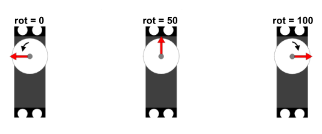
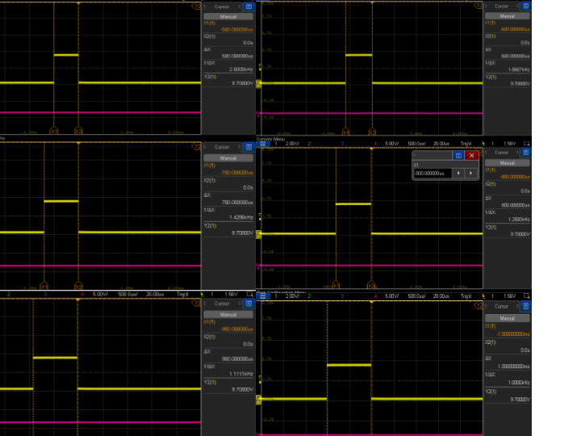
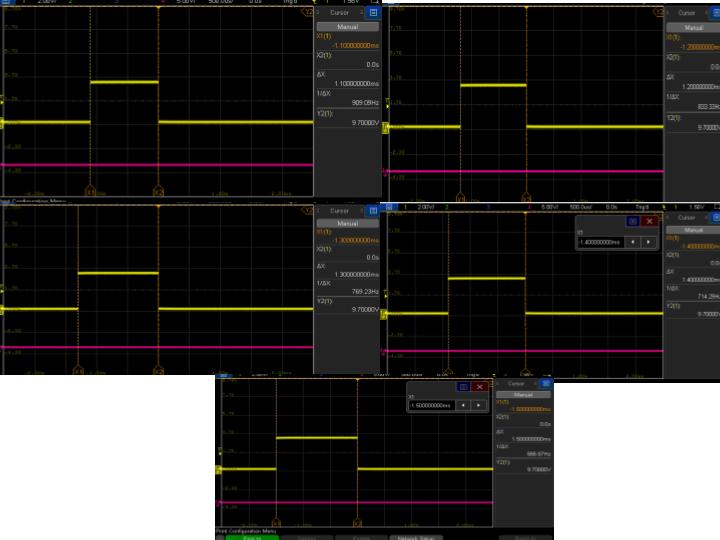

# Servo Motor

Este repositório contempla a implementação do controle de um servo motor como periférico.

Características do servo motor:
- Período de 20ms (50 Hz).
- Duty Cycle de 5us a 1,5ms.
- Rotação 0° a 180°.

O hardware utilizado foi o DE10Lite.

# Funcionamento

O periférico recebe um valor de 0 a 100, esse valor corresponde ao quanto o usuário deseja mover o servo, sendo que 0% equivale a 0° e 100% equivale a 180°. O valor de entrada é enviado pelo In-System Source. 
Caso seja necessário, a chave sw0 funciona como reset quando em nível lógico alto. 

A seguir, a demonstração da saída quando variada a entrada de 10 em 10.

O sinal gerado com a frequência estável de 50 Hz.

## Síntese 

 A síntese desse projeto contém um bloco de Propriedade Intelectual, o componente "rotacao", que utiliza do In-System Sources and Probes como entrada do sistema. O bloco principal desse sistema é o pwm, ele tem como entrada um clock de 10MHz, um valor de porcentagem de rotação e um reset, como saída possui o sinal mostrado anteriormente. O diagrama de blocos do pwm é representado a seguir. 

 

O esquema de entrada e saída fisíca é a seguinte:
- clock  => ADC_CLK_10.
- reset  => sw(0).
- rotate => rot => source.
- pwm => ARDUINO_IO(0).

## Contador.vhd

O contado é utilizado pelo pwm para contar de 0 até 200000. Isso se dá porque o clock fornecido é de 10MHz e para que se consiga usar uma frequência de 50Hz, é preciso considerar que 20ms é 200000. O contador também possui um reset que se ativa em nível lógico alto. O diagram de blocos do contador é representado a seguir.

## Pwm.vhd

O Pwm, funciona recebendo um valor, que é chamado de "rotate" (na síntese é o "rot"), esse valor é multiplicado por 100 e somado com 5000, assim temos o valor do duty cycle. Enquanto o contador for menor que o valor calculado a saída será '1' e depois, irá permanecer em '0' até que o contador volte para 0, como é mostrado a seguir.

