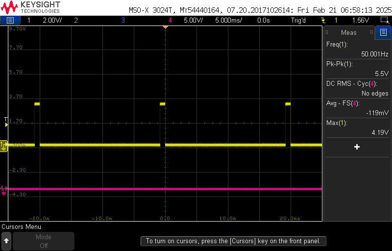
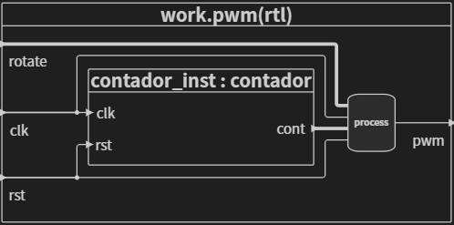
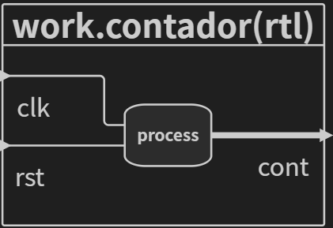
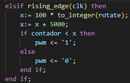

# Servo Motor

Este repositório contempla a implementação de um servo motor como periférico.

Caracteristicas do servo motor:
- Periodo de 20ms (50 Hz).
- Duty Cycle de 5us a 1,5ms.
- Rotação 0° a 180°.

O hardwar utilizado foi o DE10Lite.

# Funcionamento

O periférico recebe um valor de 0 a 100, esse valor correspode ao quanto o usuario deseja mover o servo sendo que 0% equivale a 0° e 100% equivale a 180°. O valor de entrada é enviado  pelo In-System Source. 
Caso seja necessário, a chave sw0 funciona como reset quando em nivel lógico alto. 

A seguir, a demonstração da saída quando variada a entrada de 10 em 10.

A frequência do sinal.

## Sintese 

 A sintese desse projeto contem um bloco de Propriedade Intelectual o componente "rotacao", que utiliza do *source* como entrada do sistema. O bloco principal desse sistema é o pwm, ele tem como entrada um clock de 10MHz, um valor de porecentagem de rotação e um reset, como saída possui o sinal mostrado anteriormente. O diagrama de blocos do pwm é representado a seguir. 

 

O esquema de entrada e saída fisíca é a seguinte:
- clock  => ADC_CLK_10.
- reset  => sw(0).
- rotate => rot => source.
- pwm => ARDUINO_IO(0).

## Contador.vhd

O contador é um *script* que é utilizado pelo pwm para contar até 200000. Isso se dá porque o clock fornecido é de 10MHz e para que se consiga usar uma frequência de 50Hz, é preciso considerar que 20ms é 200000. O contador também possui um reset que se ativa em nível lógico alto. O diagram de blocos do contador é repesentado a seguir.

## Pwm.vhd

O Pwm é o bloco principal e ja foi comentado anteriormente, mas para melhor entendimento será aprofundado. 
O Pwm, funciona recebendo um valor, que nesse *script* eu chamo de rotate (na sintese é o rot), esse valor é multiplicado por 100 e somado com 5000, assim temos o valor do duty cycle. Enquanto o contador for menor que o valor calculado a saída será '1' e depois, irá permanecer em '0' até que o contador volte para 0, como é mostrado a seguir.

