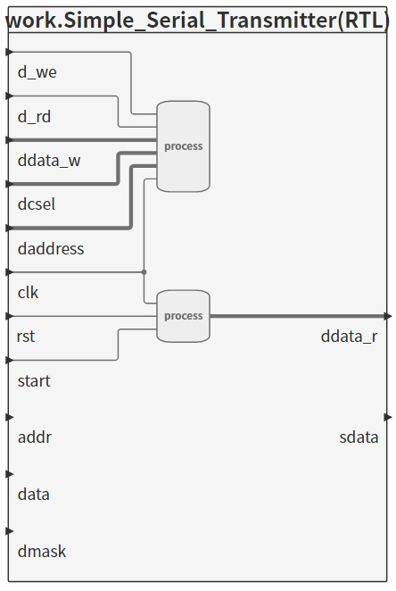
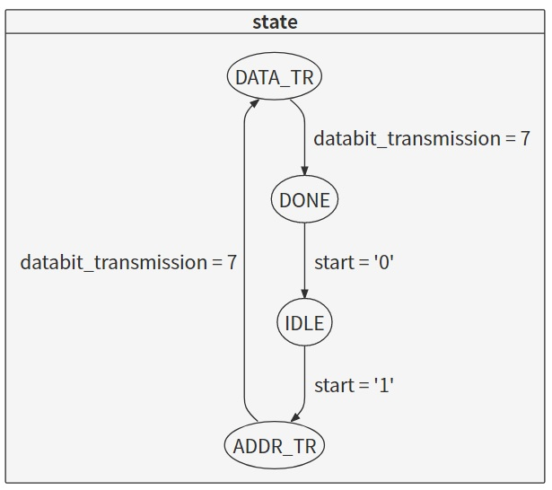
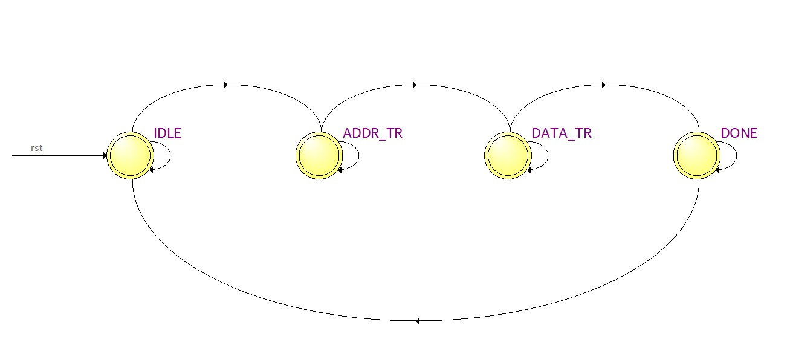
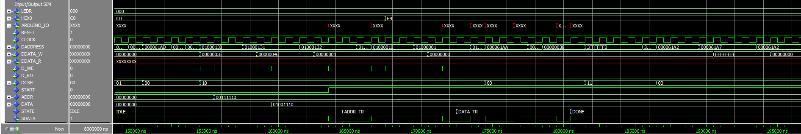
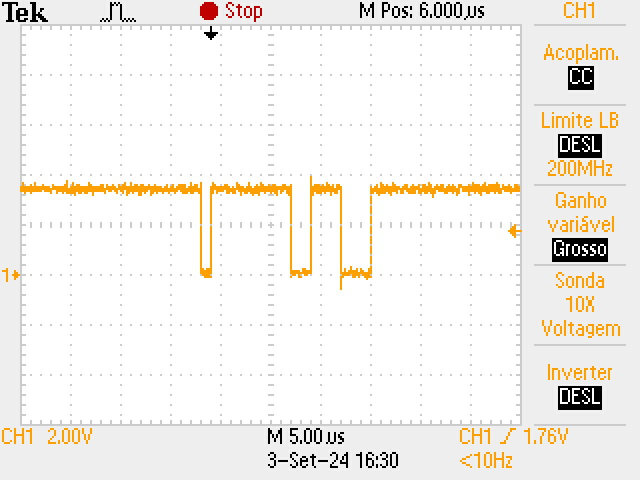
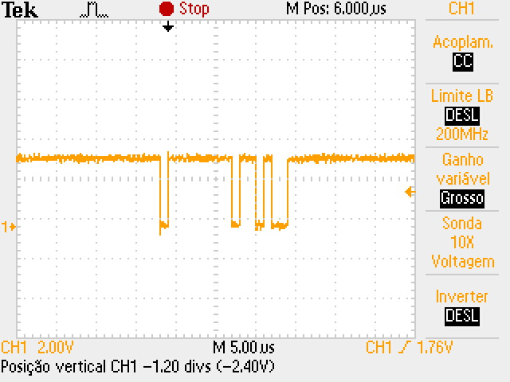

# Simple Serial Transmitter

Esse módulo implementa um transmissor serial que converte dados de 8 bits em formato paralelo para um formato serial para transmissão por um único pino de saída. O código inclui uma máquina de estados que controla o processo de transmissão, incluindo a adição de um bit de start, mantendo a saída em nível lógico alto quando inativa.

## Funcionamento
A transmissão inicia com um bit de start em nível baixo, seguido pelo envio serial do endereço (8 bits), seguido pelos dados (8 bits). Após a transmissão, a linha de saída (sdata) retorna para nível lógico alto até a próxima transmissão.

O Simple Serial Transmitter pode ser testado utilizando o modelSim, onde a simulação foi projetada para que seja possível ver o nível lógico da saída, o estado atual da máquina de estados e os bits que estão sendo enviados.

A funcionalidade do circuito pode ser validada em hardware, utilizando um osciloscópio para monitorar a saída serial (sdata).

### Diagrama de blocos do Simple Serial Transmitter
<p align="center">

</p>

### Arquivos

Os códigos utilizados para esse projeto podem ser encontrados nas pastas:

* [Script em C](../../software/simple_serial_transmitter)
* [Script em vhd](../simple_serial_transmitter)

## Máquina de estados 

Uma máquina de estados foi usada para gerenciar as diferentes fases da transmissão, incluindo o envio do bit de start, o endereço e os dados.
A máquina de estados com 4 estados pode ser vista no arquivo .vhd do Simple Serial Transmitter, assim como nos diagramas de blocos a seguir, gerados pelo software Sigasi e Quartus respectivamente.

<p align="center">

</p>
<p align="center">

</p>

## Resultados esperados para simulação e medições no osciloscópio

O transmissor deve gerar uma sequência de bits como ilustrado abaixo:
```
[Start Bit (0)] [addr (8 bits)] [data (8 bits)] 
```
* Start Bit: Um único bit em nível lógico baixo 0 sinalizando o início da transmissão.

* addr: 8 bits do endereço.

* data: 8 bits do dado a ser transmitido.

Enquanto não tiver transmissão, o nível lógico na saída será 1, até o proxímo start bit ser enviado.

### Simulação utilizando ModelSim

<p align="center">

</p>

Nessa imagem podemos examinar todos os estados da máquina de estados, e ver o processo de envio serial dos bits e o comportamento da saída sdata. Lembrando que a saída sdata é a informação utilizada para medição com o uso do osciloscópio.

### Testando em bancada
Após compilar o arquivo ```.c``` do simple serial transmitter, o arquivo ```.hex``` criado é então importado para a memória da placa e de acordo com a síntese do codígo, na saída ```ARDUINO_IO(0)``` é possível ver a saída ```stdata```, como pode ser visto nas imagens a seguir. 

<p align="center">

</p>
<p align="center">

</p>
<p align="center">

</p>

Analisando as imagens anteriores, podemos ver o start bit mudando o nível lógico da saída para 0, e após isso é feito a transmissão do sinal ```addr``` que no momento de execução estava definido como ```0xff```, após  a transferência do sinal addr, começa a ser transmitido o sinal ```data``` que no momento de execução estava definido como ```data```, que é um valor int que é incrementado a cada loop.

## Notas finais

Os arquivos utilizados para esse projeto possuem o nome ```simple_serial_transmitter```, com exceção aos arquivos de ```testbench```, ```tb.do``` e o arquivo de síntese do software Quartus.

Os arquivos ```.c``` e ```.h``` são utilizados para a geração e definição dos bits de endereço (addr), dados (data) e start_bit (start).

Também é possível visualizar a informação do ```data``` através dos blinks dos LEDs.

Os arquivos ```testbench``` e ```tb.do``` foram criados para os testes e simulações no software ModelSim.

E por fim os arquivos ```.vhd``` são os arquivos de definição do script do projeto assim como síntese para utilizar no hardware.

