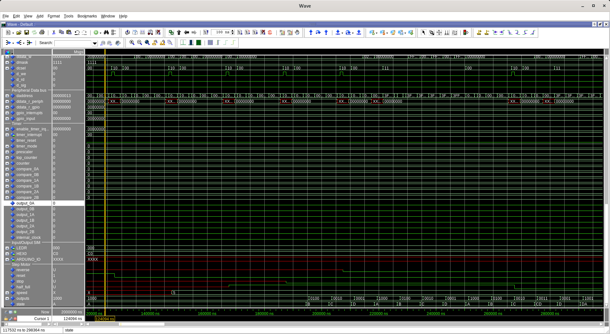
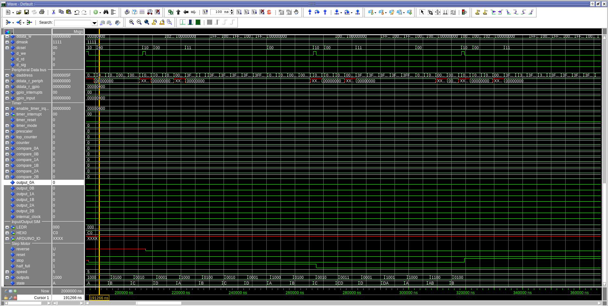

# Step motor controller

Implementação de um periférico controlador de motor de passo compatível com o circuito integrado ULN2003.

## ToDo

* Testes e sintetização em hardware
* Encontrar clock mais adequado para o funcionamento do motor de passo

## Software

Foi implementado um software capaz de colocar o motor em estado de reset, parar o motor, variar sua velocidade, inverter sua rotação e o tamanho do passo. Para mais detalhes sobre a utilização de cada função,  consultar o arquivo [step_motor.h](../../software/step_motor/step_motor.h)

## Descrição dos pinos

`clk`: Sinal de entrada de clock

`outs`: Saída dos níveis de ativação do CI ULN2003

`reset`: Retorna o motor para o estado inicial quando vai para nível lógico alto

`reverse`: Sinal que inverte a rotação do motor quando vai para nível lógico alto

`stop`: Sinal que para o motor no estado atual quando vai para nível lógico alto

`half_full`: Alterna o tipo do passo do motor

* `half_full = 0`: Meio passo
* `half_full = 1`: Passo completo

`speed`: Define a velocidade do motor em um intervalo de 0 até 7

## Funcionamento do periférico

![Figura [1] - Simulação completa](./_images/im0.png)

Figura [1] - Simulação completa

Figura [2] - Estado de reset

Figura [3] - Estados do motor em passo completo e meio passo

Figura [4] - Estado de stop e rotação invertida
