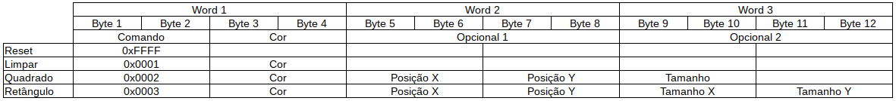

# Controlador TFT LCD

Projeto de uma controladora para um display TFT LCD. O hardware é responsável por receber o comando de escrita e converter essa instrução por uma série de informações no display, como comandos para limpar a tela e desenhar quadrados. 

## Descrição do display TFT LCD

Verificado no site de vendas do fabricante, [mcufriend](http://www.mcufriend.com/), nota-se que para o mesmo display pode haver controladoras diferentes para o mesmo produto. Devido a isso foi verificado o modelo de controladora usada no display disponível, fazendo o uso do código exemplo em arduino fornecido pelo fabricante. Assim aferiu-se que circuito integrado responsável pelo controle do display é o ILI9320.
Essa controladora possuí diferentes modos de comunicação, dentre elas, paralela de 8/9/16/18 bits e SPI. Mas fazendo a verificação da forma com que era implementado o código em arduino, verificou-se que a comunicação era feita de forma paralela de 8 bits acrescentado de 4 pinos de controle. A figura 1 apresenta o formato que o display recebe as informações. 

Figura 1. Diagrama de blocos do controlador TFT LCD.
Fonte: [ILI9320 Datasheet](https://www.rockbox.org/wiki/pub/Main/GSoCSansaView/ILI9320DS_V0.55.pdf) (pg 51, fig 23).

Nota-se pela figura 1 que o display recebe palavras de 32 bits enviadas de 8 em 8 bits.

## Descrição dos blocos do controlador TFT LCD

Figura 2. Diagrama de blocos do controlador TFT LCD.

* **decoder_tft:** Bloco responsável pela decodificação dos dados de entrada, convertendo em informação para as memórias;
* **boot_mem:** Memória responsável pela inicialização do display LCD;
* **data_mem:** Memória responsável por armazenar a informação que será enviada ao display LCD;
* **controller:** Bloco responsável pelo gerenciamento da leitura das memórias;
* **mux:** Bloco de seleção da entrada do bloco *writer*;
* **writer:** Bloco responsável pela conversão dos 32 bits da memória para 8 bits de saída do LCD mais os pinos CS, RS e WR.

## Descrição dos blocos do decoder

Figura 3. Diagrama de blocos do decoder do controlador TFT LCD.

* **dec_fsm:** Bloco responsável pela decodificação do comando e escolha do respectivo bloco;
* **dec_reset:** Bloco responsável pelo reset de todos os componentes do controlador TFT LCD;
* **dec_clean:** Bloco responsável por limpar a tela;
* **dec_rect:** Bloco responsável por imprimir um retângulo na tela;

## Descrição das funções em C

Figura 4. Sequência de bytes enviados ao hardware.

### Bibliografia
[ILI9320 Datasheet](https://www.rockbox.org/wiki/pub/Main/GSoCSansaView/ILI9320DS_V0.55.pdf)
