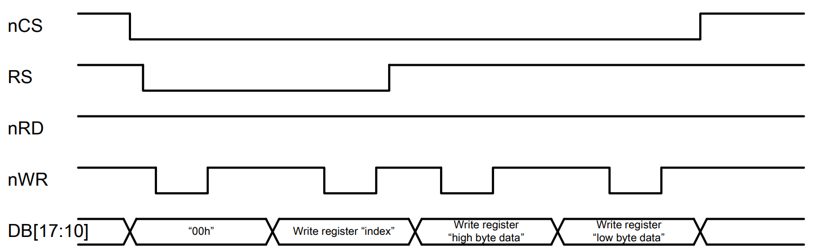
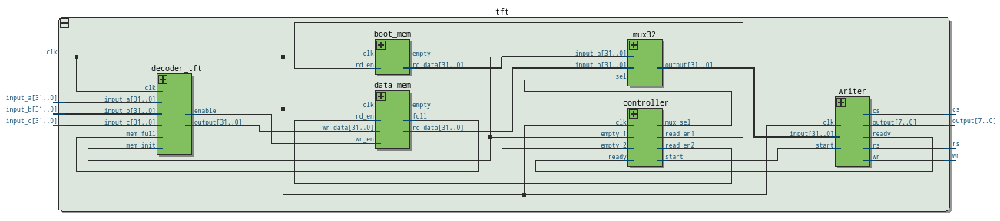

# Controlador TFT

<descrição do que é o projeto vai aqui>.

## Descrição dos blocos do controlador TFT

Figura 1. Diagrama de blocos do controlador TFT.

* **decoder:** Bloco responsável pela decodificação dos dados de entrada, convertendo em informação para as memórias;
* **boot_mem:** Memória responsável pela inicialização do display LCD;
* **data_mem:** Memória responsável por armazenar a informação que será enviada ao display LCD;
* **controller:** Bloco responsável pelo gerenciamento da leitura das memórias;
* **mux:** Bloco de seleção da entrada do bloco *writer*;
* **writer:** Bloco responsável pela conversão dos 32 bits da memória para 8 bits de saída do LCD mais os pinos CS, RS e WR.

## Descrição dos blocos do decoder

Figura 2. Diagrama de blocos do decoder do controlador TFT.

* **dec_fsm:** Bloco responsável pela decodificação do comando e escolha do respectivo bloco;
* **dec_reset:** Bloco responsável pelo reset de todos os componentes do controlador TFT;
* **dec_clean:** Bloco responsável por limpar a tela;
* **dec_rect:** Bloco responsável por imprimir um retângulo na tela;

## Descrição das funções em C

### Bibliografia
[ILI9320 Datasheet](https://www.rockbox.org/wiki/pub/Main/GSoCSansaView/ILI9320DS_V0.55.pdf)
