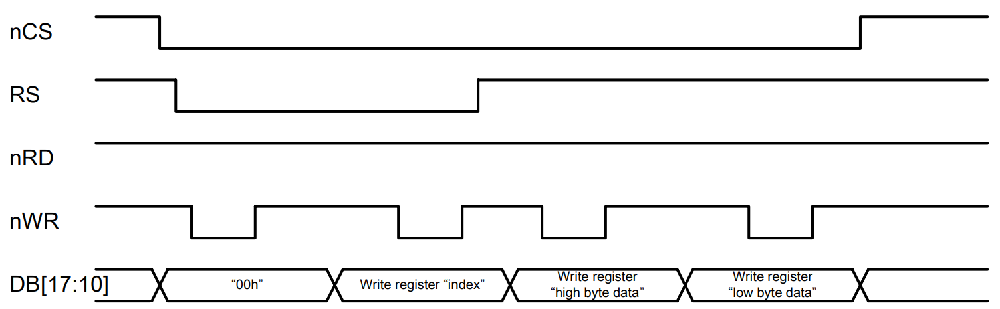
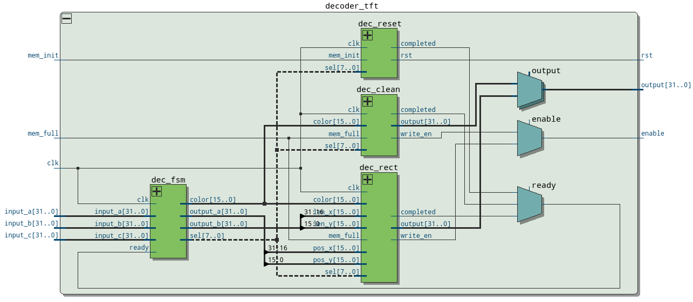
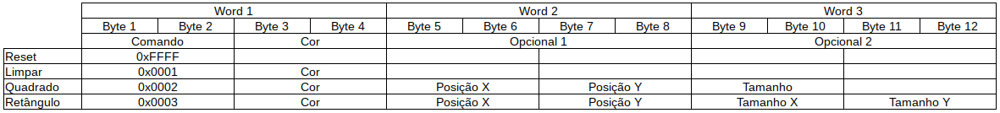


# Controlador TFT LCD

Projeto de uma controladora para um display TFT LCD. O hardware é responsável por receber o comando de escrita e converter essa instrução por uma série de informações no display, como comandos para limpar a tela e desenhar quadrados. 

## Descrição do display TFT LCD

Verificado no site de vendas do fabricante, [mcufriend](http://www.mcufriend.com/), nota-se que para o mesmo display pode haver controladoras diferentes para o mesmo produto. Devido a isso foi verificado o modelo de controladora usada no display disponível, fazendo o uso do código exemplo em arduino fornecido pelo fabricante. Assim aferiu-se que circuito integrado responsável pelo controle do display é o ILI9320.
Essa controladora possuí diferentes modos de comunicação, dentre elas, paralela de 8/9/16/18 bits e SPI. Mas fazendo a verificação da forma com que era implementado o código em arduino, verificou-se que a comunicação era feita de forma paralela de 8 bits acrescentado de 4 pinos de controle. A figura 1 apresenta o formato que o display recebe as informações. 



Figura 1. Diagrama de blocos do controlador TFT LCD.  
Fonte: [ILI9320 Datasheet](https://www.rockbox.org/wiki/pub/Main/GSoCSansaView/ILI9320DS_V0.55.pdf) (pg 51, fig 23).

Nota-se pela figura 1 que o display recebe palavras de 32 bits enviadas de 8 em 8 bits.

## Mapa de Memória (Registradores)

O periférico é controlado através de 3 registradores de 32 bits mapeados em memória, começando no endereço base configurado no parâmetro `MY_WORD_ADDRESS`.

| Endereço (Offset) | Registrador | Descrição | Gatilho (*Trigger* de Ação) |
| :--- | :--- | :--- | :--- |
| `BASE + 0x00` | `reg_input_a` | ID do Comando (Bits 31-16) e Cor (Bits 15-0). | **SIM** (Inicia a operação) |
| `BASE + 0x04` | `reg_input_b` | Parâmetros A (ex: Posição X nos bits altos, Y nos baixos). | NÃO |
| `BASE + 0x08` | `reg_input_c` | Parâmetros B (ex: Largura nos bits altos, Altura nos baixos). | NÃO |
## Descrição dos blocos do controlador TFT LCD



Figura 2. Diagrama de blocos do controlador TFT LCD.

* **decoder_tft:** Bloco responsável pela decodificação dos dados de entrada, convertendo em informação para as memórias;
* **boot_mem:** Memória responsável pela inicialização do display LCD;
* **data_mem:** Memória responsável por armazenar a informação que será enviada ao display LCD;
* **controller:** Bloco responsável pelo gerenciamento da leitura das memórias;
* **mux:** Bloco de seleção da entrada do bloco *writer*;
* **writer:** Bloco responsável pela conversão dos 32 bits da memória para 8 bits de saída do LCD mais os pinos CS, RS e WR.

(Ambas as memórias tem comportamento de uma fila circular, porém a memória de boot possui os pinos de escrita desativados)

### Arquivos e Módulos Internos

* **`tft.vhd` (Top-Level)**: Faz a interface com o barramento de memória (Mapeamento de I/O) e interliga os submódulos internos.
* **`decoder_tft.vhd` e submódulos (`dec_fsm`, `dec_rect`, `dec_clean`)**: Atuam como o coprocessador do periférico. São máquinas de estado totalmente síncronas que recebem um único comando do processador e geram autonomamente comandos de baixo nível.
* **`data_mem.vhd`**: Memória FIFO circular (*First-In, First-Out*). Armazena as instruções gráficas produzidas em alta velocidade pelos decodificadores, com sinalização de `full` (cheio) para pausar os geradores temporariamente quando necessário.
* **`boot_mem.vhd`**: Memória ROM embutida contendo a sequência exata de *bytes* necessária para inicializar o controlador físico do display (ILI9320).
* **`controller.vhd`**: Dá prioridade à `boot_mem` durante a inicialização e, após concluída, alterna automaticamente a rota de dados para a `data_mem`.
* **`writer.vhd`**: Controlador da interface física. Converte os comandos de 32 bits no protocolo paralelo de 8 bits da tela LCD (alternando os pinos `CS`, `RS`, `WR`, e `D0-D7`).

## Descrição dos blocos do decoder


Figura 3. Diagrama de blocos do decoder do controlador TFT LCD.

* **dec_fsm:** Bloco responsável pela decodificação do comando e escolha do respectivo bloco;
* **dec_reset:** Bloco responsável pelo reset de todos os componentes do controlador TFT LCD;
* **dec_clean:** Bloco responsável por limpar a tela;
* **dec_rect:** Bloco responsável por imprimir um retângulo na tela;

### Comandos Suportados

De acordo com o núcleo do decodificador (`dec_fsm`), os seguintes comandos podem ser enviados nos 16 bits mais significativos de `reg_input_a`:

* `0xFFFF`: **RESET / INITIALIZATION** (Inicia a sequência da *boot_mem* para ligar a tela)
* `0x0001`: **CLEAN SCREEN** (Limpa a tela preenchendo-a com uma cor sólida)
* `0x0002`: **DRAW SQUARE** (Desenha um quadrado)
* `0x0003`: **DRAW RECTANGLE** (Desenha um retângulo)



Figura 4. Sequência de bytes enviados ao hardware.  

## Descrição das funções em C

Funções tft.h  
```c
void tft_init();  
void tft_clean(uint16_t color);  
void tft_sqrt(uint16_t color, uint16_t x, uint16_t y, uint16_t h);  
void tft_rect(uint16_t color, uint16_t x, uint16_t y, uint16_t h, uint16_t w);  
```
### Bibliografia
[ILI9320 Datasheet](https://www.rockbox.org/wiki/pub/Main/GSoCSansaView/ILI9320DS_V0.55.pdf)
