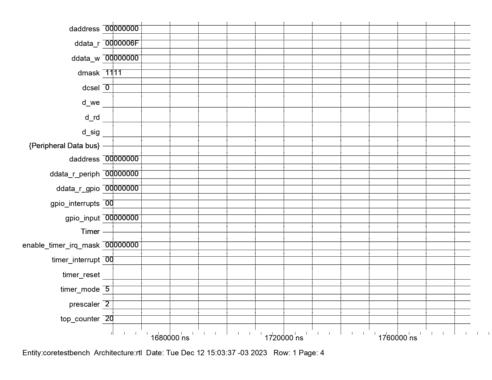
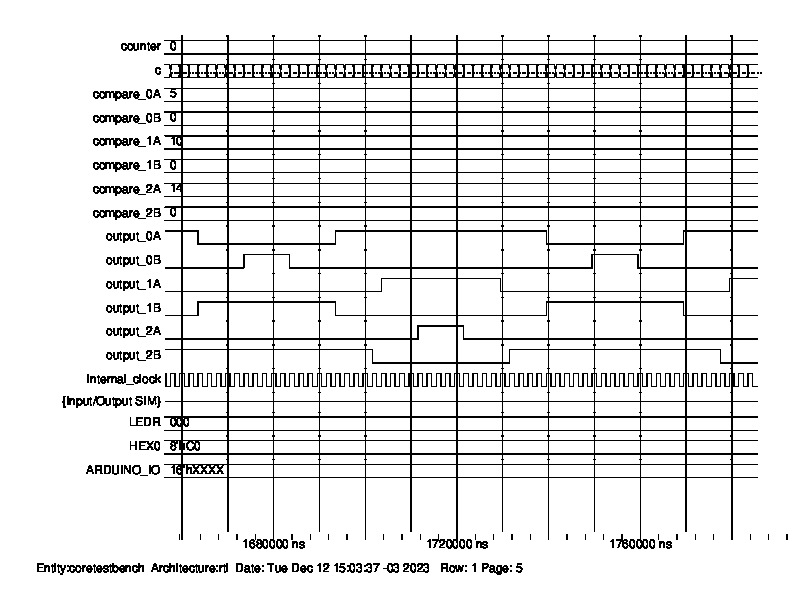
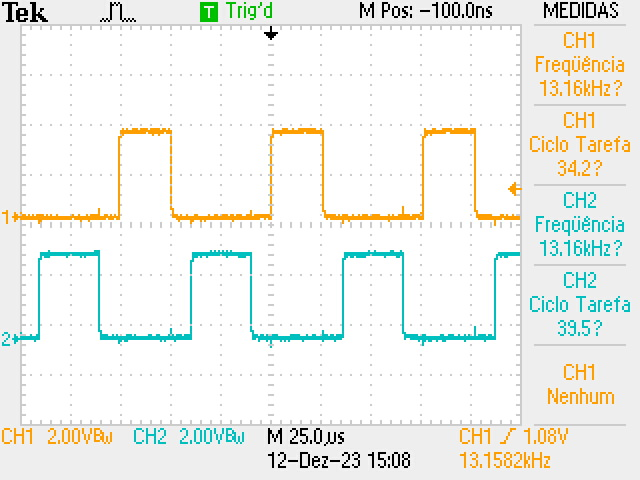
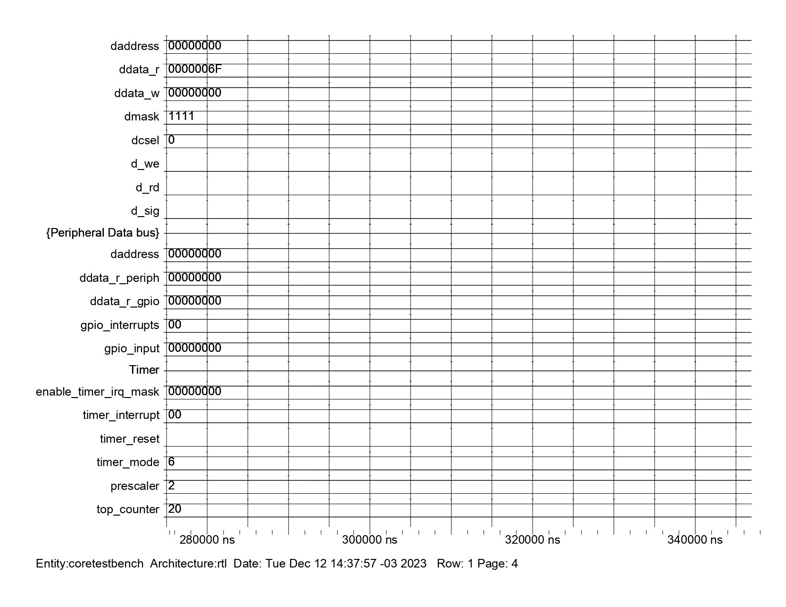
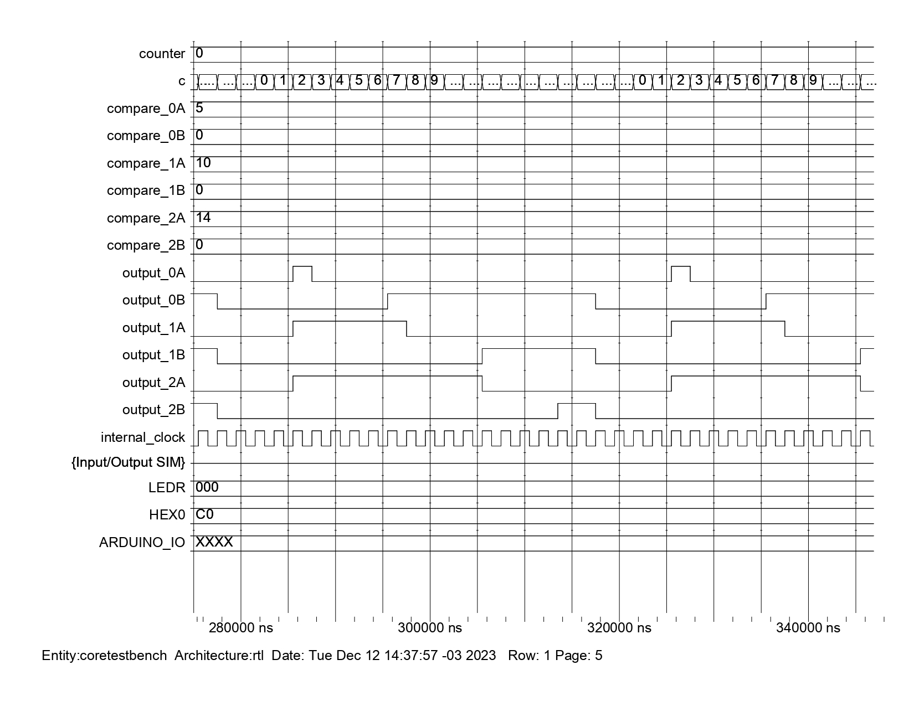
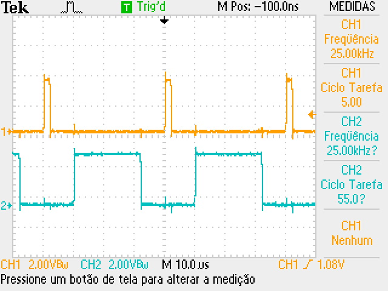
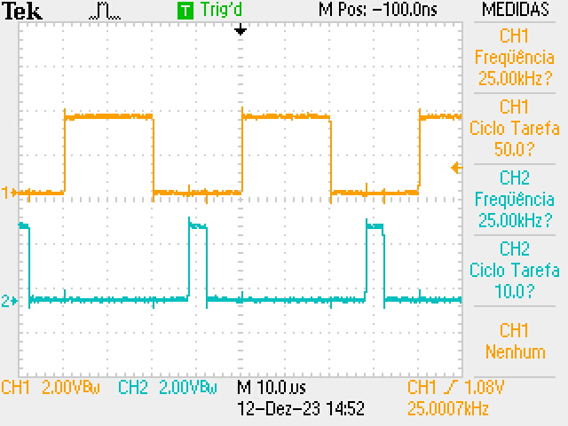
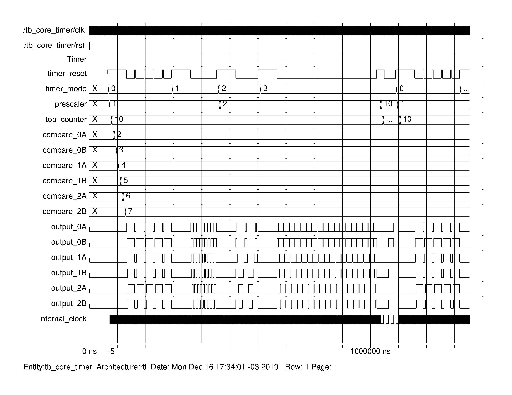

# Timer

Esta é uma implementação para um periférico de _timer_ de 32 bits em VHDL com 6 níveis de comparação / saídas.

`/tests/hardware.h` - Definição do espaço de memória.  
`/tests/timer.h` - Definição dos registradores e protótipo das funções.  
`/tests/timer.c` - Implementação das funções.  
`/tests/main_timer.c` - Código de exemplo.  

## Descrição dos pinos
- `clock`: sinal de entrada de clock. O contador interno do timer funciona na borda de subida do clock.  
- `reset`: sinal de reset do periférico, deve ser conectado ao barramento do `reset` do _core_.  
- `timer_reset`: sinal de reset do contador. O contador interno do timer é zerado, juntamente com suas saídas, quando nível do sinal `timer_reset` é alto.  
- `timer_mode`: o sinal de configuração do modo de funcionamento do timer (mais informações em [Modos de Funcionamento](#modos-de-funcionamento)).  
- `prescaler`: um sinal de configuração para a frequência de contagem. O clock interno do timer será o sinal `clock` divido pelo valor do `prescaler`.  
- `top_counter`: um sinal de configuração para a frequência do rearme automático. Não é utilizado no modo `0b00` (Oneshot mode).  
- `compare`: o sinal de configuração para o valor de comparação do contador interno. Sua ação depende do modo de funcionamento configurado pelo sinal `timer_mode` (mais informações em [Modos de Funcionamento](#modos-de-funcionamento)).  
- `output`: o sinal de saída do timer. Sua ação depende do modo de funcionamento configurado pelo sinal `timer_mode` (mais informações em [Modos de Funcionamento](#modos-de-funcionamento)).  
- `dead_time`: o sinal de configuração para o tempo morto utilizado nos modos de saídas complementares. Utilizado nos modos [PWM mode - counter up/down](#pwm-mode---counter-updown-0b101) e [PWM mode - counter up](#pwm-mode---counter-up-0b110).

## Modos de funcionamento
Quatro modos de operação para o timer foram implementados: __Oneshot mode__, que pode ser utilizado para uma _contagem simples_, **sem** um reciclo automático, e outros três modos, com reciclo automático, que podem ser utilizados para a geração de sinais periódicos como _PWMs_, sendo possível a configuração de frequência, ciclo tarefa e fase.

### Oneshot mode (`0b00`)
Neste modo o contador interno do timer conta até os valores de comparação (configurado pelos sinais `compare`). Seus respectivos sinais de saída `output` ficam habilitados até o _timer_ receber o sinal `timer_reset` em nível baixo.
- `output = 0` enquanto o contador interno for menor que `compare`.  
- `output = 1` se contagem for maior que `compare`.  
- O tempo do disparo pode ser calculado como `t = (prescaler * (timer_top - 1)) / F_CLOCK`.  

Simulação:

    

### ClearOnTop mode (`0b01`)
Neste modo o contador interno do timer conta até valor máximo dele (o valor decimal 2^{32}-1) e é zerado automaticamente, definindo uma frequência de operação. Seus sinais de saída `output` ficam em níve alto sempre quando o contador for maior ou igual ao valor do sinal de comparação `compare`.  
- `output = 0` enquanto o contador interno for menor que `compare`.  
- `output = 1` se contagem for maior que `compare`.  
- A frequência de reciclo pode ser calculado como `F = F_CLOCK / (prescaler * (timer_top - 1))`.  
- Os ciclos-tarefa podem ser calculados como `D = compare / timer_top`.  

Simulação:

    

### UpDown mode (`0b10`)
Neste modo o contador interno do timer conta progressivamente até valor máximo dele (o valor decimal 2^{32}-1), passa a contar regressivamente, até que chega em zero e passa a contar progressivamente novamente e assim segue ciclicamente. Seu sinal de saída `output` fica em níve alto sempre quando o contador for maior ou igual ao valor do sinal de comparação `compare`.  
- `output = 0` enquanto o contador interno for menor que `compare`.
- `output = 1` se contagem for maior que `compare`.
- A frequência de reciclo pode ser calculado como `F = F_CLOCK / (2 * prescaler * (timer_top - 1))`.  
- Os ciclos-tarefa podem ser calculados como `D = 2 * compare / timer_top`.  

Simulação:

    

### ClearOnCompare mode (`0b11`)
Neste modo o contador interno do timer conta até valor máximo dele (o valor decimal 2^{32}-1) e é zerado automaticamente, definindo uma frequência de operação. Seus sinais de saída `output` ficam em nível alto sempre quando o contador estiver com seu valor entre os valores definidos para os `compare` **A** e **B**, criando pulsos de fase e largura definida.
- `output = 0` enquanto o contador interno for menor que `compare`.  
- `output = 1` se contagem for maior que `compare`.  
- A frequência de reciclo pode ser calculado como `F = F_CLOCK / (prescaler * (timer_top - 1))`.  
- Os ciclos-tarefa podem ser calculados como `D = (compare_B - compare_A) / timer_top`.  

Simulação:

    

### PWM mode - counter up/down (`0b101`)

Este modo utiliza um contador interno que realiza contagem crescente até o valor máximo definido por `top_counter-1`e em seguida realiza a contagem decrescente até chegar a zero.
Esse ciclo ocorre periodicamente, gerando uma forma de onda triangular.
Os sinais de saída  `outputA` e `outputB` são complementares, ou seja, quando a saída A for 1, a saída B correspondente será 0. 
Visando aplicações em circuitos eletrônicos, foi implementado um "tempo morto" entre as saídas, que é responsável por impedir que as saídas complementares sejam 1 ao mesmo tempo. O tempo morto pode ser configurado por meio do sinal `dead_time` e é definido em quantidade de contagens. 
O valor de comparação é definido por meio do sinal `compareA` e serve como referência para mudança de nível das saídas, tanto na subida do contador, como na descida. Porém as transições irão ocorrer em `compareA-dead_time` e `compareA+dead_time`. 

- A frequência de reciclo pode ser calculado como `F = F_CLOCK / (2 * prescaler * (top_counter - 1))`.  
-  Os ciclos-tarefa podem ser calculados como `D = (compare-dead_time) / top_counter` e `D =(top_counter - compare + dead_time) / top_counter`.  
- O tempo morto pode ser calculado como `t= (2*dead_time*prescaler)/F_CLOCK`

 As imagem a seguir demonstram a simulação desse modo do timer. O `dead_time` configurado por software foi igual a 2 e os demais parâmetros e  valores de comparação selecionados  podem ser observados na lateral esquerda das imagens.
 

    

    

As saídas do timer foram conectadas a pinos de saída, dessa forma, utilizando o osciloscópio é possível observar as formas de onda resultantes. As imagens abaixo demonstram as saídas geradas, utilizando os mesmos parâmetros mostrados na simulação.

- Output_1A e output_1B

    

- Output_2A e output_2B

    

### PWM mode - counter up (`0b110`)

Este modo utiliza um contador interno que realiza contagem crescente ,  ao alcançar o valor máximo definido por `top_counter-1`retorna para zero e inicia novamente a contagem. Esse ciclo ocorre periodicamente, gerando uma forma de onda dente de serra.
Neste modo os sinais de saída  `outputA` e `outputB` também são complementares, ou seja, quando a saída A for 1, a saída B correspondente será 0. 
Assim como no modo anterior, também foi implementado um "tempo morto" entre as saídas que pode ser configurado por meio do sinal `dead_time` que é definido em quantidade de contagens. 
O valor de comparação é definido por meio do sinal `compareA` e serve como referência para mudança de nível das saídas. Neste modo, o valor de `top_counter` também faz com que ocorra a mudança de nível das saídas. As transições irão ocorrer em `compareA-dead_time` e `compareA+dead_time`, `top_counter-1-dead_time` e `0+dead_time`, de forma que as saídas nunca sejam 1 ao mesmo tempo. 

- A frequência de reciclo pode ser calculado como `F = F_CLOCK / (prescaler * top_counter)`.  
- Os ciclos-tarefa podem ser calculados como `D = (compare - (2 * dead_time)) / top_counter` e `D = (top_counter - compare - (2 * dead_time)) / top_counter`.  
 - O tempo morto pode ser calculado como `t= (2*dead_time*prescaler)/F_CLOCK`

Nas imagens abaixo é possível observar os resultados obtidos nesse modo do timer, utilizando um `dead_time` = 2 e demais parâmetros conforme exibidos na lateral esquerda das figuras.

    

    

Por meio dos pinos de saída foram visualizadas no osciloscópio as formas de onda geradas . Seguem as imagens capturadas, demonstrando as saídas, considerando os mesmos parâmetros utilizados na simulação.

- Output_0A e output_0B

    

- Output_2A e output_2B

    

## Integração com o núcleo
Simulação:

    

## Biblioteca
- `void timer_config(...);` - Mode, prescaler, top_counter  
- `void timer_reset(void);`  
- `void timer_set_compare0A(...);`  
- `void timer_set_compare0B(...);`  
- `void timer_set_compare1A(...);`  
- `void timer_set_compare1B(...);`  
- `void timer_set_compare2A(...);`  
- `void timer_set_compare2B(...);`  
- `void timer_set_dead_time(...);`  
- `uint32_t timer_get_output0A(void);`  
- `uint32_t timer_get_output0B(void);`  
- `uint32_t timer_get_output1A(void);`  
- `uint32_t timer_get_output1B(void);`  
- `uint32_t timer_get_output2A(void);`  
- `uint32_t timer_get_output2B(void);`  
