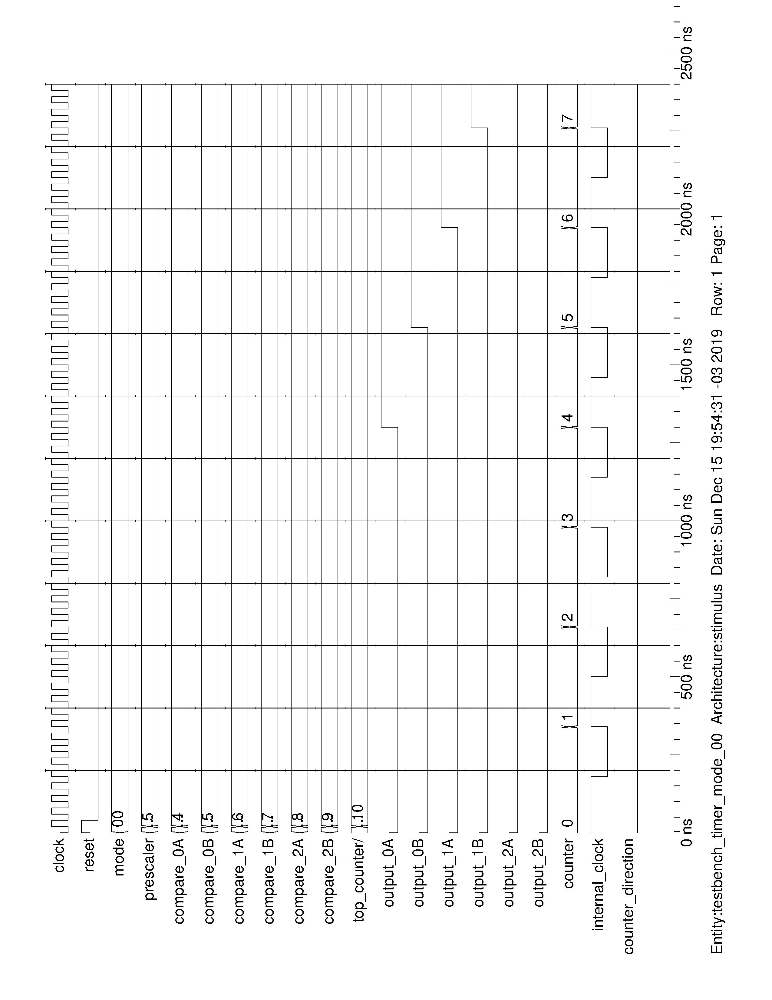
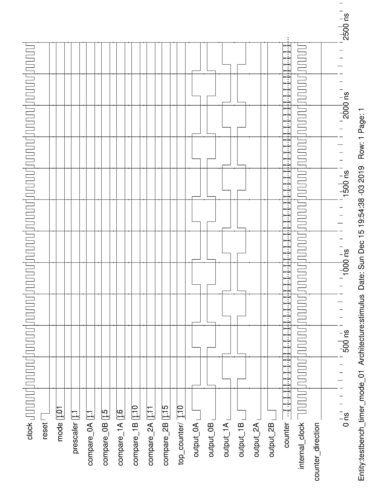
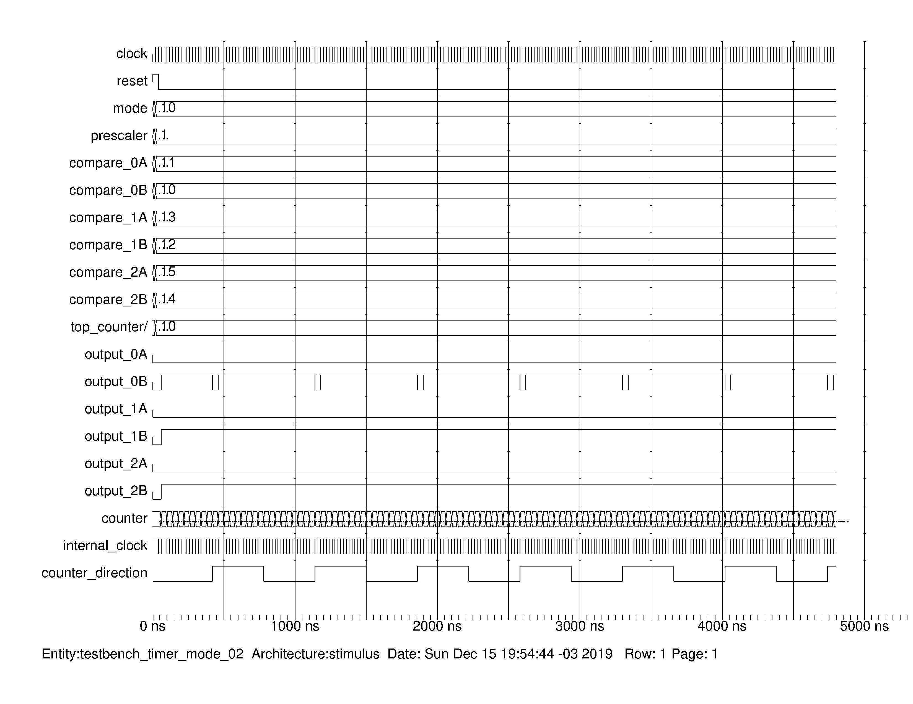
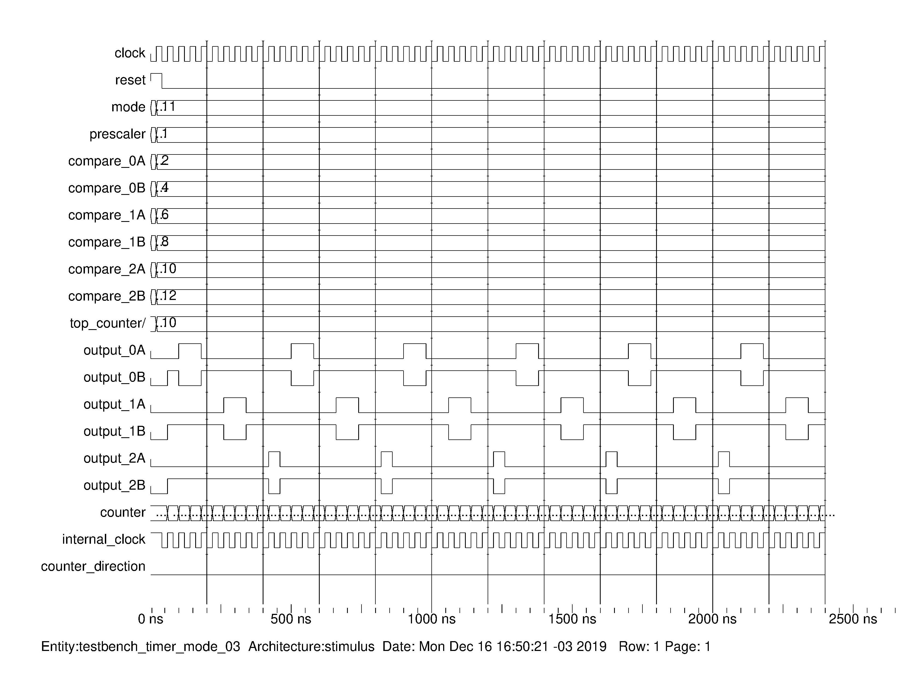

# Timer

Esta é uma implementação para um periférico de _timer_ de 32 bits em VHDL com 6 níveis de comparação / saídas.

## Descrição dos pinos
- `clock`: sinal de entrada de clock. O contador interno do timer funciona na borda de subida do clock.  
- `reset`: sinal de reset do periférico, deve ser conectado ao barramento do `reset` do _core_.  
- `timer_reset`: sinal de reset do contador. O contador interno do timer é zerado, juntamente com suas saídas, quando nível do sinal `timer_reset` é alto.  
- `timer_mode`: o sinal de configuração do modo de funcionamento do timer (mais informações em [Modos de Funcionamento](#modos-de-funcionamento)).  
- `prescaler`: um sinal de configuração para a frequência de contagem. O clock interno do timer será o sinal `clock` divido pelo valor do `prescaler`.  
- `top_counter`: um sinal de configuração para a frequência do rearme automático. Não é utilizado no modo `0b00` (Oneshot mode).  
- `compare`: o sinal de configuração para o valor de comparação do contador interno. Sua ação depende do modo de funcionamento configurado pelo sinal `timer_mode` (mais informações em [Modos de Funcionamento](#modos-de-funcionamento)).  
- `output`: o sinal de saída do timer. Sua ação depende do modo de funcionamento configurado pelo sinal `timer_mode` (mais informações em [Modos de Funcionamento](#modos-de-funcionamento)).  

## Modos de funcionamento
Quatro modos de operação para o timer foram implementados: __Oneshot mode__, que pode ser utilizado para uma _contagem simples_, **sem** um reciclo automático, e outros três modos, com reciclo automático, que podem ser utilizados para a geração de sinais periódicos como _PWMs_, sendo possível a configuração de frequência, ciclo tarefa e fase.

### Oneshot mode (`0b00`)
Neste modo o contador interno do timer conta até os valores de comparação (configurado pelos sinais `compare`). Seus respectivos sinais de saída `output` ficam habilitados até o _timer_ receber o sinal `timer_reset` em nível baixo.
- `output = 0` enquanto o contador interno for menor que `compare`.  
- `output = 1` se contagem for maior que `compare`.  
- O tempo do disparo pode ser calculado como `t = (prescaler * (timer_top - 1)) / F_CLOCK`.  

Simulação:

    

### ClearOnCompare mode (`0b01`)
Neste modo o contador interno do timer conta até valor máximo dele (o valor decimal 2^{32}-1) e é zerado automaticamente, definindo uma frequência de operação. Seus sinais de saída `output` ficam em níve alto sempre quando o contador estiver com seu valor entre os valores definidos para os `compare` **A** e **B**, criando pulsos de fase e largura definida.
- `output = 0` enquanto o contador interno for menor que `compare`.  
- `output = 1` se contagem for maior que `compare`.  
- A frequência de reciclo pode ser calculado como `F = F_CLOCK / (prescaler * (timer_top - 1))`.  
- Os ciclos-tarefa podem ser calculados como `D = (compare_B - compare_A) / timer_top`.  

Simulação:

    

### UpDown mode (`0b10`)
Neste modo o contador interno do timer conta progressivamente até valor máximo dele (o valor decimal 2^{32}-1), passa a contar regressivamente, até que chega em zero e passa a contar progressivamente novamente e assim segue ciclicamente. Seu sinal de saída `output` fica em níve alto sempre quando o contador for maior ou igual ao valor do sinal de comparação `compare`.  
- `output = 0` enquanto o contador interno for menor que `compare`.
- `output = 1` se contagem for maior que `compare`.
- A frequência de reciclo pode ser calculado como `F = F_CLOCK / (2 * prescaler * (timer_top - 1))`.  
- Os ciclos-tarefa podem ser calculados como `D = 2 * compare / timer_top`.  

Simulação:

    

### ClearOnTop mode (`0b11`)
Neste modo o contador interno do timer conta até valor máximo dele (o valor decimal 2^{32}-1) e é zerado automaticamente, definindo uma frequência de operação. Seus sinais de saída `output` ficam em níve alto sempre quando o contador for maior ou igual ao valor do sinal de comparação `compare`.  
- `output = 0` enquanto o contador interno for menor que `compare`.  
- `output = 1` se contagem for maior que `compare`.  
- A frequência de reciclo pode ser calculado como `F = F_CLOCK / (prescaler * (timer_top - 1))`.  
- Os ciclos-tarefa podem ser calculados como `D = compare / timer_top`.  

Simulação:

    

