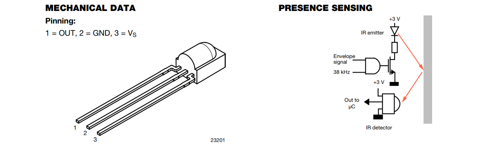
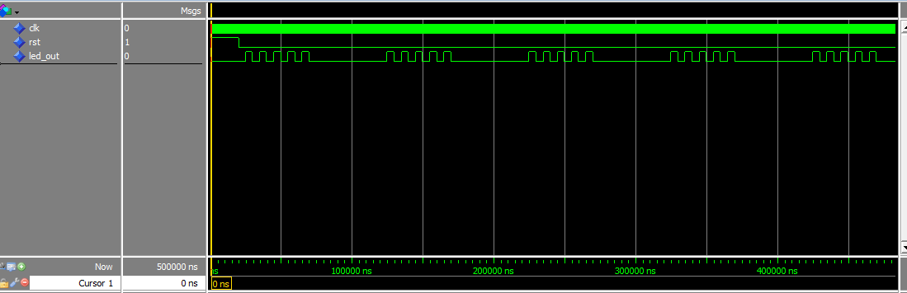
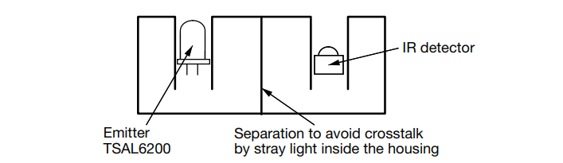
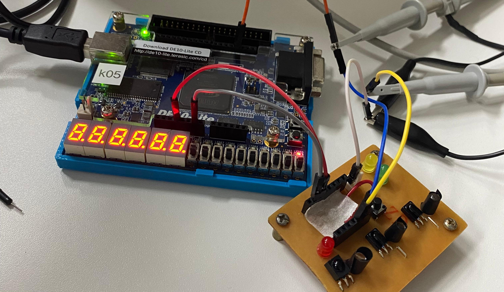
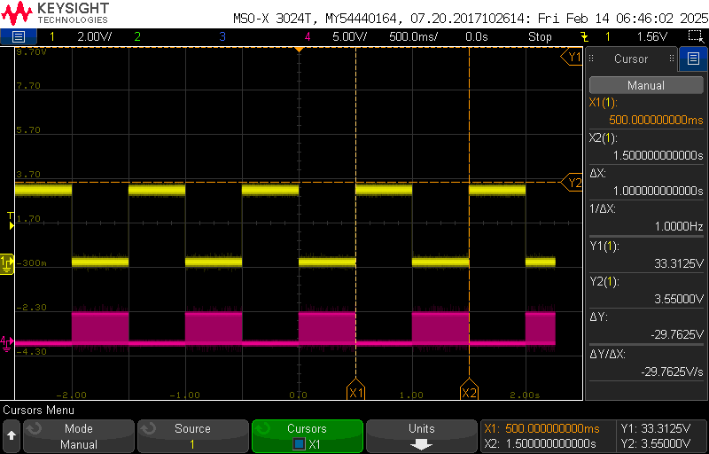
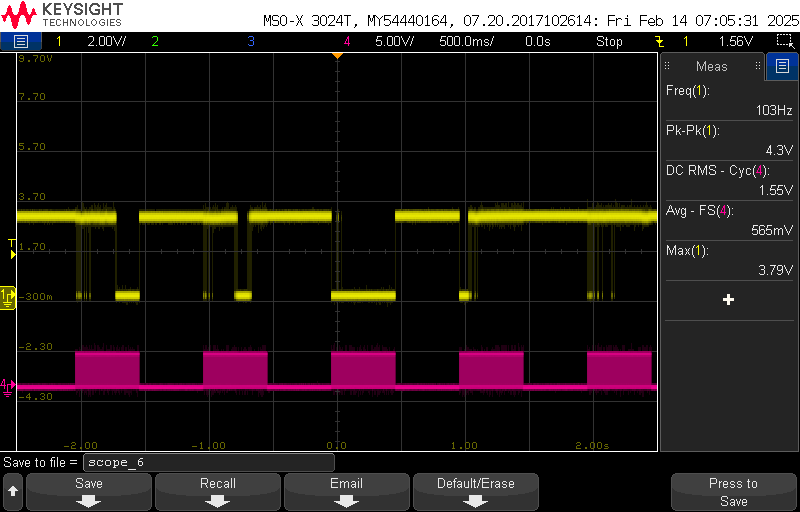
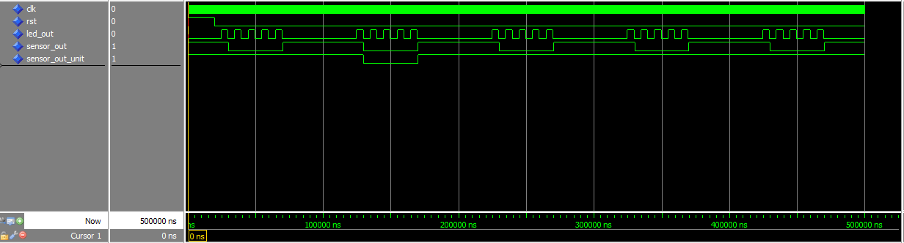
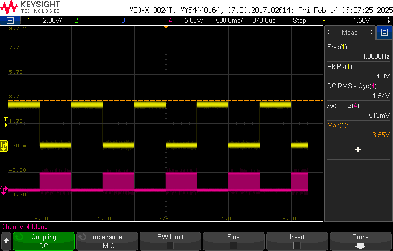

<table align="center"><tr><td align="center" width="9999">

# Implementação e simulação de um sistema de detecção de presença baseado em um sensor infravermelho TSSP580
  
Instituto Federal de Educação, Ciência e Tecnologia de Santa Catarina Campus Florianópolis<br>
Departamento Acadêmico de Eletrônica<br>
Dispositivo Lógico Programáveis</b>

*Jonathan Chrysostomo Cabral Bonette*<br>*Matheus Rodrigues da Cunha*
</table>

A utilização de sensores infravermelhos (IR) em aplicações de presença e segurança tem se tornado cada vez mais comum dada sua capacidade de detectar objetos com alta sensibilidade e rapidez, mesmo em ambientes com baixa luminosidade, esses sensores são utilizados em diversas aplicações, como sistemas de alarme, controle de iluminação, detectores de movimento em segurança e interfaces interativas.

Porém em sistemas reais, os sensores IR frequentemente enfrentam desafios decorrentes de ruídos ambientais e interferências de luz ambiente, o que pode comprometer a precisão da detecção. Para reduzir esses problemas, técnicas de modulação e filtragem digital são essenciais. A modulação – no caso deste projeto, a geração de uma portadora de 38 kHz – permite que o sensor seja sensível somente aos sinais modulados, rejeitando grande parte das interferências. Além disso, a implementação de um filtro digital baseado em contagem assegura que somente sinais persistentes (indicativos de uma detecção verdadeira) sejam processados, descartando os ruídos que talvez podem ocorrer durante o burst.

O projeto tem como objetivo a **implementação e simulação de um sistema de detecção de presença baseado em um sensor infravermelho TSSP580**. Vai ser utilizado um FPGA DE10-Lite para gerar um sinal de modulação (burst) de aproximadamente 38 kHz, que aciona um LED emissor, conforme mostra a documentação oficial. Esse sinal modulado é então utilizado para estimular um sensor IR através de um LED, na qual a resposta é processada por um filtro digital baseado em contagem no qual elimina ruídos transitórios e garante uma confiabilidade maior na detecção do sensor.<br>

<p align="center">
  
</p>

Em resumo o desenvolvimento foi dividido em pequenas implementações, cada parte com seu objetivo específico:<br>

### Etapas do Projeto:

**Etapa 1 – Simulação do Módulo LED:** <br>

Primeiramente implementamos o módulo ```led_tx.vhd``` para gerar uma portadora de 38 kHz e controlar o burst do LED, permitindo que o sinal seja transmitido.
O código gera um sinal infravermelho modulado a 38 kHz, ativando e desativando o LED IR em períodos específicos. Ele funciona com dois contadores: o primeiro gera a portadora de 38 kHz alternando o sinal a cada 13 ciclos, garantindo a frequência correta. O segundo contador controla a modulação do sinal.

- Desenvolvimento do módulo [led_tx.vhd](vscode/led_tx.vhd).<br>
- Simulação com o testbench [tb_led_tx.vhd](vscode/tb_led_tx.vhd).
- Execução do script [tb_led_tx.do](vscode/tb_led_tx.do).

Simulação no ModelSim:<br>

<p align="center">
  
</p>

**Etapa 2 – Síntese do LED no FPGA e Testes de Bancada:** <br>
Para alimentar os módulos que foram projetados para funcionar com 1 MHz, usamos uma PLL (divisor de clock) para converter a frequência que usamos na implementação de 50 MHz. Durante a verificação da prática usamos um osciloscópio para monitorar os sinais. Conectamos o cabo do osciloscópio no pino definido ARDUINO_IO(3) e foi possível observar os pulsos de 38 kHz gerados durante o burst, confirmando o funcionamento do módulo LED e a resposta do sensor conforme mostram as imagens abaixo.

- Implementação e síntese do projeto no Quartus [de10_lite.vhd](quartus/de10_lite.vhd).
- Montagem física do sensor e do LED no FPGA DE10-Lite.

Exemplo do Datasheet:<br>

<p align="center">
  
</p>

Montagem em Bancada:<br>

<p align="center">
  
</p>

Verificação do Funcionamento (Osciloscópio):<br>

<p align="center">
  
</p>

Verificação do Funcionamento do Ruído (Osciloscópio):<br>

<p align="center">
  
</p>

**Etapa 3 – Simulação do Sensor:** <br>
O arquivo ```tb_sensor.vhd``` é um testbench usado para simular o comportamento do módulo led_tx. Ele gera um clock de 1 MHz e aplica estímulos ao circuito para verificar seu funcionamento. O sinal led_out representa a saída do transmissor de LED IR, que gera pulsos modulados em 38 kHz durante o burst.

- Simulação com testbench [tb_sensor.vhd](vscode/tb_sensor.vhd).
- Execução do script [tb_sensor.do](vscode/tb_sensor.do).

Simulação no ModelSim:<br>

<p align="center">
  
</p>

**Etapa 4 – Simulação dos Ruídos:** <br>
O código cria um sinal de clock de 1 MHz, um reset inicial e gera uma sequência de ruídos na entrada do sensor para verificar sua funcionalidade. O processo sensor_process gera sinais com ruído, alternando entre 0 e 1 por pequenos períodos.

- Simulação com testbench [tb_noise.vhd](vscode/tb_noise.vhd).
- Execução do script [tb_noise.do](vscode/tb_noise.do). 

Simulação no ModelSim:<br>

<p align="center">
  
</p>

**Etapa 5 – Implementação do Filtro Digital:** <br>
O módulo ```filter.vhd``` implementa um filtro digital para remover ruídos na entrada do sensor. Foi utilizado um contador para verificar se o sinal de entrada se mantém estável por um número mínimo de ciclos antes de atualizar a saída filtrada. Foi definido um THRESHOLD para ver quantos ciclos consecutivos o sinal deve permanecer alterado antes de ser validado como uma nova leitura. Se o sensor mudar de estado rapidamente por um tempo inferior ao definido, a saída permanecerá inalterada, reduzindo a influência de ruídos. O contador é sensível à borda de subida do clock.

- Desenvolvimento do módulo [filter.vhd](vscode/filter.do) com a lógica de filtro por contagem.
- Simulação com o testbench [tb_filter.vhd](vscode/tb_filter.vhd).
- Execução do script [tb_filter.do](vscode/tb_filter.do).

Simulação no ModelSim:<br>

<p align="center">
  
</p>

Verificação do Funcionamento (Osciloscópio):<br>

<p align="center">
  
</p>

### Comparação entre Simulação e Hardware:
Os resultados simulados no ModelSim, mostraram o comportamento esperado do sistema: o módulo LED gerava pulsos de 38 kHz durante o burst, e o sensor, após filtragem digital, confirmava a detecção apenas se o sinal permanecesse em nível baixo por um tempo suficiente. Nos testes em bancada, as medições com o osciloscópio confirmaram a presença dos pulsos de 38 kHz e a eficácia do filtro na rejeição de ruídos transitórios.<br>

O filtro digital implementado por contagem demonstrou bom funcionamento na eliminação dos ruídos mantendo a saída desejável (em nível alto) quando os ruídos ocorriam e somente mudando para nível baixo quando a detecção era confirmada por 10 ciclos consecutivos e isso é importante o bom funcioanmento para evitar falsos disparos em aplicações reais.<br>
