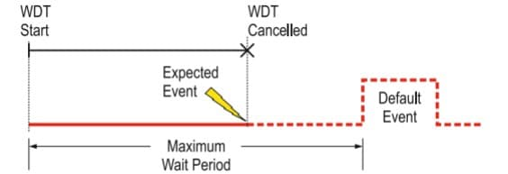
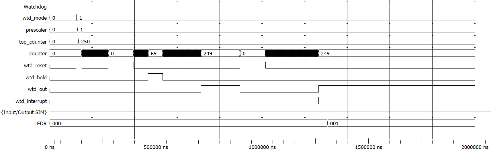

# Watchdog Timer
  
Esta é uma implementação para um periférico de _watchdog_ de 16 bits em VHDL.

O _watchdog_ funciona basicamente como um equipamento de segurança. Em condições normais, assume-se que o tempo será seguido antes que o período colapse (WDT é cancelado). Caso isso não aconteça, existe a possibilidade de haver algo de errado com o sistema, dessa maneira o mesmo deve agir para executar um evento padrão de estabilização. Neste caso, o evento padrão é o `reset` do sistema. A imagem abaixo mostra um diagrama de funcionamento do _watchdog_.

## Descrição dos sinais

-  `prescaler`: variável de 16 bits, para a configuração da frequência de contagem em função da de entrada.

-  `internal_clock`: clock interno do sistema, responsável pela contagem.

-  `counter`: contador do _watchdog_.

-  `wtd_reset`: quando seu sinal é enviado para o nível alto, limpa todos os sinais do periférico e inibe seu funcionamento.

-  `wtd_mode`: responsável por selecionar o modo de funcionamento do _watchdog_, caso haja implementação de mais de um modo.

-  `wtd_clear`: será enviado pelo core para indicar que já pode reiniciar a contagem no modo repetitivo (ainda não implementado).

-  `wtd_interrupt_clr`: Irá servir pra interrupção limpar a flag de IRQ, `wtd_interrupt`

-  `wtd_hold`: interrompe a contagem, mantendo o valor, até que a receba um sinal em nível baixo, e a contagem continua do valor na qual tinha sido parado.

-  `wtd_interrupt`: sinaliza que o _watchdog_ chegou ao seu valor máximo de contagem sem receber nenhum evento, significa que algo travou.

## Implementação das funções no software

-  `void wtd_config(uint32_t wtd_mode, uint32_t prescaler, uint32_t top_counter)`: Configura o _watchdog_, seta o `wtd_reset` para zerar todas as variáveis, e evitar que tenha algum dado com valor equivocado. Define o `wtd_mode`, o `prescaler` e o `top_counter`.

-  `void wtd_enable(void)`: Ativa o _watchdog_ ao enviar um sinal de nível baixo para o `wtd_reset`.

-  `void wtd_disable(void)`: Desativa o _watchdog_ ao enviar um sinal de nível alto para o `wtd_reset`.

-  `void wtd_hold(uint32_t hold)`: Para o contador interno dentro do processo, de modo que congela a operação do _watchdog_.

-  `uint32_t wtd_interrupt_read(void)`: função para ler o valor da flag de interrupaçãp do _watchdog_  `wtd_interrupt`.

-  `void wtd_clearoutputs(void)`: limpa os valores da saída do _watchdog_.

## Funcionamento

Como já mencionando, o _watchdog_ funciona basicamente com um contador, aguardando o recebimento de uma flag para sinalizar que o evento esperado ocorreu. Enquanto não há o recebimento deste sinal, o processo mantém sua contagem até o tempo máximo estipulado. Quando este valor é atingido o _watchdog_ deve entrar em ação sinalizando que algo no sistema não funcionou como deveria, dado que não houve o recebimento da flag do evento.  

A simulação vista a seguir apresenta diferentes comportamentos possíveis para o uso do _watchdog_ com um arquivo de execução em `.c`. Utilizou-se nesta ilustração o arquivo `software/wtd/watchdog_test.c`, que executa todas as funcionalidades implementadas no periférico.

O processo é iniciado pela configuração do _watchdog_ com a função `wtd_config`, que se traduz no nível alto do sinal `wtd_reset` e mudança de valores de `wtd_mode`, `prescaler` e `top_counter` na marca de 130us. É esperado que se mantenha o `wtd_reset` alto, visto que a mudança destes valores pode acarretar em um `reset` acidental se o contador estiver ativo.

	wtd_config(wtd_mode, prescaler, top_counter);

Em seguida é realizado o teste de uso do _watchdog_ com evento esperado.

	wtd_enable();
	delay_(10);
	wtd_disable();
	delay_(10);

É feita a ativação do componente com a função `wtd_enable`, espera com `delay_(10)` e desativação com `wtd_disable`. Observa-se no período de 150us a 275us a contagem (vista como um a faixa sólida, devido à resolução do simulador) e retorno de `counter`a zero, sem haver mudança nos sinais de saída `wtd_interrupt` e `wtd_out` - pois o arquivo utilizou a função de desativação dentro do prazo.

O conjunto de funções seguinte executa dois testes, da função `wtd_hold` e do estouro do _watchdog_. O início, dado pela habilitação ocorrida no tempo 396us, é seguido pela sequência de funções de _hold_ com argumentos `1` e `0` com seus devidos _delays_ para teste. Observa-se o congelamento do instante 463us ao 532us, onde o sinal `counter` se mantém em `69`. 

	wtd_enable();
	delay_(3);
	wtd_hold(1);
	delay_(3);
	wtd_hold(0);

Após o descongelamento a contagem segue a partir do mesmo valor, até que atinge o valor `249`, igual a `top_counter - 1`, em 721us. Neste momento verifica-se que os sinais de saída são levantados e mantidos. 

	delay_(40);
	wtd_disable();

Por fim busca-se a leitura do endereço de memória em que é escrito o sinal `wtd_interrupt`, para verificação do funcionamento por _software_, referente ao tempo de execução 1015us. Entra-se em um laço `while` até que o retorno da função `wtd_interrupt_read` seja `1`, acompanhado da ativação do primeiro pino de GPIO do sistema - ligado à barra de LEDs. Observa-se no último sinal da simulação que o valor de `LEDR` se torna `001` em 1306us, cerca de 40us após o estouro do _watchdog_.

	delay_(10);
	wtd_enable();
	while(!wtd_interrupt_read());
	OUTBUS = 1;