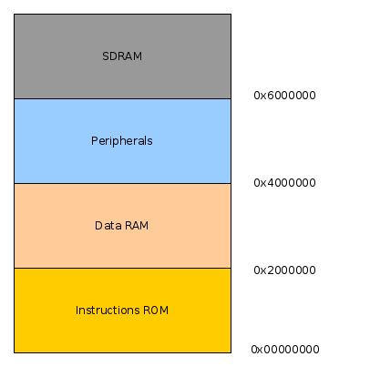

# RISC SoftCores Softwares examples

Esse diretório contém exemplos de softwares.

- blink.c : LED blink com módulo gpio.
- ./adc/  : ADC com DE10-de10_lite.
- ./i2c/  : Módulo I2C.
- ./m_unit/: unidade de multiplicação e divisão inteira por Hardware.
- ./sdram/ : Memória externa SDRAM
- ./spi/   : Módulo SPI.
- ./tft/   : Display TFT
- ./timer/ : temporizador
- ./uart/  : módulo de comunicação UART
- ./vga/   : hardware vga

## Mapa de endereços

Em hardware.h e sections.ld são definidos os endeços de cada periférico. Conforme a figura:

O funcionamento do exemplo de software depende da síntese do periférico, exemplo:

- blink.c (gpio): [Peripheral folder](../peripherals/gpio)
