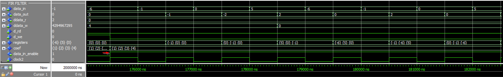
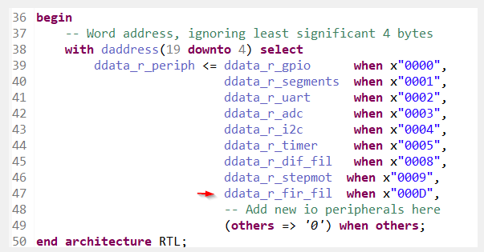



# Filtro digital de média móvel

Este projeto implementa um filtro digital de média móvel como um dos periférico do núcleo riscv. O periférico implementa n registradores de 32 bits.

A entrada de dados é feita pela entrada do periférico, sincronizados com o pulso de clock do sistema.

O periférico implementa três funções, reset, habilita e recebe resultado. 

O funcionamento deste periférico é receber dados de forma contínua e retornar a média movél desses dados a partir dos ultimos n dados.

## Funcionamento do periférico

A constante de entrada "G_AVG_LEN_LOG : integer := 2" definirá quantos registrados será ultilizado para média móvel.

- Exemplo 1) Média móvel de 4 valores: "G_AVG_LEN_LOG : integer := 2", ou seja 2^2 = 4.

- Exemplo 2) Média móvel de 32 valores "G_AVG_LEN_LOG : integer := 5", ou seja 2^5 = 32.
		  

Quando o hardware estiver em reset, ou reset via software pela função, a saída e os registradores serão zerados.

A entrada de dados é cascateada conforme abaixo:

```vhdl
registers   <= signed(data_in) & registers(0 to registers'length-2);  
```

O acumulador = acumulador - último registrador, conforme abaixo.

```vhdl
r_acc       <= r_acc + signed(data_in) - signed(registers(registers'length-1));
```

A saída será a média dos registradores.
data_out  <= std_logic_vector(r_acc(G_NBIT+G_AVG_LEN_LOG-1 downto G_AVG_LEN_LOG)); 

### Código em C

Em hardware.h as definição dos endereços utilizados:

```c 
#define PERIPH_BASE		((uint32_t)0x4000000) 

#define DIG_FILT_CTRL   (*(_IO32 *) (PERIPH_BASE + 80))
#define DIG_FILT_IN     (*(_IO32 *) (PERIPH_BASE + 84))
#define DIG_FILT_OUT    (*(_IO32 *) (PERIPH_BASE + 88))	
```

NOTA: os endereços supracitados são referentes as words x"14", x"15" e x"16" utilizados para leitura e escrita no .vhd

O protótipo das funções e definições: 

```c
/* Digital filter peripheral 
*/
#ifndef _DIF_FILT
#define _DIF_FILT

#include "../_core/hardware.h"
#include "../_core/utils.h"

typedef struct {
  _IO8 enable :1 ;           /*!< Bit habilitação filto */
  _IO8 reset  :1 ;           /*!< Bit de filtro Habilitado. */
 
} DIG_FIL_REG_TYPE;

#define DIG_FILT_CTRL ((DIG_FIL_REG_TYPE *) &DIG_FIL_BASE_ADDRESS )
#define DIG_FILT_OUT    *(&DIG_FIL_BASE_ADDRESS + 4)    


void dig_filt_reset(uint8_t);
void dig_filt_enable(uint8_t);
uint32_t dig_filt_get_output();

#endif
```


Implementação das funções:

```c
/* Digital filter peripheral
*/

#include "dig_filt.h"

void dig_filt_reset(uint8_t data){
  DIG_FILT_CTRL-> reset = data;
}

void dig_filt_enable(uint8_t data){
  DIG_FILT_CTRL-> enable = data;
}

uint32_t dig_filt_get_output(){
  return (DIG_FILT_OUT);
}
```

O código a seguir é um exemplo para observar-se o funcionamento do periférico:

```c
/* 
	digital filter peripheral
*/

#include "dig_filt.h"
#include "../gpio/gpio.h"

int main(){
	uint32_t data = 0;

	dig_filt_enable(1);						// habilitada filtro

	while (1){

        	SEGMENTS_BASE_ADDRESS = dig_filt_get_output();  // get output function
		      
		delay_(100000);						// for human interaction	
	}

	return 0;
}
```

# Filtro FIR

Esse projeto implementa um filtro FIR como um dos periféricos do núcleo do riscv. Para realizar o equacionamento da entidade do filtro, foi utilizado a implementação proposta no livro Circuit Design with VHDL[1]  de Volnei A. Pedroni.  A equação para esse filtro pode ser vista abaixo.

<p align="center"></p>

Em que M representa a ordem do filtro,  b_k os coeficientes do filtro, x(n) é o valor do sinal de entrada e y(n) é o sinal de saída. Para o periférico do riscv, foi implementado um filtro com quatro coeficientes de entrada, representados por 32 bits, esses valores são armazenados em um vetor do tipo memory_t e imputados através do software.

O enable desse periférico é feito através de hardware, ou seja, a entrada somente será filtrada quando todos os coeficientes já tiverem sidos carregados para a memória, assim, o pino "data_in_enable" serve apenas para conferência, podendo ser suprimido da saída. A entrada de dados também é representada por 32 bits, dessa forma, o valor da saída será de 64 bits, em que a parte alta(msb) pode ser visualizada nos pinos de gpio e a parte baixa(lsb) no display em formato hexadecimal.

A saída utilizada nesse filtro(data_out) serve apenas para conferência no componente system sources e probes, podendo ser suprimida. 

<p align="center"></p>


## Funcionamento do Periférico

A constante de entrada " N_coefficients: integer  := 4; " representa o número de coeficientes utilizados no filtro, esse valor pode ser ajustado conforme desejo do usuário, entretanto, para modificar seu valor é necessário fazer a modificação no código vhdl e em c.

Assim, quando ocorrer a borda de subida do clock e habilitação de escrita estiver ativada, cada coeficiente será carregado para a memória, somente após todos os coeficientes terem sido carregados é que o enable será ativado, assim a entrada começara a ser filtrada.

A entrada de dados é cascateada, de forma que ocorrerá a multiplicação entre os coeficientes e o valor da entrada. A saída é um sinal que recebe o somatório final. Quando a habilitação de leitura estiver ativada, será enviado a parte msb do dado em um endereço e então será enviado a parte lsb para outro endereço.

<p align="center"></p>


Assim, conforme a imagem, temos que:

<p align="center"></p>


##  Código em C

Para adicionar o periférico ao núcleo do riscv, foi necessário modificar os seguintes arquivos:

1. memory/iodatabusmux.vhd 

   <p align="center"></p>

   

   2. Inclusão do endereço em software/_core/hardware.h 

   3.  Definição dos endereços e da struct em fir_filt.h

      ```c
      /* FIR filter peripheral 
      */
      #ifndef _FIR_FILT
      #define _FIR_FILT
      
      #include "../_core/hardware.h"
      #include "../_core/utils.h"
      
      typedef struct {
        _IO32 coef0;
        _IO32 coef1;
        _IO32 coef2;
        _IO32 coef3; 
        _IO32 dadomsb;
        _IO32 dadolsb;
      } DIG_FIL_REG_TYPE;
      
      #define FIR_FILT_CTRL ((DIG_FIL_REG_TYPE *) &FIR_FILT_BASE_ADDRESS )
        
        
      void fir_filter_coefficient0(uint32_t coefficient);
      void fir_filter_coefficient1(uint32_t coefficient);
      void fir_filter_coefficient2(uint32_t coefficient);
      void fir_filter_coefficient3(uint32_t coefficient);
      uint32_t fir_filt_get_output_msb_data();
      uint32_t fir_filt_get_output_lsb_data();
      
      ```

      

2. Em fir_filt.c temos as funções.

   ```c
     /* FIR filter peripheral
   */
   
   #include "fir_filt.h"
   
   void fir_filter_coefficient0(uint32_t coefficient){
   
       FIR_FILT_CTRL-> coef0 = coefficient;
     
   }
   
   void fir_filter_coefficient1(uint32_t coefficient){
   
       FIR_FILT_CTRL-> coef1 = coefficient;
     
   }
   
   void fir_filter_coefficient2(uint32_t coefficient){
   
       FIR_FILT_CTRL-> coef2 = coefficient;
     
   }
   
   void fir_filter_coefficient3(uint32_t coefficient){
   
       FIR_FILT_CTRL-> coef3 = coefficient;
     
   }
   
   uint32_t fir_filt_get_output_msb_data(){
     return (FIR_FILT_CTRL -> dadomsb);
   }
   
   uint32_t fir_filt_get_output_lsb_data(){
     return (FIR_FILT_CTRL -> dadolsb);
   }
   
   ```

3. Em main_fir_filt.c temos as chamadas de funções e a possibilidade de alterar os coeficientes do filtro.

   ```c
   /* 
   	fir filter peripheral
   */
   
   #include "fir_filt.h"
   #include "../gpio/gpio.h"
   
   int main(){
   			
   	fir_filter_coefficient0(1);
       fir_filter_coefficient1(2);
       fir_filter_coefficient2(3);
       fir_filter_coefficient3(4);
   
   	while (1){
           
           OUTBUS = fir_filt_get_output_msb_data();
           SEGMENTS_BASE_ADDRESS = fir_filt_get_output_lsb_data();
           	      
   		delay_(100000);						// for human interaction
   		
   	}
   
   	return 0;
   }
   
   ```

   

# Referências

[1] PEDRONI, Volnei A. Circuit Design with VHDL. 1. ed. Cambrige: MIT Press, 2004.

