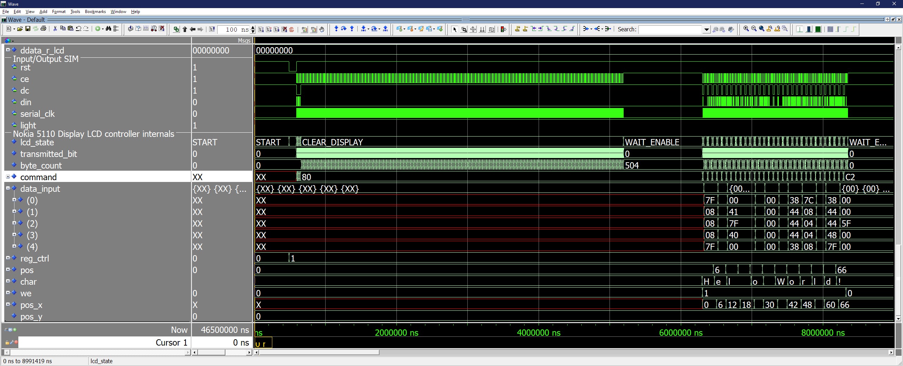
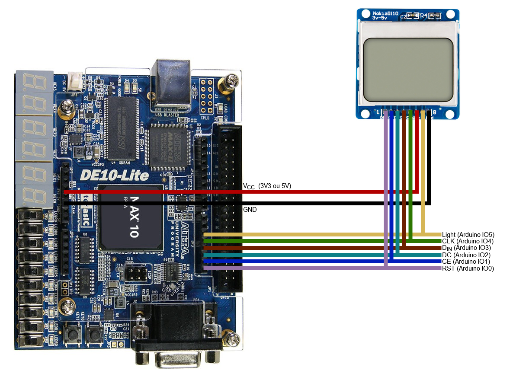
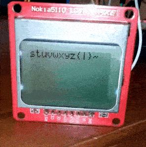

# Código em C

Toma-se conhecimento de que o controle apenas utilizando o registrador é trivial porém pouco legível, logo funções são criadas para facilitar a compreensão e uso.

## Cabeçalho

Assim, foram declaradas as funções `lcd_init`, responsável pela inicialização do _display_ Nokia 5110 LCD, `lcd_clear`, função que limpa o _display_, e `lcd_print`, que imprime na tela do _display_:
 
[`lcd.h`](lcd.h):
```C
#ifndef __LCD_H
#define __LCD_H

#include "../_core/hardware.h"

void lcd_init();
void lcd_clear();
void lcd_print(char *string, _IO32 len, _IO32 x, _IO32 y);

typedef struct{
    _IO32 reg_ctrl; /*!< State machine control register. */
    _IO32 pos;      /*!< Data index. */
    _IO32 data;     /*!< Data to display.*/
    _IO32 we;       /*!< Write enable */
} DISPLAY_NOKIA_5110_REG_TYPE;

#define DISPLAY_NOKIA_5110_REGISTER ((DISPLAY_NOKIA_5110_REG_TYPE *) &DISPLAY_NOKIA_5110_BASE_ADDRESS)
#define DISPLAY_NOKIA_5110_HEIGHT 6
#define DISPLAY_NOKIA_5110_WIDTH 84
#define DISPLAY_NOKIA_5110_LETTER_SPACING 6

#endif 
```

Nota-se que os argumentos da função `lcd_print` incluem, respectivamente, a string a ser impressa, o seu tamanho, a posição inicial de impressão da coluna e posição inicial de impressão da linha. No que a coluna aceita valores de 0 até 83 (84 colunas) e a linha aceita valores da faixa de 0 até 5 (6 linhas), valores excendentes para coluna resultam em incremento(s) para a linha, e para a linha, impera uma lógica circular.

## Funções

Desse modo, as implementações dessas funções são dadas no arquivo [`lcd.c`](lcd.c).

[`lcd.c`](lcd.c):
```C
#include <stdint.h>
#include "../_core/utils.h"
#include "../_core/hardware.h"
#include "lcd.h"

inline _IO32 lcd_pos(_IO32 x, _IO32 y){
    while(x >= DISPLAY_NOKIA_5110_WIDTH){
        x -= DISPLAY_NOKIA_5110_WIDTH;
        y += 1;
    }
    
    while(y >= DISPLAY_NOKIA_5110_HEIGHT)
        y -= DISPLAY_NOKIA_5110_HEIGHT;
        
    return x + y * DISPLAY_NOKIA_5110_WIDTH;
}

void lcd_init(){
    DISPLAY_NOKIA_5110_REGISTER->reg_ctrl = 1;
    DISPLAY_NOKIA_5110_REGISTER->we = 0;
    delay_(700);
}

void lcd_clear(){
    DISPLAY_NOKIA_5110_REGISTER->reg_ctrl = 0;
    DISPLAY_NOKIA_5110_REGISTER->we = 1;
    delay_(100);
    DISPLAY_NOKIA_5110_REGISTER->we = 0;
    delay_(600);
}
void lcd_print(char *string, _IO32 len, _IO32 x, _IO32 y){
    for(int i = 0; i < len; i++){
        DISPLAY_NOKIA_5110_REGISTER->reg_ctrl = 1;
        DISPLAY_NOKIA_5110_REGISTER->pos = lcd_pos(x, y) + (i*DISPLAY_NOKIA_5110_LETTER_SPACING);
        DISPLAY_NOKIA_5110_REGISTER->data = string[i];
        DISPLAY_NOKIA_5110_REGISTER->we = 1;
        delay_(10);
    }
    
    DISPLAY_NOKIA_5110_REGISTER->we = 0;
    delay_(100);
}
```
## Exemplo

Ao fim do desenvolvimento das funções, um exemplo também foi fornecido no arquivo [`main_lcd.c`](main_lcd.c).

[`main_lcd.c`](main_lcd.c):
```C
#include <stdint.h>
#include "lcd.h"
#include "../_core/utils.h"
#include "../_core/hardware.h"

int main(){
    char phrase[] = "Hello World!";
    char every_character[] = " !\"#$%&'()*+-,-./0123456789:;<=>?@"
                             "ABCDEFGHIJKLMNOPQRSTUVWXYZ[\\]^_`ab"
                             "cdefghijklmnopqrstuvwxyz{|}~";
    _IO32 len = sizeof(phrase)-1;
    _IO32 len_all = sizeof(every_character)-1;
    lcd_init();

    while(1){
        lcd_print(phrase, len, 0, 0);
        
        /* Comment delay for testbench and uncomment for synthesis. */
        //delay_(10000);
        
        lcd_clear();
        lcd_print(every_character, len_all-12, 0, 0);

        /* Comment delay for testbench and uncomment for synthesis. */
        //delay_(10000);
        
        lcd_clear();
        lcd_print(&every_character[len_all-12], 12, 0, 0);
        
        /* Comment delay for testbench and uncomment for synthesis. */
        //delay_(10000);
        
        lcd_clear();
    }

    return 0;
}
```

Observa-se que além da frase "_Hello World!_", também foi feita a impressão de todos os caracteres suportados (incluindo espaço) pelo controlador, listados abaixo para ênfase:

```
!"#$%&'()*+-,-./0123456789:;<=>?@ABCDEFGHIJKLMNOPQRSTUVWXYZ[\]^_`abcdefghijklmnopqrstuvwxyz{|}~
```

## Compilação do exemplo

A compilação do exemplo é feita com auxílio do arquivo [`Makefile`](Makefile), no que a máquina usada para o processo deve ter instalada o compilador _cross compiler_ GNU riscv-none-embed-gcc e o seu caminho de instalação indicado apropriadamente no [`Makefile`](Makefile). Para fazer a compilação, mova-se para este diretório e digite o comando `make clean & make` no terminal. Esse comando gera um arquivo IntelHex de nome [`quartus_main_lcd.hex`](quartus_main_lcd.hex).

[`Makefile`](Makefile):
```Makefile
ifndef RISCV_TOOLS_PREFIX
#RISCV_TOOLS_PREFIX=riscv-none-embed-
# Para usar no LSC 
RISCV_TOOLS_PREFIX = ~/.local/xPacks/@gnu-mcu-eclipse/riscv-none-gcc/8.2.0-2.2.1/.content/bin/riscv-none-embed- # <- Alterar o caminho.
endif

QUARTUS_DIR=~/intelFPGA_lite/21.1/quartus/bin/ # <- Opcionalmente alterar o caminho da instalação do Quartus.
```
Há também a opção de modificar o caminho da instalação do Quartus no arquivo, com o intuito de utilizar funcionalidades extras de síntese e gravação diretamente no [`Makefile`](Makefile).

# Simulação do _testbench_

Primeiramente, antes de realizar o _testbench_, devem ser comentadas as linhas que contenham `delay_(10000)` no arquivo de exemplo [`main_lcd.c`](main_lcd.c).

O _testbench_ foi implementado no arquivo [`peripherals/lcd/testbench.vhd`](../../peripherals/lcd/testbench.vhd), ele já possui integração ao núcleo RISCV e exibe nas suas últimas linhas os sinais de saída para o _display_ e os sinais internos do controlador, como denotado pela imagem abaixo:

<p align="center">
    
</p>

# Síntese na FPGA Altera MAX10 DE10-Lite

Já para a síntese na FPGA, devem ser descomentadas as linhas que contenham `delay_(10000)` no arquivo de exemplo [`main_lcd.c`](main_lcd.c).

O arquivo principal para síntese é o [`peripherals/lcd/sint/de10_lite/de0_lite.vhd`](../../peripherals/lcd/sint/de10_lite/de0_lite.vhd), em que são utilizados as portas Arduino IO[[2]](#bibliografia), a porta de alimnentação de 3,3V ou 5V (de acordo com o modelo do _display_) e a referência no GND, seguindo o mesmo modelo do esquemático abaixo:

<p align="center">
    
</p>

Ao final, após a síntese e gravação do arquivo [`quartus_main_lcd.hex`](quartus_main_lcd.hex) na memória interna utilizada para o núcleo RISCV, espera-se para o exemplo o comportamento demonstrado abaixo:

<p align="center">
    
</p>

# Bibliografia
[1] [_Datasheet_ do display Nokia 5110 LCD](https://www.sparkfun.com/datasheets/LCD/Monochrome/Nokia5110.pdf)

[2] [_Datasheet_ da placa de desenvolvimento Altera DE10-Lite](https://www.intel.com/content/dam/www/programmable/us/en/portal/dsn/42/doc-us-dsnbk-42-2912030810549-de10-lite-user-manual.pdf)